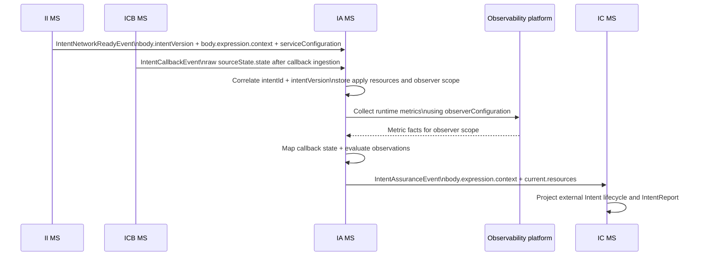

# Intent Assurance MS Solution Brief

| **Document status** | **Value** |
| --- | --- |
| Status | Current baseline |
| Document version | v1.0 |
| Last updated | 2026-06-01 |
| Scope | Intent Assurance MS solution brief |
| Source of truth after commit | GitHub `baseline/intent/ia-ms/ia_ms_solution_brief.md` |

Document authority: this solution brief is authoritative for IA MS operational flow, configuration guidance, and implementation-facing behaviour. Field-level contracts are defined in the IA MS specification; design decisions and ownership boundaries are captured in the IA MS design brief.

## Table of contents:

- [1. Summary:](#1-summary)
- [2. Logical View:](#2-logical-view)
- [3. Process View:](#3-process-view)
- [4. Solution Elaboration:](#4-solution-elaboration)
- [5. Responsibilities:](#5-responsibilities)
- [6. IA MS does not:](#6-ia-ms-does-not)
- [7. Contracts:](#7-contracts)
- [8. IntentNetworkReadyEvent input shape:](#8-intentnetworkreadyevent-input-shape)
- [9. IntentCallbackEvent input shape:](#9-intentcallbackevent-input-shape)
- [10. Observation metric shape:](#10-observation-metric-shape)
- [11. Callback state mapping:](#11-callback-state-mapping)
- [12. IntentAssuranceEvent output shape:](#12-intentassuranceevent-output-shape)
- [13. Fields not accepted:](#13-fields-not-accepted)
- [14. Authorisation:](#14-authorisation)
- [15. Persistence / state / outbox model:](#15-persistence-state-outbox-model)
- [16. Internal Kafka publication:](#16-internal-kafka-publication)
- [17. Internal Kafka topics:](#17-internal-kafka-topics)
- [18. Event identity:](#18-event-identity)
- [19. Internal Kafka CloudEvents headers:](#19-internal-kafka-cloudevents-headers)
- [20. Internal Kafka message body:](#20-internal-kafka-message-body)
- [21. Behaviour:](#21-behaviour)
- [22. Configuration:](#22-configuration)
- [23. Consumer contract:](#23-consumer-contract)
- [24. Open items:](#24-open-items)
- [25. Closed items:](#25-closed-items)
- [26. MS identity:](#26-ms-identity)

## 1. Summary:

Intent Assurance MS (IA MS) is the internal runtime assurance truth service for Intent Management. It owns assurance evaluation after network-ready service configuration, raw callback relay events, and runtime observation metrics are available.

IA MS consumes `IntentNetworkReadyEvent`, `IntentCallbackEvent`, and runtime metrics/observation facts only. It correlates runtime state, normalises raw source callback states, evaluates observed resource metrics against resolved runtime targets and the stored applied assurance baseline, persists IA-owned assurance state, and publishes `IntentAssuranceEvent`.

IA MS does not expose a TMF-compliant API. IC MS remains the owner of externally visible runtime `Intent` lifecycle projection and external `IntentReport` resources. IC MS consumes IA MS assurance outcomes and projects the public TMF-compliant state.

Drift, degradation, failure, active, and terminated outcomes are represented through `IntentAssuranceEvent.lifecycleStatus`, `statusReason`, and resource-level metrics.

## 2. Logical View:

IA MS sits after service-ready preparation and callback ingestion in the Intent Management runtime flow.

```text
IntentNetworkReadyEvent
        |
        v
Intent Assurance MS <--- IntentCallbackEvent from ICB MS
        |
        +--- observation endpoint calls / metric facts
        |
        v
IntentAssuranceEvent ---> IC MS external lifecycle and report projection
```

Primary collaborators:

| Collaborator | Relationship |
|---|---|
| II MS | Produces `IntentNetworkReadyEvent` with service-ready change-execution and observation configuration. |
| ICB MS | Accepts external callbacks and relays raw `IntentCallbackEvent` to the dedicated callback topic. |
| Observability platform | Provides runtime metric facts for observer-scope resources. |
| IC MS | Consumes `IntentAssuranceEvent` and projects external `Intent` and `IntentReport` state. |
| Knowledge Plane / policy configuration | May support mapping and evaluation policy, but IA MS does not query KP for every assurance decision by default. |

IA MS persists its own assurance state, idempotency records, observation snapshots, mapping audit, and outbox records. It does not depend on IC MS for its internal event publication path.

## 3. Process View:

The normal IA MS runtime process is:

1. Consume `IntentNetworkReadyEvent` produced by `intent-intelligence-ms`.
2. Store the selected apply resources from `serviceConfiguration.orchestratorConfiguration.resources`.
3. Store the full observer scope from `serviceConfiguration.observerConfiguration.resources`.
4. Store the resolved runtime `body.expression.context` needed for assurance, including location/service context, targets, constraints, and preferences where relevant.
5. Consume `IntentCallbackEvent` from the dedicated callback topic.
6. Validate and correlate `intentId` against IA-owned state and platform context.
7. Map raw `sourceState.state` values into IA-owned lifecycle and assurance meaning.
8. Obtain runtime metric facts from observability endpoints informed by the observer configuration.
9. Evaluate observed metrics against resolved runtime targets and IA stored applied assurance baseline.
10. Update IA-owned assurance state.
11. Publish `IntentAssuranceEvent` through the IA outbox relay.
12. IC MS consumes the event and updates external `Intent` lifecycle and `IntentReport` projection.

`IntentNetworkReadyEvent` alone never proves apply success. Active state requires apply/callback confirmation and/or runtime observations according to the workflow policy.

Onboarding sequence view:



Ordering constraints:

- `IntentNetworkReadyEvent` establishes the assurance context and observer scope; it does not prove apply success.
- `IntentCallbackEvent` may arrive before, after, or between observation attempts, so IA MS must correlate and process events idempotently by `intentId`, `intentVersion`, and event identity.
- IA MS must not emit misleading `IntentAssuranceEvent` outcomes for stale, superseded, or unmatched versions.

## 4. Solution Elaboration:

IA MS is deliberately narrow. It turns service-ready configuration, callback facts, and observation facts into curated assurance outcomes. It does not expose raw callback payloads or raw telemetry dumps to downstream services.

IA MS should be implemented as an internal event-driven microservice with:

- idempotent Kafka consumers;
- IA-owned PostgreSQL-compatible persistence;
- a durable outbox for `IntentAssuranceEvent` publication;
- mapping/audit records for callback state interpretation and skip/dead-letter decisions;
- retry-safe processing for at-least-once delivery;
- clear separation between raw input capture, IA state update, and event publication.

The assurance event is metrics-first. `lifecycleStatus` and `statusReason` explain the interpreted outcome. Resource-level `metrics` carry the factual observed data needed by IC MS, II MS, and other authorised decision components.

Derived evaluation blocks such as `current.evaluations` or `body.evaluations` are not included by default. IA MS also does not include a default `requiresReoptimisation` flag. II MS or another authorised decision component reads lifecycle state, status reason, and resource metrics to decide whether re-interpretation, re-optimisation, reselection, or no action is required.

## 5. Responsibilities:

| Responsibility | IA MS behaviour |
|---|---|
| Runtime assurance truth | Owns the current assurance/projection state used to determine whether an intent is healthy, degraded, failed, or terminated. |
| Network-ready configuration consumption | Consumes `IntentNetworkReadyEvent` from II MS and stores selected apply resources plus observer scope. |
| Callback consumption | Consumes raw `IntentCallbackEvent` from the dedicated callback topic. |
| Intent correlation | Validates/correlates `intentId` using IA-owned state and platform context. |
| Raw state mapping | Maps raw `sourceState.state` into platform lifecycle and assurance meaning. |
| Runtime observation | Obtains runtime metrics from observability endpoints informed by `observerConfiguration`. |
| Assurance evaluation | Evaluates runtime observations against resolved targets and the stored applied assurance baseline. |
| Assurance state update | Updates IA-owned current assurance/projection state. |
| Assurance publication | Publishes `IntentAssuranceEvent` to the internal event backbone. |
| Outbox ownership | Owns IA outbox and relay for reliable event publication. |

## 6. IA MS does not:

| Concern | Owner / reason |
|---|---|
| Design-time `IntentSpecification` lifecycle | ID MS owns this. |
| Runtime `Intent` REST API | IC MS owns this. |
| External TMF-compliant lifecycle projection | IC MS owns this. |
| External `IntentReport` resource creation | IC MS owns this. |
| Raw callback ingestion REST endpoint | ICB MS owns this. |
| Callback outbox persistence | ICB MS owns this. |
| Network apply/change-execution execution | Change-execution layer owns this. |
| Intent interpretation and semantic resolution | II MS owns this. |
| Optimisation decision | Optimiser / IO context owns this. |
| Knowledge Plane config CRUD/governance | Knowledge Plane operating model owns this. |
| OEX user experience | OEX layer owns this. |
| `IntentNetworkReadyEvent` production | II MS owns and emits it. IA MS only consumes it. |

## 7. Contracts:

IA MS has no external TMF-compliant REST API in the active baseline.

IA MS internal contracts are:

| Contract | Direction | Source / target | Purpose |
|---|---|---|---|
| `IntentNetworkReadyEvent` | Input | II MS | Service-ready change-execution and observation configuration. |
| `IntentCallbackEvent` | Input | ICB MS | Raw callback state relayed from source/change-execution systems. |
| Observation endpoint metric facts | Input | Observability platform | Runtime metrics for observer-scope resources. |
| `IntentAssuranceEvent` | Output | Internal event backbone, consumed by IC MS | Curated assurance outcome used for external projection. |

## 8. IntentNetworkReadyEvent input shape:

`IntentNetworkReadyEvent` is produced by `intent-intelligence-ms`. IA MS must not show `ce-source: intent-assurance-ms` for this event.

Required handling fields:

| Field / area | IA MS usage |
|---|---|
| `body.intentId` | Primary correlation key. |
| `body.intentVersion` | Runtime intent version context where supplied. |
| `body.lifecycleStatus` | Upstream milestone state, normally `InProgress`. |
| `body.statusReason` | Human-readable service-ready milestone reason. |
| `body.expression.context` | Resolved runtime context for assurance, including targets, constraints, and preferences. |
| `body.expression.context.constraints.location` | Location context for assurance. |
| `body.expression.context.constraints.serviceType` | Service type context for assurance. |
| `body.expression.context.constraints.serviceClass` | Service class context for assurance. |
| `body.serviceConfiguration.orchestratorConfiguration` | Selected apply/change-execution configuration. |
| `body.serviceConfiguration.orchestratorConfiguration.resources[]` | Optimiser-selected resources/configuration ready for apply. |
| `body.serviceConfiguration.observerConfiguration` | Assurance/monitoring configuration. |
| `body.serviceConfiguration.observerConfiguration.resources[]` | Full observer scope IA/observer should monitor. |
| `body.serviceConfiguration.observerConfiguration.resources[].metrics` | List of metric names to observe, not metric values. |
| `body.references` | Correlation and resource references. |

`IntentNetworkReadyEvent` means service configuration is ready for change-execution/apply. It does not mean the service has already been applied.

## 9. IntentCallbackEvent input shape:

IA MS consumes raw callback relay events emitted by ICB MS. The canonical callback fields are:

- `callbackSource`
- `callbackTimestamp`
- `sourceState`
- `sourceState.state`

`sourceState.state` carries the raw source/change-execution state value, such as `APPLIED`, `APPLY_FAILED`, or `TERMINATED`.

Required handling fields:

| Field / area | IA MS usage |
|---|---|
| `body.callbackId` | Optional ICB callback submission/outbox identifier where supplied. |
| `body.intentId` | Primary IA correlation key. |
| `body.callbackSource` | Raw source system identity supplied by ICB MS. |
| `body.callbackTimestamp` | Source callback timestamp. |
| `body.sourceState.state` | Raw source/change-execution state value to map. |
| `body.sourceState.reason` | Optional raw reason to support IA mapping/audit. |
| `body.receivedAt` | ICB receive/accept time. |
| `body.details` | Optional safe raw or structured callback detail. |
| `body.references.correlationId` | Correlation across the workflow. |
| `body.references.intent` | Platform intent reference where generated by ICB/IA. |

Do not use retired source-specific callback state/source/timestamp field names as baseline callback field names.

## 10. Observation metric shape:

IA MS obtains runtime metrics from observability/observation endpoints informed by `IntentNetworkReadyEvent.serviceConfiguration.observerConfiguration`.

Logical metric facts should be treated as factual observations, for example:

```json
{
  "observedAt": "2026-04-18T12:29:55+10:00",
  "resourceMetrics": [
    {
      "resourceId": "SYD-PRI-01",
      "roles": ["primary"],
      "metrics": {
        "latencyMs": 18,
        "availabilityPercent": 99.992,
        "jitterMs": 1.8,
        "packetLossPercent": 0.006
      }
    }
  ]
}
```

Metric names must remain neutral. Use names such as `latencyMs`, `availabilityPercent`, `jitterMs`, and `packetLossPercent`. Do not encode metric origin into event-facing wrappers or field names such as `metrics.benchmark`, `metrics.telemetry`, `currentLatencyMs`, or `observedLatencyMs`.

## 11. Callback state mapping:

IA MS owns raw callback state mapping. ICB MS must not map raw source states into lifecycle states.

| Raw `sourceState.state` | IA MS treatment | Typical `IntentAssuranceEvent.lifecycleStatus` |
|---|---|---|
| `APPLY_ACCEPTED` | Apply request accepted by source/change-execution layer. | `InProgress` |
| `APPLY_IN_PROGRESS` | Apply still underway. | `InProgress` |
| `APPLIED` | Apply completed; runtime observations may further confirm health. | `Active` |
| `APPLY_REJECTED` | Apply request rejected before successful application. | `Failed` |
| `APPLY_FAILED` | Apply failed after attempt. | `Failed` |
| `PARTIALLY_APPLIED` | Some selected resources applied while others failed or remain unconfirmed. Preserve factual resource state and map to `Degraded` or `Failed` according to policy severity. | `Degraded` or `Failed` |
| `TERMINATION_ACCEPTED` | Termination accepted. | `InProgress` |
| `TERMINATED` | Termination confirmed. | `Terminated` |
| Unknown / unmapped | Record skip, dead-letter, or operational handling decision. | No default lifecycle event unless policy requires one. |

Mapping must be auditable. Unknown or unmapped values should not be silently converted into misleading healthy or failed states.

## 12. IntentAssuranceEvent output shape:

`IntentAssuranceEvent` is the single IA-owned runtime assurance outcome event. It carries curated assurance facts using the internal event contract, not an external TMF `IntentExpression` wrapper.

Common CloudEvents-style headers:

```http
ce-specversion: 1.0
ce-type: IntentAssuranceEvent
ce-source: intent-assurance-ms
ce-id: evt-intent-assurance-001
ce-time: 2026-04-18T12:20:00+10:00
ce-subject: INT-HOSP-2026-001
content-type: application/json
```

Payload field specification:

| Field / area | Purpose |
|---|---|
| `body.intentId` | Runtime intent identifier. |
| `body.intentVersion` | Runtime intent version context where supplied. |
| `body.lifecycleStatus` | Lifecycle-driving assurance state that IC MS projects externally. |
| `body.statusReason` | Human-readable explanation of the assurance outcome. |
| `body.expression.context` | Resolved runtime context with targets, constraints, and preferences. |
| `body.current.resources[]` | Full observed resource/path set in IA assurance scope where applicable. |
| `body.references` | Correlation and resource references. |

Reusable resource entries use:

- `roles`
- `resourceId`
- `resourceType`
- `resourceClass`
- direct safe resource attributes such as `accessTechnology` where needed
- `relationships`
- `metrics`

Representative degraded outcome snippet. The IA MS specification is the canonical reference for full `IntentAssuranceEvent` examples:

```json
{
  "body": {
    "intentId": "INT-HOSP-2026-001",
    "intentVersion": "v1",
    "lifecycleStatus": "Degraded",
    "statusReason": "Current primary path latency is outside resolved runtime targets.",
    "expression": {
      "context": {
        "targets": {
          "maxLatencyMs": 10,
          "minAvailabilityPercent": 99.99,
          "maxJitterMs": 2,
          "maxPacketLossPercent": 0.01
        },
        "constraints": {
          "location": {
            "locationId": "AU-NSW-SYD-HOSP-001",
            "displayName": "Sydney-Main-Hospital"
          },
          "serviceType": "surgical-connectivity",
          "serviceClass": "critical-gold",
          "priority": "critical",
          "redundancyRequired": true
        },
        "preferences": {
          "preferredAccessTechnology": "5G"
        }
      }
    },
    "current": {
      "resources": [
        {
          "resourceId": "SYD-PRI-01",
          "roles": [
            "primary"
          ],
          "resourceType": "deliveryResource",
          "resourceClass": "critical-gold",
          "accessTechnology": "fibre",
          "relationships": [
            {
              "type": "pairedSecondary",
              "resourceId": "SYD-SEC-01"
            }
          ],
          "metrics": {
            "latencyMs": 18,
            "availabilityPercent": 99.992,
            "jitterMs": 1.8,
            "packetLossPercent": 0.006
          }
        }
      ]
    },
    "references": {
      "correlationId": "corr-intent-assurance-degraded-001",
      "intent": {
        "id": "INT-HOSP-2026-001",
        "href": "/intentManagement/v5/intent/INT-HOSP-2026-001"
      },
      "intentSpecification": {
        "id": "ispec-hss-001",
        "specKey": "hospital-surgical-slice-spec",
        "version": "1.20",
        "href": "/intentManagement/v5/intentSpecification/ispec-hss-001"
      }
    }
  }
}
```

## 13. Fields not accepted:

IA MS must not include the following by default in `IntentAssuranceEvent`:

| Field / pattern | Reason |
|---|---|
| Raw callback payloads | IA emits curated outcomes, not callback dumps. |
| Raw telemetry dumps | IA emits curated assurance facts, not full telemetry streams. |
| External TMF `IntentExpression` wrappers | Internal events use plain JSON `body.expression.context`, not external TMF expression wrappers. |
| `provider` | Not part of the IA event baseline. |
| `current.evaluations` | Metrics-first event; no derived evaluation block by default. |
| `body.evaluations` | Metrics-first event; no derived evaluation block by default. |
| `requiresReoptimisation` | Decision components infer need from lifecycle/status/metrics. |
| Optimiser scoring or solver internals | Optimiser-owned internals must not leak into IA event. |
| Retired source-specific callback state/source/timestamp fields | Replaced by `sourceState`, `callbackSource`, and `callbackTimestamp`. |
| `metrics.benchmark` / `metrics.telemetry` wrappers | Metric origin is inferred from event stage and processing context. |
| `currentLatencyMs` / `observedLatencyMs` / similar context-encoded metric names | Use neutral metric names. |

## 14. Authorisation:

IA MS is an internal service. It does not expose an external TMF-compliant API or OEX-facing user operation. IA MS must follow the platform internal service authentication and authorisation policy for service identity, topic access, mTLS or workload identity, and least-privilege persistence access.

Authorisation should follow internal service-to-service controls:

- only authorised internal consumers may read the IA input topics;
- only IA MS may publish `IntentAssuranceEvent` as `ce-source: intent-assurance-ms`;
- only IA MS should write IA-owned persistence tables;
- callback source trust is not established by IA alone; ICB MS owns callback endpoint admission and relay, while IA owns state correlation and mapping;
- downstream consumers must not treat IA event payloads as public TMF events.

## 15. Persistence / state / outbox model:

IA MS owns its own PostgreSQL-compatible persistence boundary.

| Table | Purpose |
|---|---|
| `intent_assurance_state` | Current assurance/projection state per intent. |
| `intent_assurance_observation` | Current/recent curated observations. |
| `intent_assurance_idempotency` | Consumed event deduplication. |
| `intent_assurance_mapping_audit` | Callback mapping and skip/dead-letter decisions. |
| `intent_assurance_outbox` | Durable publication of `IntentAssuranceEvent`. |
| `intent_assurance_dead_letter` | Required minimum dead-letter handling for exhausted input processing, unknown or invalid callbacks, stale/superseded event handling that cannot be safely ignored, and repeated observation collection failures after retry policy is exhausted. |
| `shedlock` | Relay coordination if an embedded clustered relay is used. |

Persistence rules:

- consumers must be idempotent;
- `ce-id` / event id is the deduplication key;
- `correlationId` must be propagated;
- intent-scoped events should use `intentId` as the Kafka key where practical;
- IA state updates and outbox writes should be transactional where possible;
- unpublished outbox rows must remain durable until successfully published or governed by explicit operational policy.

## 16. Internal Kafka publication:

IA MS publishes `IntentAssuranceEvent` to the internal event backbone through its outbox relay.

Publication rules:

- delivery is at-least-once;
- consumers must be idempotent;
- `ce-id` / event id is the deduplication key;
- Kafka key should prefer `intentId` for intent-scoped events;
- schema evolution should prefer additive changes;
- breaking changes require versioning;
- payloads must not include secrets, tokens, credentials, or raw internal stack traces.

## 17. Internal Kafka topics:

| Topic | Direction | Purpose |
|---|---|---|
| `t7.intent.management.events.callbacks` | Input | Dedicated callback topic carrying `IntentCallbackEvent` from ICB MS. |
| `t7.intent.management.events` | Input/output | Main internal event backbone for `IntentNetworkReadyEvent` input and `IntentAssuranceEvent` output. |

Exact topic naming should remain aligned with the environment-specific platform Kafka naming convention, but the dedicated callback topic must remain separate from ordinary internal workflow events. The `t7` topic prefix is an environment-specific example and must be parameterised through Section 22 configuration rather than hard-coded in deployable components.

## 18. Event identity:

`IntentAssuranceEvent` identity rules:

| Concern | Baseline |
|---|---|
| Event type | `IntentAssuranceEvent` |
| Producer | `intent-assurance-ms` |
| Subject | `intentId` |
| Kafka key | Prefer `intentId` |
| Deduplication key | `ce-id` / event id |
| Correlation | `correlationId` in `body.references` or equivalent reference area |
| Delivery model | At-least-once |
| Consumer behaviour | Idempotent consumption required |

## 19. Internal Kafka CloudEvents headers:

IA MS uses CloudEvents-style metadata in Kafka/message headers with a plain JSON body.

Example:

```http
ce-specversion: 1.0
ce-type: IntentAssuranceEvent
ce-source: intent-assurance-ms
ce-id: evt-intent-assurance-001
ce-time: 2026-04-18T12:20:00+10:00
ce-subject: INT-HOSP-2026-001
content-type: application/json
```

Internal events are not external TMF listener events and are not wrapped in TMF event structures.

## 20. Internal Kafka message body:

The active IA event message shape is:

```json
{
  "body": {
    "intentId": "...",
    "intentVersion": "...",
    "lifecycleStatus": "Active | Degraded | Failed | InProgress | Terminated",
    "statusReason": "...",
    "expression": {
      "context": {
        "targets": {},
        "constraints": {
          "location": {},
          "serviceType": "...",
          "serviceClass": "..."
        },
        "preferences": {}
      }
    },
    "current": {
      "resources": []
    },
    "references": {}
  }
}
```

`current.resources[]` should carry the full observed resource/path set in the IA assurance scope where applicable. `lifecycleStatus` and `statusReason` explain the interpreted outcome; each resource entry remains factual and metrics-oriented.

## 21. Behaviour:

IA MS must treat observation gaps, stale observations, and exhausted retries as explicit operational facts. Missing telemetry must not be converted into a healthy assurance state.

| Scenario | IA MS behaviour |
|---|---|
| `IntentNetworkReadyEvent` received | Store service-ready apply resources, observer scope, references, and `body.expression.context`. Do not mark intent `Active` solely from this event. |
| Stale or superseded event version received | Do not overwrite newer IA state or publish misleading current-version assurance outcomes. Record audit/dead-letter handling according to policy. |
| Apply callback received with `APPLIED` | Correlate `intentId`, map state, update assurance state, and publish an assurance outcome according to workflow policy. |
| Apply callback received with `APPLY_FAILED` | Correlate, map to failure meaning, update state, publish `IntentAssuranceEvent` with `Failed` where policy requires. |
| Partial apply callback received | Correlate selected resources, preserve factual applied/failed/unconfirmed resource context, and publish `IntentAssuranceEvent` with `Degraded` or `Failed` according to policy severity. |
| Unknown `intentId` callback | Record skip/dead-letter decision according to IA policy; do not publish misleading assurance state. |
| Unknown `sourceState.state` | Record mapping audit and skip/dead-letter/operational handling decision; no default lifecycle event unless policy requires. |
| Observed metrics inside target | Publish or maintain `Active`/healthy assurance state as policy requires. |
| Observed metrics outside target | Publish `Degraded` or `Failed` according to policy and severity. |
| Observability unavailable, stale, or incomplete | Retry according to configured policy, mark the observation collection gap operationally, retain previous assurance state where safe, and do not invent healthy state from missing or stale telemetry. |
| Kafka unavailable | Keep unpublished events in the IA outbox and retry later. |
| IA DB unavailable | Hard fail processing; do not acknowledge consumed events until retry/DLQ policy applies. |

## 22. Configuration:

IA MS configuration should include:

| Configuration area | Purpose |
|---|---|
| Callback state mapping | Maps raw `sourceState.state` values to IA lifecycle/assurance meaning. |
| Skip/dead-letter policy | Controls unknown intent, unknown state, invalid callback, stale or superseded version handling, replay handling, and repeated observation collection failure after retry policy is exhausted. |
| Observation endpoint profiles | Maps observer configuration targets/profiles to actual observability endpoints. |
| Metric threshold/evaluation policy | Defines how target breaches become `Active`, `Degraded`, `Failed`, or operational gaps. |
| Outbox relay policy | Controls retry/backoff, batch size, and relay scheduling. |
| Idempotency retention | Controls deduplication record retention. |
| Topic names | Environment-specific Kafka topic names. |

Configuration must not make IA MS the owner of optimiser decisions or external lifecycle projection. It should only support IA-owned assurance interpretation and publication.

## 23. Consumer contract:

Primary consumer of `IntentAssuranceEvent` is IC MS.

Consumer expectations:

- consume idempotently;
- use `ce-id` / event id for deduplication;
- use `intentId` and `correlationId` for workflow correlation;
- treat IA events as curated internal assurance facts;
- do not expose IA internal payloads directly as public TMF events;
- project external `Intent.lifecycleStatus` and `IntentReport` state according to IC MS rules;
- do not expect raw callback payloads, raw telemetry dumps, or optimiser solver internals in IA events.

Other authorised internal decision components may consume `IntentAssuranceEvent` to decide whether re-interpretation, re-optimisation, reselection, or no action is required.

## 24. Open items:

| Item | Note |
|---|---|
| Exact observation endpoint API contract | Controlled environment-specific decision. The solution brief assumes logical observation endpoint facts; concrete observation API endpoints, credentials, and endpoint profiles are supplied through platform configuration. |
| Dead-letter storage and replay implementation detail | DLQ handling is required as a minimum baseline; the exact storage/topic and replay runbook remain an implementation detail aligned to platform policy. |
| Mapping policy ownership detail | IA owns mapping execution; final operational governance for mapping config should remain aligned with platform configuration management. |

## 25. Closed items:

| Item | Decision |
|---|---|
| Event example harmonisation | Closed for the active IA baseline. Future example changes must preserve the metrics-first `IntentAssuranceEvent` shape and must not reintroduce candidates, evaluations, benchmark wrappers, or `requiresReoptimisation` by default. |
| IA external API | IA MS has no external TMF-compliant API. |
| IA input events | IA consumes `IntentNetworkReadyEvent`, `IntentCallbackEvent`, and runtime metrics/observation facts only. |
| `IntentNetworkReadyEvent` owner | Produced by II MS, not IA MS. |
| Callback field names | Use `callbackSource`, `callbackTimestamp`, and `sourceState.state`. |
| Raw callback lifecycle mapping owner | IA MS owns mapping; ICB MS does not map lifecycle. |
| IA output event | `IntentAssuranceEvent` only. |
| Re-optimisation flag | No default `requiresReoptimisation` flag. |
| Evaluation blocks | No `current.evaluations` or `body.evaluations` by default. |
| Metrics naming | Use neutral metric names such as `latencyMs`, `availabilityPercent`, `jitterMs`, and `packetLossPercent`. |

## 26. MS identity:

| Attribute | Value |
|---|---|
| Full name | Intent Assurance MS |
| Short name | IA MS |
| Service name | `intent-assurance-ms` |
| Domain | Intent Domain |
| External API owner | No external TMF-compliant API |
| Main responsibility | Runtime assurance truth, callback state normalisation, observation evaluation, and `IntentAssuranceEvent` publication |
| Main input events | `IntentNetworkReadyEvent`, `IntentCallbackEvent` |
| Main non-event input | Runtime metrics / observation facts from observability endpoints |
| Main output event | `IntentAssuranceEvent` |
| Event style | Internal CloudEvents-style headers with plain JSON `body` |