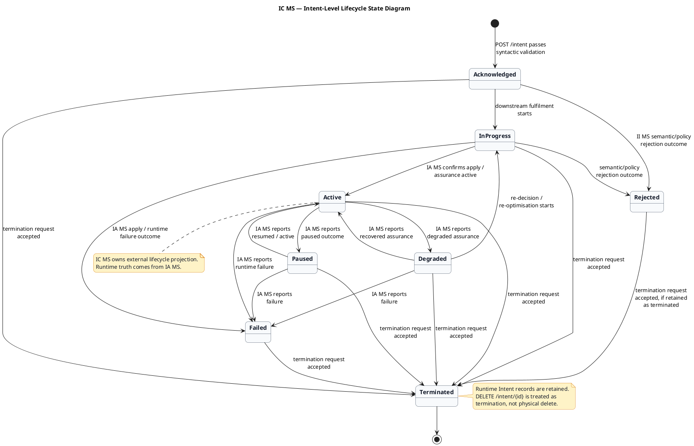
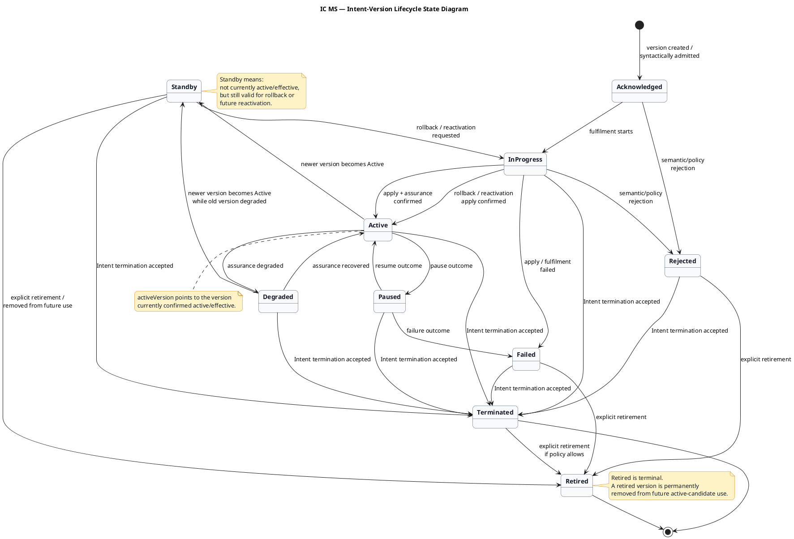

# ic_ms_design_brief.md

## Service identity:

| **Item** | **Baseline** |
|---|---|
| Full name | Intent Controller MS |
| Short name | IC MS |
| Service name | `intent-controller-ms` |
| Domain | Intent Domain |
| Primary resource | `Intent` |
| Secondary resource | `IntentReport` |
| Primary responsibility | TMF-facing runtime intent controller and lifecycle/status projection |

## IC MS core purpose:

IC MS owns the runtime intent API boundary for the Intent Enabler.

It is responsible for:

| **Area** | **IC MS responsibility** |
|---|---|
| External `Intent` API | Create, retrieve, list, update, patch, delete runtime intents |
| External `IntentReport` API | Expose read-only assurance/report projections for intents |
| Runtime lifecycle/status projection | Own external `Intent.lifecycleStatus`, `statusReason`, and `statusChangeDate` |
| Syntactic validation | Validate incoming runtime `Intent` against active `IntentSpecification` from ID MS |
| Initial admission | Accept syntactically valid requests and project `Acknowledged` |
| State/progress event publication | Emit `IntentValidatedEvent` to the internal event backbone after syntactic validation succeeds |
| Rejection projection | Consume rejection outcome from II MS and project `Rejected` |
| Assurance projection | Consume `IntentAssuranceEvent` from IA MS and update external `Intent` / `IntentReport` |
| External events | Emit TMF-style `Intent*Event` and `IntentReport*Event` events |

## IC MS does not own:

| **Not owned by IC MS** | **Owner** |
|---|---|
| `IntentSpecification` design-time catalogue | ID MS |
| Semantic validation | II MS |
| Policy validation | II MS + lightweight II MS KP + `t7.knowledge plane` |
| Knowledge resolution | II MS + `t7.knowledge plane` |
| Optimisation | `t7.optimiser` |
| Network apply | IA MS + `t7.orchestrator` |
| Runtime assurance truth | IA MS |
| Real-time telemetry | `t7.telemetry` consumed by IA MS |
| Callback ingestion | ICB MS |
| Raw orchestrator callback interpretation | IA MS |

## IC MS API surface:

### Intent resource APIs:

| **Purpose** | **Method** | **Endpoint** |
|---|---:|---|
| Create runtime intent | `POST` | `/intentManagement/v5/intent` |
| List runtime intents | `GET` | `/intentManagement/v5/intent` |
| Retrieve runtime intent by ID | `GET` | `/intentManagement/v5/intent/{id}` |
| Full replace runtime intent | `PUT` | `/intentManagement/v5/intent/{id}` |
| Partial update runtime intent | `PATCH` | `/intentManagement/v5/intent/{id}` |
| Delete / terminate runtime intent | `DELETE` | `/intentManagement/v5/intent/{id}` |

### IntentReport APIs:

| **Purpose** | **Method** | **Endpoint** |
|---|---:|---|
| List reports for intent | `GET` | `/intentManagement/v5/intent/{intentId}/intentReport` |
| Retrieve report by ID | `GET` | `/intentManagement/v5/intent/{intentId}/intentReport/{id}` |

### Hub subscription APIs:

Strict TMF route form:

| **Purpose** | **Method** | **Endpoint** |
|---|---:|---|
| Create event subscription | `POST` | `/intentManagement/v5/hub` |
| Delete event subscription | `DELETE` | `/intentManagement/v5/hub/{id}` |

Accepted domain-scoped platform extension:

| **Purpose** | **Method** | **Endpoint** |
|---|---:|---|
| Create intent event subscription | `POST` | `/intentManagement/v5/intent/hub` |
| Retrieve intent event subscription | `GET` | `/intentManagement/v5/intent/hub/{id}` |
| Delete intent event subscription | `DELETE` | `/intentManagement/v5/intent/hub/{id}` |

## IC MS validation responsibility:

On `POST /intentManagement/v5/intent`, IC MS:

1. receives the external runtime intent request
2. validates basic TMF/resource shape
3. resolves the referenced `IntentSpecification`
4. validates the request against the active `IntentSpecification`
5. rejects syntactically invalid requests
6. accepts syntactically valid requests
7. creates/persists the external `Intent` projection
8. sets initial `lifecycleStatus = Acknowledged`
9. emits `IntentValidatedEvent` to the internal event backbone after syntactic validation succeeds

IC MS validates syntax and contract shape only.

It does not decide semantic meaning, network feasibility, policy allowability, resource candidates, optimisation, apply result, or runtime assurance truth.

## IntentValidatedEvent production rule:

IC MS does not emit `IntentValidatedEvent` as a point-to-point command for one specific consumer.

IC MS emits `IntentValidatedEvent` as a platform state/progress event that states:

```text
This Intent has passed IC MS syntactic validation and has been admitted into the intent lifecycle.
```

Current primary consumer:

```text
II MS / intent-intelligence-ms
```

II MS is the current primary consumer because it performs semantic validation and resolution. However, the event is not defined only for II MS. It may be consumed by other authorised internal consumers where useful.

### Rule:

`IntentValidatedEvent` is a state/progress event, not a point-to-point command.

## IC MS lifecycle/status projection:

IC MS externally exposes lifecycle/status using:

```json
{
  "lifecycleStatus": "Acknowledged",
  "statusReason": "Intent request accepted for semantic validation and fulfilment.",
  "statusChangeDate": "2026-04-18T12:00:00+10:00"
}
```

### Lifecycle values:

```text
Acknowledged
InProgress
Active
Degraded
Paused
Rejected
Failed
Terminated
```

### Lifecycle ownership rule:

IC MS owns the external lifecycle/status projection, but not the runtime truth.

| **Lifecycle/status source** | **IC MS action** |
|---|---|
| IC MS syntactic validation succeeds | Project `Acknowledged` |
| II MS semantic/policy rejection | Project `Rejected` |
| IA MS apply success / active assurance | Project `Active` |
| IA MS degraded assurance | Project `Degraded` |
| IA MS paused/failed/terminated outcome | Project `Paused`, `Failed`, or `Terminated` |
| Delete/terminate request accepted | Project termination path according to final delete/terminate rules |

## Internal event interactions:

### Produces:

```text
IntentValidatedEvent
```

Meaning:

```text
The runtime Intent has passed IC MS syntactic validation and is admitted for downstream semantic validation, resolution, and fulfilment processing.
```

### Current primary consumer:

```text
II MS / intent-intelligence-ms
```

### Consumes:

```text
IntentRejectedEvent
IntentAssuranceEvent
```

### Does not consume by default:

```text
IntentCallbackEvent
```

`IntentCallbackEvent` is consumed by IA MS. IA MS maps callback/orchestrator state into assurance/lifecycle truth and emits `IntentAssuranceEvent`.

## External event family:

IC MS emits TMF-style external events for `Intent` and `IntentReport` projection changes.

### Intent events:

```text
IntentCreateEvent
IntentAttributeValueChangeEvent
IntentStatusChangeEvent
IntentDeleteEvent
```

### IntentReport events:

```text
IntentReportCreateEvent
IntentReportAttributeValueChangeEvent
IntentReportDeleteEvent
```

These events are external projection/resource events only.

They must not expose raw telemetry, raw optimiser decisions, raw `t7.knowledge plane` data, raw callback payloads, internal candidate scoring, internal Kafka event payloads, or full internal `IntentAssuranceEvent` body unless deliberately curated into `IntentReport`.

## IntentReport responsibility:

`IntentReport` is a read-only external report projection owned by IC MS.

It is based on assurance truth from IA MS, but it is not raw assurance telemetry.

IntentReport may contain curated information such as current lifecycle/status, status reason, assurance summary, current service/resource summary, evaluation summary, violation/degradation summary, last assurance update time, and references to the related `Intent`.

IntentReport should not expose implementation-only details unless they are explicitly approved for external reporting.

## TMF compliance and platform extension rule:

IC MS remains TMF-aligned at the external contract level, but controlled platform extensions are acceptable when documented, non-breaking, and semantically compatible with TMF.

Strict TMF-compatible update operation:

```http
PATCH /intentManagement/v5/intent/{id}
```

Accepted platform extension:

```http
PUT /intentManagement/v5/intent/{id}
```

Platform preference:

- `PUT` is preferred for deterministic full replacement where supported.
- `PATCH` is supported for TMF compatibility but not encouraged for ordinary edits.

## IC MS boundary statement:

**IC MS is the TMF-facing runtime intent controller. It owns external `Intent` and `IntentReport` resources, performs syntactic validation against active `IntentSpecification`, emits `IntentValidatedEvent` as an internal state/progress event, and projects external lifecycle/status from II MS rejection outcomes and IA MS assurance outcomes. IC MS does not perform semantic validation, policy validation, optimisation, network apply, runtime assurance, telemetry ingestion, or callback mediation.**

## Lifecycle/status and versioning baseline:

### Intent-level lifecycleStatus:

The overall external Intent lifecycle remains:

```text
Acknowledged
InProgress
Active
Degraded
Paused
Rejected
Failed
Terminated
```

### Intent-version lifecycleStatus:

Individual Intent versions can use:

```text
Acknowledged
InProgress
Active
Standby
Degraded
Paused
Rejected
Failed
Terminated
Retired
```

### Version state meanings:

| **Version lifecycleStatus** | **Meaning** |
|---|---|
| `Acknowledged` | Version accepted after syntactic validation |
| `InProgress` | Version is being semantically resolved, optimised, applied, or assured |
| `Active` | Version is currently active/effective in the network/service |
| `Standby` | Version is not currently active/effective, but is retained as a valid rollback or future reactivation candidate |
| `Degraded` | Version is still active/effective, but runtime assurance is degraded |
| `Paused` | Version is temporarily paused where applicable |
| `Rejected` | Version was rejected before successful fulfilment |
| `Failed` | Version failed during fulfilment, apply, or runtime processing |
| `Terminated` | Version was stopped because the Intent/service was terminated |
| `Retired` | Version is permanently removed from future active-candidate use; terminal |

### Version pointer:

Use:

```json
{
  "activeVersion": "v1"
}
```

Do not use:

```json
{
  "effectiveVersion": "v1"
}
```

or:

```json
{
  "currentVersion": "v1"
}
```

### Why `activeVersion`:

| **Term** | **Decision** | **Reason** |
|---|---|---|
| `activeVersion` | Use | Natural and clearly points to the version currently active/effective in the network/service |
| `effectiveVersion` | Do not use | Accurate, but less natural |
| `currentVersion` | Do not use | Ambiguous; could mean latest submitted, latest edited, latest stored, or active |

### Lifecycle/status ownership:

IC MS owns the external lifecycle/status projection, not the runtime truth.

Runtime truth comes from:

| **Source** | **Meaning** |
|---|---|
| IC MS | Syntactic admission only |
| II MS | Semantic/policy rejection outcome |
| IA MS | Apply, active, degraded, failed, paused, and runtime assurance outcomes |
| External client/OEX | Termination request |

### Lifecycle/versioning example:

| **Step** | **Trigger / event** | **Intent version** | **Version lifecycleStatus** | **Intent activeVersion** | **IC MS external projection** |
|---:|---|---|---|---|---|
| 1 | `POST /intent` passes syntactic validation | `v1` | `Acknowledged` | none | Intent admitted; `IntentValidatedEvent` emitted |
| 2 | Downstream fulfilment starts | `v1` | `InProgress` | none | Intent is being processed |
| 3 | IA MS confirms apply/assurance active | `v1` | `Active` | `v1` | Intent active; `v1` becomes active version |
| 4 | Runtime degradation reported by IA MS | `v1` | `Degraded` | `v1` | Intent degraded, but `v1` remains `activeVersion` |
| 5 | Meaningful update accepted, creates new version | `v2` | `Acknowledged` / `InProgress` | `v1` | New version being processed; service still running on `v1` |
| 6 | IA MS confirms updated apply active | `v2` | `Active` | `v2` | `v2` becomes `activeVersion` |
| 7 | `v2` becomes `activeVersion` | `v1` | `Standby` | `v2` | `v1` no longer active/effective, but remains a rollback candidate |
| 8 | Rollback requested | `v1` | `InProgress` | `v2` | `v1` being reapplied; `v2` still active until rollback is confirmed |
| 9 | Rollback apply confirmed | `v1` | `Active` | `v1` | `v1` becomes `activeVersion` again |
| 10 | Rollback completes | `v2` | `Standby` | `v1` | `v2` no longer active, but remains a future candidate |
| 11 | Version explicitly removed from future use | `v2` | `Retired` | `v1` | `v2` is terminal and cannot become active again |
| 12 | Termination request accepted | active version | `Terminated` | last active version retained | Intent projection moves to `Terminated`; record retained |

### Example JSON — while v2 is still being processed:

```json
{
  "id": "INT-HOSP-2026-001",
  "lifecycleStatus": "InProgress",
  "activeVersion": "v1",
  "versions": [
    {
      "version": "v1",
      "lifecycleStatus": "Active"
    },
    {
      "version": "v2",
      "lifecycleStatus": "InProgress"
    }
  ]
}
```

### Example JSON — after v2 becomes active:

```json
{
  "id": "INT-HOSP-2026-001",
  "lifecycleStatus": "Active",
  "activeVersion": "v2",
  "versions": [
    {
      "version": "v1",
      "lifecycleStatus": "Standby"
    },
    {
      "version": "v2",
      "lifecycleStatus": "Active"
    }
  ]
}
```

### Example JSON — during rollback to v1:

```json
{
  "id": "INT-HOSP-2026-001",
  "lifecycleStatus": "InProgress",
  "activeVersion": "v2",
  "versions": [
    {
      "version": "v1",
      "lifecycleStatus": "InProgress"
    },
    {
      "version": "v2",
      "lifecycleStatus": "Active"
    }
  ]
}
```

### Example JSON — after rollback to v1 is confirmed:

```json
{
  "id": "INT-HOSP-2026-001",
  "lifecycleStatus": "Active",
  "activeVersion": "v1",
  "versions": [
    {
      "version": "v1",
      "lifecycleStatus": "Active"
    },
    {
      "version": "v2",
      "lifecycleStatus": "Standby"
    }
  ]
}
```

### Example JSON — after v2 is retired from future use:

```json
{
  "id": "INT-HOSP-2026-001",
  "lifecycleStatus": "Active",
  "activeVersion": "v1",
  "versions": [
    {
      "version": "v1",
      "lifecycleStatus": "Active"
    },
    {
      "version": "v2",
      "lifecycleStatus": "Retired"
    }
  ]
}
```

### Example JSON — after termination:

```json
{
  "id": "INT-HOSP-2026-001",
  "lifecycleStatus": "Terminated",
  "activeVersion": "v1",
  "versions": [
    {
      "version": "v1",
      "lifecycleStatus": "Terminated"
    },
    {
      "version": "v2",
      "lifecycleStatus": "Retired"
    }
  ]
}
```

### Delete/terminate rule:

IC MS does not physically delete runtime `Intent` records by default.

`DELETE /intentManagement/v5/intent/{id}` or equivalent terminate flow is treated as a termination request.

The retained `Intent` record remains available for:

- audit
- reporting
- lifecycle history
- traceability
- existing `IntentReport` references

### Final baseline statements:

**Use `activeVersion`, not `effectiveVersion` or `currentVersion`, for the Intent version currently confirmed active/effective in the network/service.**

**When a newer Intent version becomes `Active`, IC MS moves `activeVersion` to the newer version and transitions the previously active version to `Standby`. `Standby` means the version is no longer currently active/effective, but is retained as a valid rollback or future reactivation candidate.**

**`Retired` is terminal and means the version is permanently removed from future active-candidate use. Once a version is `Retired`, its lifecycle state cannot change again.**

**IC MS does not physically delete runtime `Intent` records by default. Termination transitions the retained Intent projection to `Terminated` for audit, reporting, lifecycle history, and traceability.**

**IC MS must not invent runtime lifecycle truth. It projects external `Intent.lifecycleStatus`, `statusReason`, and `statusChangeDate` based on syntactic admission, II MS rejection outcomes, IA MS assurance outcomes, and accepted termination requests.**

## Intent lifecycle state diagrams:

### Purpose:

IC MS lifecycle modelling is split into two related views:

1. Intent-level lifecycle — the external `Intent.lifecycleStatus` that IC MS projects.
2. Intent-version lifecycle — the lifecycle of each runtime Intent version, including `Standby` and `Retired`.

Important rule:

`Standby` and `Retired` are version-level states, not overall Intent lifecycle states.

### Intent-level lifecycle states:

```text
Acknowledged
InProgress
Active
Degraded
Paused
Rejected
Failed
Terminated
```

### Intent-version lifecycle states:

```text
Acknowledged
InProgress
Active
Standby
Degraded
Paused
Rejected
Failed
Terminated
Retired
```

### Key lifecycle rules:

| **Rule** | **Baseline** |
|---|---|
| Initial syntactic success | Intent/version starts as `Acknowledged` |
| Semantic/policy rejection | Moves to `Rejected` |
| Fulfilment/apply starts | Moves to `InProgress` |
| Assurance confirms active | Moves to `Active` |
| Runtime degradation | Active version can move to `Degraded` while remaining `activeVersion` |
| Recovery from degradation | `Degraded -> Active` |
| New version becomes active | New version becomes `Active`; previous active version moves to `Standby` |
| Rollback | `Standby -> InProgress -> Active`; previous active version moves to `Standby` |
| Explicit retirement | Version moves to `Retired`; terminal |
| Termination | Intent-level moves to `Terminated`; active version moves to `Terminated`; records retained |
| Physical delete | Not baselined for runtime `Intent` |

### Intent-level lifecycle PlantUML:

File: `ic_ms_intent_lifecycle_state_diagram.puml`



### Intent-version lifecycle PlantUML:

File: `ic_ms_intent_version_lifecycle_state_diagram.puml`



### Example activeVersion transition:

```text
v1 Active, activeVersion = v1
-> v2 created, v2 InProgress, activeVersion still v1
-> v2 Active, activeVersion = v2, v1 moves to Standby
-> rollback requested, v1 InProgress, activeVersion still v2
-> rollback confirmed, v1 Active, activeVersion = v1, v2 moves to Standby
```

### Baseline statement:

IC MS lifecycle diagrams must keep Intent-level lifecycle and Intent-version lifecycle separate. The external Intent lifecycle is what IC MS projects to callers. Version lifecycle tracks each runtime version and includes `Standby` for rollback/reactivation candidates and `Retired` as a terminal state for versions permanently removed from future active-candidate use.

## External Intent projection and version visibility baseline:

### External projection rule:

For the external `Intent` resource, IC MS projects the currently relevant version of that Intent ID.

This means:

- `GET /intent/{id}` returns the current projected version for that Intent ID.
- `GET /intent` lists current projected versions for retained Intent IDs.
- The returned `version` is the projected runtime version.
- IC MS does not return the full internal version aggregate by default.
- Internal version history, `Standby`, `Retired`, rollback candidates, and previous versions remain internal unless exposed through `IntentReport` or a documented platform extension.

### GET /intent/{id} example:

```http
GET /intentManagement/v5/intent/INT-HOSP-2026-001
Accept: application/json
```

```json
{
  "id": "INT-HOSP-2026-001",
  "href": "/intentManagement/v5/intent/INT-HOSP-2026-001",
  "name": "Sydney Hospital Surgical Connection Intent",
  "version": "v2",
  "lifecycleStatus": "Active",
  "statusReason": "Intent version v2 is active and assurance is healthy.",
  "statusChangeDate": "2026-04-18T12:20:00+10:00",
  "intentSpecification": {
    "id": "hospital-surgical-slice-spec-v1.20",
    "href": "/intentManagement/v5/intentSpecification/hospital-surgical-slice-spec-v1.20"
  },
  "@type": "Intent",
  "@baseType": "Entity"
}
```

### Version-history exposure rule:

Internal version history is retained for audit, rollback, assurance correlation, and traceability.

Historical versions are not returned by default in the external `Intent` resource.

If needed, version history may be exposed through one of the following:

| **Mechanism** | **Purpose** |
|---|---|
| `IntentReport` | Curated external reporting/history projection |
| Documented platform extension | Explicit version inspection endpoint if required later |
| Internal operational tooling | Operator/debug use without changing external TMF-facing resource shape |

### Baseline statement:

**For the external `Intent` resource, IC MS simply projects the currently relevant version of that Intent ID. `GET /intent/{id}` and `GET /intent` return current projected Intent state, not the full internal version aggregate. The returned `version` is the projected runtime version. Internal version history, `Standby`, `Retired`, rollback candidates, and previous versions remain internal unless exposed through `IntentReport` or a documented platform extension.**
