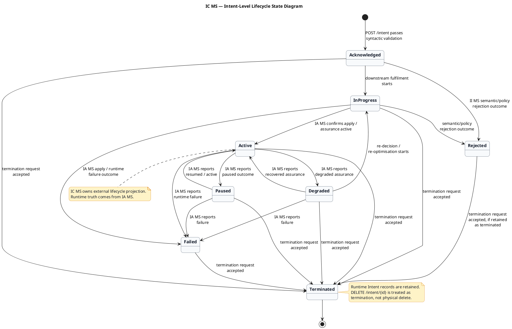
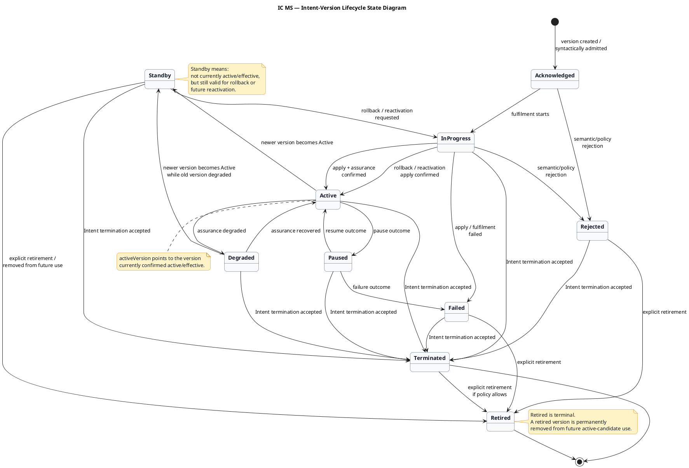

# ic_ms_design_brief.md

## Service identity:

| **Item** | **Baseline** |
|---|---|
| Full name | Intent Controller MS |
| Short name | IC MS |
| Service name | `intent-controller-ms` |
| Domain | Intent Domain |
| Primary resource | `Intent` |
| Secondary resource | `IntentReport` |
| Primary responsibility | TMF-facing runtime intent controller and lifecycle/status projection |

## IC MS core purpose:

IC MS owns the runtime intent API boundary for the Intent Enabler.

It is responsible for:

| **Area** | **IC MS responsibility** |
|---|---|
| External `Intent` API | Create, retrieve, list, update, patch, delete runtime intents |
| External `IntentReport` API | Expose read-only assurance/report projections for intents |
| Runtime lifecycle/status projection | Own external `Intent.lifecycleStatus`, `statusReason`, and `statusChangeDate` |
| Syntactic validation | Validate incoming runtime `Intent` against active `IntentSpecification` from ID MS |
| Initial admission | Accept syntactically valid requests and project `Acknowledged` |
| State/progress event publication | Emit `IntentValidatedEvent` to the internal event backbone after syntactic validation succeeds |
| Rejection projection | Consume rejection outcome from II MS and project `Rejected` |
| Assurance projection | Consume `IntentAssuranceEvent` from IA MS and update external `Intent` / `IntentReport` |
| External events | Emit TMF-style `Intent*Event` and `IntentReport*Event` events |

## IC MS does not own:

| **Not owned by IC MS** | **Owner** |
|---|---|
| `IntentSpecification` design-time catalogue | ID MS |
| Semantic validation | II MS |
| Policy validation | II MS + lightweight II MS KP + `t7.knowledge plane` |
| Knowledge resolution | II MS + `t7.knowledge plane` |
| Optimisation | `optimiser-controller-ms` using optimiser backends such as `t7-gurobi-optimiser` where relevant |
| Network apply / orchestration execution | Orchestration layer / network orchestrator |
| Apply outcome interpretation | IA MS |
| Runtime assurance truth | IA MS |
| Real-time telemetry | `t7.telemetry` consumed by IA MS |
| Callback ingestion | ICB MS |
| Raw orchestrator callback interpretation | IA MS |

## IC MS API surface:

### Deployment path convention:

Examples in this design brief use the platform route prefix:

```http
/intentManagement/v5
```

Strict TMF gateway exposure may use:

```http
/tmf-api/intentManagement/v5
```

The API gateway may map between the external TMF deployment prefix and the internal platform route prefix without changing IC MS resource ownership or operation semantics.

### Intent resource APIs:

| **Purpose** | **Method** | **Endpoint** |
|---|---:|---|
| Create runtime intent | `POST` | `/intentManagement/v5/intent` |
| List runtime intents | `GET` | `/intentManagement/v5/intent` |
| Retrieve runtime intent by ID | `GET` | `/intentManagement/v5/intent/{id}` |
| Full replace runtime intent | `PUT` | `/intentManagement/v5/intent/{id}` |
| Partial update runtime intent | `PATCH` | `/intentManagement/v5/intent/{id}` |
| Delete / terminate runtime intent | `DELETE` | `/intentManagement/v5/intent/{id}` |

### IntentReport APIs:

| **Purpose** | **Method** | **Endpoint** |
|---|---:|---|
| List reports for intent | `GET` | `/intentManagement/v5/intent/{intentId}/intentReport` |
| Retrieve report by ID | `GET` | `/intentManagement/v5/intent/{intentId}/intentReport/{id}` |

### Hub subscription APIs:

Strict TMF route form:

| **Purpose** | **Method** | **Endpoint** |
|---|---:|---|
| Create event subscription | `POST` | `/intentManagement/v5/hub` |
| Delete event subscription | `DELETE` | `/intentManagement/v5/hub/{id}` |

Accepted domain-scoped platform extension:

| **Purpose** | **Method** | **Endpoint** |
|---|---:|---|
| Create intent event subscription | `POST` | `/intentManagement/v5/intent/hub` |
| Retrieve intent event subscription | `GET` | `/intentManagement/v5/intent/hub/{id}` |
| Delete intent event subscription | `DELETE` | `/intentManagement/v5/intent/hub/{id}` |

Strict TMF hub routes are rooted at `/intentManagement/v5/hub`. IC MS also supports the domain-scoped `/intentManagement/v5/intent/hub` route family as an approved platform extension for Intent and IntentReport event subscriptions. `GET /intentManagement/v5/intent/hub/{id}` is an operational convenience extension and is not part of the strict minimum TMF hub operation set.

## IC MS validation responsibility:

On `POST /intentManagement/v5/intent`, IC MS:

1. receives the external runtime intent request
2. validates basic TMF/resource shape
3. resolves the referenced `IntentSpecification`
4. validates the request against the active `IntentSpecification`
5. rejects syntactically invalid requests
6. accepts syntactically valid requests
7. creates/persists the external `Intent` projection
8. sets initial `lifecycleStatus = Acknowledged`
9. emits `IntentValidatedEvent` to the internal event backbone after syntactic validation succeeds

IC MS validates syntax and contract shape only.

It does not decide semantic meaning, network feasibility, policy allowability, resource candidates, optimisation, apply result, or runtime assurance truth.

## IntentValidatedEvent production rule:

IC MS does not emit `IntentValidatedEvent` as a point-to-point command for one specific consumer.

IC MS emits `IntentValidatedEvent` as a platform state/progress event that states:

```text
This Intent has passed IC MS syntactic validation and has been admitted into the intent lifecycle.
```

Current primary consumer:

```text
II MS / intent-intelligence-ms
```

II MS is the current primary consumer because it performs semantic validation and resolution. However, the event is not defined only for II MS. It may be consumed by other authorised internal consumers where useful.

### Rule:

`IntentValidatedEvent` is a state/progress event, not a point-to-point command.

## IC MS lifecycle/status projection:

IC MS externally exposes lifecycle/status using:

```json
{
  "lifecycleStatus": "Acknowledged",
  "statusReason": "Intent request accepted for semantic validation and fulfilment.",
  "statusChangeDate": "2026-04-18T12:00:00+10:00"
}
```

### Lifecycle values:

```text
Acknowledged
InProgress
Active
Degraded
Paused
Rejected
Failed
Terminated
```

### Lifecycle ownership rule:

IC MS owns the external lifecycle/status projection, but not the runtime truth.

| **Lifecycle/status source** | **IC MS action** |
|---|---|
| IC MS syntactic validation succeeds | Project `Acknowledged` |
| II MS semantic/policy rejection | Project `Rejected` |
| IA MS apply success / active assurance | Project `Active` |
| IA MS degraded assurance | Project `Degraded` |
| IA MS paused/failed/terminated outcome | Project `Paused`, `Failed`, or `Terminated` |
| Delete/terminate request accepted | Project termination path according to final delete/terminate rules |

## Internal event interactions:

### Produces:

```text
IntentValidatedEvent
```

Meaning:

```text
The runtime Intent has passed IC MS syntactic validation and is admitted for downstream semantic validation, resolution, and fulfilment processing.
```

### Current primary consumer:

```text
II MS / intent-intelligence-ms
```

### Consumes:

```text
IntentRejectedEvent
IntentAssuranceEvent
```

### Does not consume by default:

```text
IntentCallbackEvent
```

`IntentCallbackEvent` is consumed by IA MS. IA MS maps callback/orchestrator state into assurance/lifecycle truth and emits `IntentAssuranceEvent`.

## External event family:

IC MS emits TMF-style external events for `Intent` and `IntentReport` projection changes.

### Intent events:

```text
IntentCreateEvent
IntentAttributeValueChangeEvent
IntentStatusChangeEvent
IntentDeleteEvent
```

### IntentReport events:

```text
IntentReportCreateEvent
IntentReportAttributeValueChangeEvent
IntentReportDeleteEvent
```

`IntentReportDeleteEvent` is retained in this vocabulary for TMF alignment and governed internal/admin deletion or retention purge scenarios only; it is not emitted for ordinary external consumer delete because that operation is not exposed by default.

### External event timestamp rule:

External TMF-facing event examples and emitted event envelopes populate both `eventTime` and `timeOccurred` with the same canonical event occurrence timestamp. `timeOccurred` is the corrected platform spelling used consistently across IC MS and ID MS external event examples.

These events are external projection/resource events only.

They must not expose raw telemetry, raw optimiser decisions, raw `t7.knowledge plane` data, raw callback payloads, internal candidate scoring, internal Kafka event payloads, or full internal `IntentAssuranceEvent` body unless deliberately curated into `IntentReport`.

## IntentReport responsibility:

`IntentReport` is a read-only external report projection owned by IC MS.

It is based on assurance truth from IA MS, but it is not raw assurance telemetry and not the raw `IntentAssuranceEvent` body.

IntentReport uses the TMF expression wrapper. Curated report facts are carried inside `IntentReport.expression.expressionValue`. The default report areas are:

- `version`
- `lifecycleStatus`
- `reportTime`
- `summary`
- `statusReason` where useful
- `serviceSummary`
- `resourceSummary` where useful
- `targetSummary`
- `observationSummary`

`targetSummary` is fact-only by default: target value, observed value, and unit. It does not include aggregate compliance-result labels or per-target `status` by default. Consumers decide compliance from the facts.

IntentReport should not expose raw telemetry dumps, raw callback payloads, raw optimiser details, raw KP data, internal candidate scoring, internal Kafka payloads, or implementation-only details unless deliberately curated and approved for external reporting.


### IntentReport delete posture

`IntentReport` is read-only from ordinary external API consumers. IC MS does not expose ordinary external `DELETE /intentManagement/v5/intent/{intentId}/intentReport/{id}` through NGW or public TMF-facing consumer APIs by default.

External consumers can list and retrieve `IntentReport` records only.

Reason: `IntentReport` is a curated assurance/lifecycle report projection and audit/history record. Deleting it as a normal consumer operation would remove traceability and would require a separate report lifecycle such as `Archived` or `Deleted`, which is deliberately not baselined.

IC MS may provide an internal-only governed `IntentReport` delete/purge capability. This capability is not routed through NGW, not advertised as a public consumer API, and not available to normal external consumers. It is restricted to retention purge, legal deletion, platform administration, approved data-correction workflows, or policy-governed cleanup.

If a deployment must expose the TMF report delete route for compatibility, it must be restricted/admin-only or return a policy error such as `403 Forbidden` or `405 Method Not Allowed` for ordinary consumers.

`IntentReportDeleteEvent` remains part of the external TMF-style event vocabulary for `IntentReport` alignment. It may be emitted only after successful governed internal/admin removal where notification is allowed by policy. It is not emitted as the result of ordinary external consumer delete because ordinary report delete is not exposed.

No separate `IntentReport` lifecycle is baselined for ordinary consumer use because delete/purge is a governed administrative operation, not a normal report lifecycle transition.


## TMF compliance and platform extension baseline:

IC MS remains TMF-aligned at the external contract level, while retaining documented, non-breaking platform extensions for deterministic update, domain-scoped subscription management, concurrency, and retained projection governance.

Strict TMF-compatible external operations:

| **Resource area** | **Strict TMF-compatible operations** |
|---|---|
| `Intent` | `POST /intentManagement/v5/intent`, `GET /intentManagement/v5/intent`, `GET /intentManagement/v5/intent/{id}`, `PATCH /intentManagement/v5/intent/{id}`, `DELETE /intentManagement/v5/intent/{id}` |
| `IntentReport` | `GET /intentManagement/v5/intent/{intentId}/intentReport`, `GET /intentManagement/v5/intent/{intentId}/intentReport/{id}` |
| Hub subscription | `POST /intentManagement/v5/hub`, `DELETE /intentManagement/v5/hub/{id}` |

Approved IC MS platform extensions:

| **Extension** | **Purpose / boundary** |
|---|---|
| `PUT /intentManagement/v5/intent/{id}` | Deterministic full replacement where supported; `PATCH` remains available for strict TMF-compatible clients. |
| `/intentManagement/v5/intent/hub` | Domain-scoped subscription route for IC-owned `Intent*Event` and `IntentReport*Event` notifications. |
| `GET /intentManagement/v5/intent/hub/{id}` | Operational convenience for retrieving a domain-scoped subscription. Not part of the strict minimum TMF hub operation set. |
| `ETag` / `If-Match` with `428 Precondition Required` and `412 Precondition Failed` | Platform optimistic-concurrency policy for unsafe operations. |
| Termination-retention behaviour for `DELETE /intent/{id}` | `DELETE` is treated as termination of the retained runtime `Intent` projection, not physical deletion by default. |
| Governed/admin-only `IntentReport` delete posture | Ordinary external consumers list/retrieve reports only; internal/admin purge may emit `IntentReportDeleteEvent` where policy allows. |

Platform preference:

- `PUT` is preferred for deterministic full replacement where supported.
- `PATCH` is supported for TMF compatibility but not encouraged for ordinary edits.
- Strict TMF clients can use `PATCH` and root `/hub` routes; platform-aware clients can use the documented IC domain-scoped routes and `PUT` extension where allowed.

## IC MS boundary statement:

**IC MS is the TMF-facing runtime intent controller. It owns external `Intent` and `IntentReport` resources, performs syntactic validation against active `IntentSpecification`, emits `IntentValidatedEvent` as an internal state/progress event, and projects external lifecycle/status from II MS rejection outcomes and IA MS assurance outcomes. IC MS does not perform semantic validation, policy validation, optimisation, network apply, runtime assurance, telemetry ingestion, or callback mediation.**

## Lifecycle/status and versioning baseline:

### Intent-level lifecycleStatus:

The overall external Intent lifecycle remains:

```text
Acknowledged
InProgress
Active
Degraded
Paused
Rejected
Failed
Terminated
```

### Intent-version lifecycleStatus:

Individual Intent versions can use:

```text
Acknowledged
InProgress
Active
Standby
Degraded
Paused
Rejected
Failed
Terminated
Retired
```

### Version state meanings:

| **Version lifecycleStatus** | **Meaning** |
|---|---|
| `Acknowledged` | Version accepted after syntactic validation |
| `InProgress` | Version is being semantically resolved, optimised, applied, or assured |
| `Active` | Version is currently active/effective in the network/service |
| `Standby` | Version is not currently active/effective, but is retained as a valid rollback or future reactivation candidate |
| `Degraded` | Version is still active/effective, but runtime assurance is degraded |
| `Paused` | Version is temporarily paused where applicable |
| `Rejected` | Version was rejected before successful fulfilment |
| `Failed` | Version failed during fulfilment, apply, or runtime processing |
| `Terminated` | Version was stopped because the Intent/service was terminated |
| `Retired` | Version is permanently removed from future active-candidate use; terminal |

### Version pointer:

Use:

```json
{
  "activeVersion": "v1"
}
```

Do not use:

```json
{
  "effectiveVersion": "v1"
}
```

or:

```json
{
  "currentVersion": "v1"
}
```

### Why `activeVersion`:

| **Term** | **Decision** | **Reason** |
|---|---|---|
| `activeVersion` | Use | Natural and clearly points to the version currently active/effective in the network/service |
| `effectiveVersion` | Do not use | Accurate, but less natural |
| `currentVersion` | Do not use | Ambiguous; could mean latest submitted, latest edited, latest stored, or active |

### Lifecycle/status ownership:

IC MS owns the external lifecycle/status projection, not the runtime truth.

Runtime truth comes from:

| **Source** | **Meaning** |
|---|---|
| IC MS | Syntactic admission only |
| II MS | Semantic/policy rejection outcome |
| IA MS | Apply, active, degraded, failed, paused, and runtime assurance outcomes |
| External client/OEX | Termination request |

### Lifecycle/versioning example:

| **Step** | **Trigger / event** | **Intent version** | **Version lifecycleStatus** | **Intent activeVersion** | **IC MS external projection** |
|---:|---|---|---|---|---|
| 1 | `POST /intent` passes syntactic validation | `v1` | `Acknowledged` | none | Intent admitted; `IntentValidatedEvent` emitted |
| 2 | Downstream fulfilment starts | `v1` | `InProgress` | none | Intent is being processed |
| 3 | IA MS confirms apply/assurance active | `v1` | `Active` | `v1` | Intent active; `v1` becomes active version |
| 4 | Runtime degradation reported by IA MS | `v1` | `Degraded` | `v1` | Intent degraded, but `v1` remains `activeVersion` |
| 5 | Meaningful update accepted, creates new version | `v2` | `Acknowledged` / `InProgress` | `v1` | New version being processed; service still running on `v1` |
| 6 | IA MS confirms updated apply active | `v2` | `Active` | `v2` | `v2` becomes `activeVersion` |
| 7 | `v2` becomes `activeVersion` | `v1` | `Standby` | `v2` | `v1` no longer active/effective, but remains a rollback candidate |
| 8 | Rollback requested | `v1` | `InProgress` | `v2` | `v1` being reapplied; `v2` still active until rollback is confirmed |
| 9 | Rollback apply confirmed | `v1` | `Active` | `v1` | `v1` becomes `activeVersion` again |
| 10 | Rollback completes | `v2` | `Standby` | `v1` | `v2` no longer active, but remains a future candidate |
| 11 | Version explicitly removed from future use | `v2` | `Retired` | `v1` | `v2` is terminal and cannot become active again |
| 12 | Termination request accepted | active version | `Terminated` | last active version retained | Intent projection moves to `Terminated`; record retained |

### Example JSON — while v2 is still being processed:

```json
{
  "id": "INT-HOSP-2026-001",
  "lifecycleStatus": "InProgress",
  "activeVersion": "v1",
  "versions": [
    {
      "version": "v1",
      "lifecycleStatus": "Active"
    },
    {
      "version": "v2",
      "lifecycleStatus": "InProgress"
    }
  ]
}
```

### Example JSON — after v2 becomes active:

```json
{
  "id": "INT-HOSP-2026-001",
  "lifecycleStatus": "Active",
  "activeVersion": "v2",
  "versions": [
    {
      "version": "v1",
      "lifecycleStatus": "Standby"
    },
    {
      "version": "v2",
      "lifecycleStatus": "Active"
    }
  ]
}
```

### Example JSON — during rollback to v1:

```json
{
  "id": "INT-HOSP-2026-001",
  "lifecycleStatus": "InProgress",
  "activeVersion": "v2",
  "versions": [
    {
      "version": "v1",
      "lifecycleStatus": "InProgress"
    },
    {
      "version": "v2",
      "lifecycleStatus": "Active"
    }
  ]
}
```

### Example JSON — after rollback to v1 is confirmed:

```json
{
  "id": "INT-HOSP-2026-001",
  "lifecycleStatus": "Active",
  "activeVersion": "v1",
  "versions": [
    {
      "version": "v1",
      "lifecycleStatus": "Active"
    },
    {
      "version": "v2",
      "lifecycleStatus": "Standby"
    }
  ]
}
```

### Example JSON — after v2 is retired from future use:

```json
{
  "id": "INT-HOSP-2026-001",
  "lifecycleStatus": "Active",
  "activeVersion": "v1",
  "versions": [
    {
      "version": "v1",
      "lifecycleStatus": "Active"
    },
    {
      "version": "v2",
      "lifecycleStatus": "Retired"
    }
  ]
}
```

### Example JSON — after termination:

```json
{
  "id": "INT-HOSP-2026-001",
  "lifecycleStatus": "Terminated",
  "activeVersion": "v1",
  "versions": [
    {
      "version": "v1",
      "lifecycleStatus": "Terminated"
    },
    {
      "version": "v2",
      "lifecycleStatus": "Retired"
    }
  ]
}
```

### Delete/terminate rule:

IC MS does not physically delete runtime `Intent` records by default.

`DELETE /intentManagement/v5/intent/{id}` or equivalent terminate flow is treated as a termination request.

The retained `Intent` record remains available for:

- audit
- reporting
- lifecycle history
- traceability
- existing `IntentReport` references

### Final baseline statements:

**Use `activeVersion`, not `effectiveVersion` or `currentVersion`, for the Intent version currently confirmed active/effective in the network/service.**

**When a newer Intent version becomes `Active`, IC MS moves `activeVersion` to the newer version and transitions the previously active version to `Standby`. `Standby` means the version is no longer currently active/effective, but is retained as a valid rollback or future reactivation candidate.**

**`Retired` is terminal and means the version is permanently removed from future active-candidate use. Once a version is `Retired`, its lifecycle state cannot change again.**

**IC MS does not physically delete runtime `Intent` records by default. Termination transitions the retained Intent projection to `Terminated` for audit, reporting, lifecycle history, and traceability.**

**IC MS must not invent runtime lifecycle truth. It projects external `Intent.lifecycleStatus`, `statusReason`, and `statusChangeDate` based on syntactic admission, II MS rejection outcomes, IA MS assurance outcomes, and accepted termination requests.**

## Intent lifecycle state diagrams:

### Purpose:

IC MS lifecycle modelling is split into two related views:

1. Intent-level lifecycle — the external `Intent.lifecycleStatus` that IC MS projects.
2. Intent-version lifecycle — the lifecycle of each runtime Intent version, including `Standby` and `Retired`.

Important rule:

`Standby` and `Retired` are version-level states, not overall Intent lifecycle states.

### Intent-level lifecycle states:

```text
Acknowledged
InProgress
Active
Degraded
Paused
Rejected
Failed
Terminated
```

### Intent-version lifecycle states:

```text
Acknowledged
InProgress
Active
Standby
Degraded
Paused
Rejected
Failed
Terminated
Retired
```

### Key lifecycle rules:

| **Rule** | **Baseline** |
|---|---|
| Initial syntactic success | Intent/version starts as `Acknowledged` |
| Semantic/policy rejection | Moves to `Rejected` |
| Fulfilment/apply starts | Moves to `InProgress` |
| Assurance confirms active | Moves to `Active` |
| Runtime degradation | Active version can move to `Degraded` while remaining `activeVersion` |
| Recovery from degradation | `Degraded -> Active` |
| New version becomes active | New version becomes `Active`; previous active version moves to `Standby` |
| Rollback | `Standby -> InProgress -> Active`; previous active version moves to `Standby` |
| Explicit retirement | Version moves to `Retired`; terminal |
| Termination | Intent-level moves to `Terminated`; active version moves to `Terminated`; records retained |
| Physical delete | Not baselined for runtime `Intent` |

### Intent-level lifecycle PlantUML:

File: `ic_ms_intent_lifecycle_state_diagram.puml`



### Intent-version lifecycle PlantUML:

File: `ic_ms_intent_version_lifecycle_state_diagram.puml`



### Example activeVersion transition:

```text
v1 Active, activeVersion = v1
-> v2 created, v2 InProgress, activeVersion still v1
-> v2 Active, activeVersion = v2, v1 moves to Standby
-> rollback requested, v1 InProgress, activeVersion still v2
-> rollback confirmed, v1 Active, activeVersion = v1, v2 moves to Standby
```

### Baseline statement:

IC MS lifecycle diagrams must keep Intent-level lifecycle and Intent-version lifecycle separate. The external Intent lifecycle is what IC MS projects to callers. Version lifecycle tracks each runtime version and includes `Standby` for rollback/reactivation candidates and `Retired` as a terminal state for versions permanently removed from future active-candidate use.

## External Intent projection and version visibility baseline:

### External projection rule:

For the external `Intent` resource, IC MS projects the currently relevant version of that Intent ID.

This means:

- `GET /intent/{id}` returns the current projected version for that Intent ID.
- `GET /intent` lists current projected versions for retained Intent IDs.
- The returned `version` is the projected runtime version.
- IC MS does not return the full internal version aggregate by default.
- Internal version history, `Standby`, `Retired`, rollback candidates, and previous versions remain internal unless exposed through `IntentReport` or a documented platform extension.

### GET /intent/{id} example:

```http
GET /intentManagement/v5/intent/INT-HOSP-2026-001
Accept: application/json
```

```json
{
  "id": "INT-HOSP-2026-001",
  "href": "/intentManagement/v5/intent/INT-HOSP-2026-001",
  "name": "Sydney Hospital Surgical Connection Intent",
  "version": "v2",
  "lifecycleStatus": "Active",
  "statusReason": "Intent version v2 is active and assurance is healthy.",
  "statusChangeDate": "2026-04-18T12:20:00+10:00",
  "intentSpecification": {
    "id": "hospital-surgical-slice-spec-v1.20",
    "href": "/intentManagement/v5/intentSpecification/hospital-surgical-slice-spec-v1.20"
  },
  "@type": "Intent",
  "@baseType": "Entity"
}
```

### Version-history exposure rule:

Internal version history is retained for audit, rollback, assurance correlation, and traceability.

Historical versions are not returned by default in the external `Intent` resource.

If needed, version history may be exposed through one of the following:

| **Mechanism** | **Purpose** |
|---|---|
| `IntentReport` | Curated external reporting/history projection |
| Documented platform extension | Explicit version inspection endpoint if required later |
| Internal operational tooling | Operator/debug use without changing external TMF-facing resource shape |

### Baseline statement:

**For the external `Intent` resource, IC MS simply projects the currently relevant version of that Intent ID. `GET /intent/{id}` and `GET /intent` return current projected Intent state, not the full internal version aggregate. The returned `version` is the projected runtime version. Internal version history, `Standby`, `Retired`, rollback candidates, and previous versions remain internal unless exposed through `IntentReport` or a documented platform extension.**

## Operation behaviour and IntentSpecification reference baseline:

### IntentSpecification reference rule:

IC MS supports only a concrete `IntentSpecification.id` reference in runtime `Intent` create/update requests.

Supported:

```json
{
  "intentSpecification": {
    "id": "hospital-surgical-slice-spec-v1.20"
  }
}
```

Not supported:

```json
{
  "intentSpecification": {
    "familyId": "hospital-surgical-slice-spec"
  }
}
```

Not supported:

```json
{
  "intentSpecification": {
    "name": "Hospital Surgical Slice Intent Specification"
  }
}
```

IC MS does not resolve `IntentSpecification` by family, key, name, or inferred payload shape.

### Two separate version concepts:

| **Version concept** | **Applies to** | **Meaning** |
|---|---|---|
| `IntentSpecification` version | Design-time contract | Which schema/contract validates the runtime Intent |
| `Intent` version | Runtime intent | Which runtime request/config version is projected, active, standby, failed, terminated, or retained |

### Operation behaviour:

| **Operation** | **Behaviour** |
|---|---|
| `POST /intent` | Requires concrete `intentSpecification.id`; validates against that exact spec; referenced spec must be `ACTIVE`; creates projected runtime version `v1` |
| `GET /intent/{id}` | Returns current projected Intent state for that Intent ID, not the full internal version aggregate |
| `GET /intent` | Lists current projected Intent states for retained Intent IDs |
| `PUT /intent/{id}` | Platform extension for deterministic full replacement; if meaningful runtime content changes, creates a new runtime version; requires concrete `intentSpecification.id`; validates against that exact active spec |
| `PATCH /intent/{id}` | TMF-compatible partial update; if meaningful runtime content changes, creates a new runtime version; requires concrete `intentSpecification.id` when runtime content needs validation |
| `DELETE /intent/{id}` | Treated as termination, not physical delete; retained Intent projection moves to `Terminated` |

### POST /intent rule:

On create, IC MS requires:

```json
{
  "intentSpecification": {
    "id": "hospital-surgical-slice-spec-v1.20"
  }
}
```

Rules:

- IC MS resolves exactly `hospital-surgical-slice-spec-v1.20`.
- The referenced `IntentSpecification` must be `ACTIVE`.
- IC MS validates runtime `Intent` content against that exact spec.
- IC MS stores the concrete spec ID/version on the created projected Intent version.
- Create starts projected runtime Intent version `v1`.
- If no concrete `intentSpecification.id` is provided, IC MS rejects the request.

### PUT /intent/{id} rule:

`PUT` is a platform extension for deterministic full replacement.

Rules:

- Operates on the retained Intent identified by `{id}`.
- Requires `If-Match`.
- If meaningful runtime content changes, IC MS creates a new runtime Intent version.
- The request must include concrete `intentSpecification.id`.
- The referenced `IntentSpecification` must be `ACTIVE`.
- IC MS validates the new runtime version against that exact spec.
- The previous projected active version remains active while the new version is `Acknowledged` / `InProgress`.
- IC MS stores the concrete spec ID/version on the new runtime Intent version.

### PATCH /intent/{id} rule:

`PATCH` is supported for TMF compatibility but not encouraged for ordinary edits.

Rules:

- Operates on the retained Intent identified by `{id}`.
- Requires `If-Match`.
- If the patch changes meaningful runtime content, IC MS creates a new runtime Intent version.
- The patch must include concrete `intentSpecification.id` when runtime content needs spec validation.
- The referenced `IntentSpecification` must be `ACTIVE`.
- IC MS validates the new runtime version against that exact spec.
- If the patch only changes non-runtime metadata, it may update the current projection without creating a new runtime version, subject to governance rules.

### GET rules:

#### GET /intent/{id}:

- Returns the current projected Intent state for that Intent ID.
- Does not return the full internal version aggregate by default.
- Includes the projected runtime `version`.
- Includes the concrete `IntentSpecification.id` used by the projected version.
- Does not resolve or mutate specification versions.

#### GET /intent:

- Lists current projected Intent states for retained Intent IDs.
- May support filters such as:
  - `lifecycleStatus`
  - `version`
  - `intentSpecification.id`
- Does not resolve or mutate specification versions.

### DELETE /intent/{id} rule:

`DELETE` is treated as termination, not physical deletion.

Rules:

- Operates on the retained Intent identified by `{id}`.
- Requires `If-Match`.
- Transitions Intent-level `lifecycleStatus` to `Terminated`.
- Runtime Intent record remains retained for audit, reporting, lifecycle history, and traceability.

### Termination version-state rule:

| **Version state before termination** | **Version state after termination** |
|---|---|
| `Active` | `Terminated` |
| `Standby` | `Terminated` |
| `InProgress` | `Terminated` |
| `Degraded` | `Terminated` |
| `Paused` | `Terminated` |
| `Rejected` | Remains `Rejected` |
| `Failed` | Remains `Failed` |
| `Retired` | Remains `Retired` |

Reason:

Termination closes live/candidate versions, but should not rewrite final historical outcomes such as `Rejected`, `Failed`, or `Retired`.

### Baseline statement:

**IC MS supports only concrete `intentSpecification.id` references in runtime `Intent` create/update requests. IC MS does not resolve `IntentSpecification` by family, key, name, or inferred payload shape.**

**For `POST`, `PUT`, and runtime-content-changing `PATCH`, IC MS validates runtime Intent content against the exact referenced `IntentSpecification.id`, and that specification must be `ACTIVE`.**

**`GET` operations return current projected Intent state, not internal version aggregates, and do not resolve or mutate specification versions.**

**`DELETE /intent/{id}` is treated as termination, not physical deletion. It transitions the retained Intent projection to `Terminated` and updates live/candidate version states according to the termination rules.**

## Caching, ETag, and dependency-specific circuit-breaker baseline:

### Caching scope:

IC MS caching applies only to GET responses.

Caching is baselined for:

```http
GET /intentManagement/v5/intent
GET /intentManagement/v5/intent/{id}
GET /intentManagement/v5/intent/{intentId}/intentReport
GET /intentManagement/v5/intent/{intentId}/intentReport/{reportId}
```

No caching strategy is baselined for non-GET operations.

### GET caching behaviour:

| **Endpoint** | **Cache behaviour** |
|---|---|
| `GET /intent/{id}` | Private bounded TTL; returns current projected Intent version |
| `GET /intent` | Private bounded TTL; shorter TTL for list |
| `GET /intent/{intentId}/intentReport` | Private bounded TTL; short TTL because reports can change with assurance |
| `GET /intent/{intentId}/intentReport/{reportId}` | Private bounded TTL; moderate TTL |

### Client cache override:

Clients can request a fresh GET response using:

```http
Cache-Control: no-cache
```

### ETag rule:

ETag is used for unsafe-operation concurrency through:

```http
If-Match
```

Applies to:

```http
PUT /intentManagement/v5/intent/{id}
PATCH /intentManagement/v5/intent/{id}
DELETE /intentManagement/v5/intent/{id}
```

`DELETE` is treated as termination, not physical deletion.

### Dependency-specific circuit-breaker behaviour:

| **Dependency path** | **CB style** | **Baseline behaviour** |
|---|---|---|
| IC MS -> DB | Hard fail-fast | Return `503`; consumer retries |
| IC MS -> cache | Graceful/silent | Bypass cache or ignore failed cache writes; use DB/source-of-truth; emit telemetry |
| IC MS -> ID MS | Cached active-spec fallback then fail-closed for create/update | Use valid fresh cached active spec where available; otherwise fail closed for runtime-content admission |
| IC MS -> Kafka/event broker | Graceful/silent with transactional outbox | API succeeds after DB + outbox commit; relay retries Kafka later |
| IC MS -> external webhook callback | Async fail-fast per delivery attempt | Delivery attempt fails fast, retries later; original API unaffected |

### ID MS dependency rule:

For `POST`, `PUT`, and runtime-content-changing `PATCH`, IC MS must validate against the exact referenced `intentSpecification.id`.

If ID MS cannot confirm that spec is `ACTIVE`:

| **Situation** | **IC MS behaviour** |
|---|---|
| Valid fresh cached active spec exists | Continue syntactic validation using cache |
| No valid fresh cached active spec | Fail closed; do not admit/create new runtime version |

### Failure responses:

DB unavailable:

```http
HTTP/1.1 503 Service Unavailable
Content-Type: application/json
Retry-After: 30
```

```json
{
  "code": "SERVICE_UNAVAILABLE",
  "reason": "IC_MS_DATABASE_UNAVAILABLE",
  "message": "Intent service is temporarily unavailable because the persistence layer cannot be accessed.",
  "status": 503,
  "referenceError": "https://mycsp.com.au/errors/SERVICE_UNAVAILABLE",
  "@type": "Error"
}
```

Active IntentSpecification cannot be confirmed:

```http
HTTP/1.1 503 Service Unavailable
Content-Type: application/json
Retry-After: 30
```

```json
{
  "code": "SERVICE_UNAVAILABLE",
  "reason": "INTENT_SPECIFICATION_LOOKUP_UNAVAILABLE",
  "message": "Intent creation or update cannot be accepted because the referenced active IntentSpecification could not be confirmed.",
  "status": 503,
  "referenceError": "https://mycsp.com.au/errors/SERVICE_UNAVAILABLE",
  "@type": "Error"
}
```

### Baseline statements:

**IC MS caching applies only to GET responses. Clients either use cached GET responses within TTL or request a fresh copy using `Cache-Control: no-cache`. ETag is used only for unsafe-operation concurrency through `If-Match`. No caching strategy is baselined for non-GET operations.**

**For runtime-content admission, IC MS must confirm the exact referenced active `IntentSpecification.id` from ID MS or a valid fresh cached active specification. If it cannot confirm the active specification, IC MS fails closed and does not admit the runtime Intent or runtime version.**

**IC MS uses dependency-specific circuit-breaker behaviour. DB failure is hard fail-fast and returns `503 Service Unavailable`. Cache failure is graceful/silent. Kafka/event-broker failure is handled through transactional outbox. External webhook callback failure is asynchronous and does not affect the original API response.**

## Deployment and persistence strategy:

### Runtime/state model:

IC MS is a stateful MS, backed by a managed PostgreSQL-compatible RDBMS.

IC MS application instances can still scale independently because durable state is externalised to the database rather than held in local memory.

### Source of truth:

The IC MS database is the source of truth for:

- retained `Intent` projections
- internal `IntentVersion` history
- `IntentReport` projections
- hub/event subscriptions where IC MS owns the subscription route
- inbox records for idempotent event consumption
- outbox records for durable event publication
- ETag values
- lifecycle/status projection state
- audit-relevant runtime projection metadata

### Recommended persistence model:

| **Table / store** | **Purpose** |
|---|---|
| `intent` | Stores retained external `Intent` projection, current projected version, lifecycle/status, ETag, timestamps, and resource body |
| `intent_version` | Stores internal runtime Intent versions, version lifecycle/status, concrete `IntentSpecification.id`, rollback/standby/retired history, and version payload |
| `intent_report` | Stores external `IntentReport` projections linked to retained `Intent` records |
| `event_subscription` | Stores external event subscriptions where IC MS owns the route |
| `inbox_event` | Stores consumed internal events such as `IntentRejectedEvent` and `IntentAssuranceEvent` for idempotent processing |
| `outbox_event` | Stores durable internal/external events before publication |
| audit table / audit log | Optional dedicated audit trail if not covered by platform audit capability |

### JSONB usage:

Use JSONB where flexible document-shaped content is required.

Recommended JSONB fields:

- external `Intent` resource body snapshot
- internal `IntentVersion` payload
- `IntentReport` body snapshot
- event payload snapshot in `outbox_event`
- consumed event snapshot in `inbox_event`
- curated resource/service/evaluation summaries where structure may evolve

Relational columns should still be used for governance and query fields such as `id`, `version`, `lifecycleStatus`, `activeVersion` / projected version, `intentSpecificationId`, `etag`, and timestamps.

### Suggested relational columns:

For `intent`:

| **Column** | **Purpose** |
|---|---|
| `id` | Stable Intent ID, for example `INT-HOSP-2026-001` |
| `projected_version` | Current externally projected runtime version |
| `lifecycle_status` | Current external `Intent.lifecycleStatus` |
| `status_reason` | Current external status reason |
| `status_change_date` | Last lifecycle/status projection change timestamp |
| `intent_specification_id` | Concrete `IntentSpecification.id` used by the projected version |
| `etag` | Current ETag for unsafe-operation concurrency |
| `resource_body` | Current external projected `Intent` JSONB representation |
| `created_at` | Creation timestamp |
| `updated_at` | Last update timestamp |
| `terminated_at` | Termination timestamp where applicable |

For `intent_version`:

| **Column** | **Purpose** |
|---|---|
| `intent_id` | Parent Intent ID |
| `version` | Runtime version, for example `v1`, `v2` |
| `version_lifecycle_status` | Version-level status such as `Active`, `Standby`, `Retired`, or `Terminated` |
| `intent_specification_id` | Concrete active `IntentSpecification.id` used for validation |
| `version_body` | Internal version JSONB payload |
| `created_at` | Version creation timestamp |
| `activated_at` | Timestamp when version became active, if applicable |
| `terminated_at` | Timestamp when version was terminated, if applicable |
| `retired_at` | Timestamp when version became retired, if applicable |

### Event publication and consumption:

IC MS should use transactional outbox for event publication.

Events published through outbox include:

- internal `IntentValidatedEvent`
- external `IntentCreateEvent`
- external `IntentAttributeValueChangeEvent`
- external `IntentStatusChangeEvent`
- external `IntentDeleteEvent`
- external `IntentReportCreateEvent`
- external `IntentReportAttributeValueChangeEvent`
- external `IntentReportDeleteEvent` — governed internal/admin retention or deletion scenarios only

IC MS should use inbox/idempotency handling for consumed events, including:

- `IntentRejectedEvent`
- `IntentAssuranceEvent`

### High availability and scaling:

IC MS should support:

- multiple application instances
- independent horizontal scaling of application instances
- safe restart behaviour
- no durable state held only in local memory
- rolling deployments
- same-region multi-AZ database configuration where available
- future cross-region active-passive DR support for the database

### Disaster recovery:

Initial deployment may be single-region or same-region multi-AZ.

The selected database service/deployment pattern must support future cross-region active-passive DR as use cases expand.

Active-active multi-region writes are not baselined initially.

### Health checks:

| **Health endpoint / check** | **Meaning** |
|---|---|
| Liveness | Process is running and can respond |
| Readiness | Service can access dependencies needed for serving traffic |
| DB readiness | Required for normal IC MS resource operations |
| ID MS readiness for admission | Required for new runtime-content admission unless valid fresh cached active spec exists |
| Kafka/outbox relay readiness | Should not block API readiness if DB/outbox commit path is healthy |
| Cache readiness | Should not block API readiness because cache failure is graceful/silent |

Readiness should fail when the DB/source-of-truth path is unavailable.

Cache failure should not make IC MS unavailable.

Kafka/event-broker unavailability should be surfaced through relay metrics/alerts rather than making the IC MS API unavailable when DB/outbox commit is healthy.

### Configuration and secrets:

IC MS configuration should be externalised through platform configuration and secret management.

Examples:

- DB connection settings
- cache endpoint
- Kafka/event broker connection
- ID MS lookup endpoint
- active-spec cache TTL values
- outbox relay settings
- inbox/idempotency settings
- retry/backoff settings
- service identity
- OAuth/JWT/security settings where applicable

Secrets must not be stored in application images or source files.

### Deployment baseline statement:

**IC MS is a stateful MS, backed by a managed PostgreSQL-compatible RDBMS. IC MS application instances can still scale independently because durable state is externalised to the database rather than held in local memory. The database is the source of truth for retained `Intent` projections, internal `IntentVersion` history, `IntentReport` projections, subscriptions, inbox/outbox records, ETag values, and lifecycle/status projection state.**

## Shared semantic bucket design baseline

IC MS accepts and projects runtime `Intent` resources using the shared semantic buckets defined by ID MS.

External runtime `Intent.expression` uses the TMF expression wrapper. The domain payload sits inside `expression.expressionValue.context`:

```json
{
  "expression": {
    "@type": "JsonLdExpression",
    "iri": "https://mycsp.com.au/tio/hospital-surgical-slice/v1.0",
    "expressionValue": {
      "context": {
        "targets": {
          "maxLatencyMs": 10,
          "minAvailabilityPercent": 99.99,
          "maxJitterMs": 2,
          "maxPacketLossPercent": 0.01
        },
        "constraints": {
          "location": {
            "locationId": "AU-NSW-SYD-HOSP-001",
            "locationType": "hospital",
            "geographicScope": "campus"
          },
          "serviceType": "surgical-connectivity",
          "serviceClass": "critical-gold",
          "priority": "critical",
          "redundancyRequired": true,
          "timeWindow": {
            "startDateTime": "2026-04-18T12:00:00+10:00"
          }
        },
        "preferences": {
          "preferredAccessTechnology": "5G"
        }
      }
    }
  }
}
```

Design rules:

- IC MS validates syntactic shape against the active ID MS `IntentSpecification.expressionSpecification` and `targetEntitySchema` contract.
- IC MS preserves the external TMF expression wrapper on TMF-facing `Intent` resources.
- IC MS emits `IntentValidatedEvent` with the admitted expression as internal native JSON using the same canonical `targets`, `constraints`, and `preferences` buckets, without the external TMF expression wrapper.
- `location`, `serviceType`, and `serviceClass` sit under `context.constraints`; they are not peer fields beside `targets`, `constraints`, and `preferences`.
- IC MS does not perform semantic/KP validation.
- IC MS does not invent optimiser categories; it preserves the bucketed expression for II MS.


## Runtime expression context alignment with ID MS

IC MS must use the ID MS external runtime expression baseline for runtime Intent create/update/retrieve examples. External `Intent.expression.expressionValue` contains a single `context` object. The `context` object contains only the canonical semantic buckets:

```text
targets
constraints
preferences
```

`location`, `serviceType`, and `serviceClass` are not peer fields beside those buckets. They sit under `context.constraints` because they restrict what and where the intent must fulfil.

Internal `IntentValidatedEvent.body.expression` carries the admitted expression as native JSON using the same canonical buckets, without the external TMF expression wrapper.

## TMF fields and precondition response alignment

IC MS supports the optional TMF-style `fields` query parameter on create/list/retrieve/update operations where applicable, including `IntentReport` list/retrieve projections.

Unsafe operations requiring optimistic concurrency use `If-Match`. Missing required `If-Match` returns `428 Precondition Required`. Stale or mismatched `If-Match` returns `412 Precondition Failed`.

`DELETE /intent/{id}` remains termination, not physical deletion. The preferred TMF-aligned response for accepted termination is `202 Accepted`; callers can retrieve the retained terminated projection using `GET /intent/{id}`.
