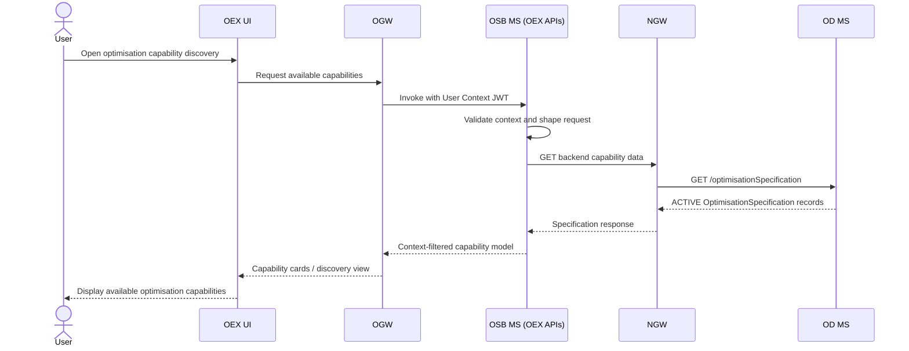
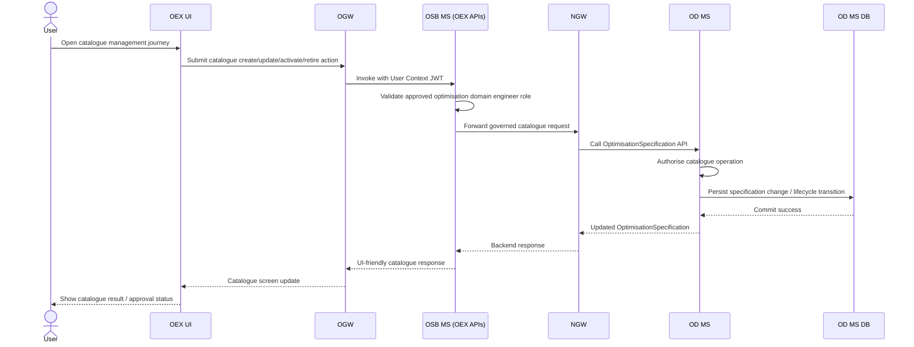
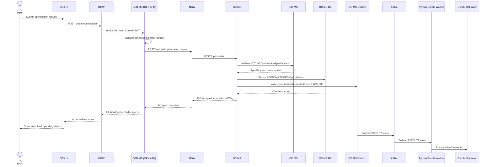
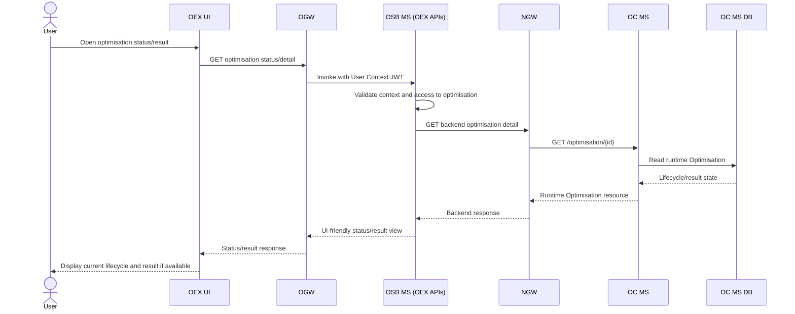
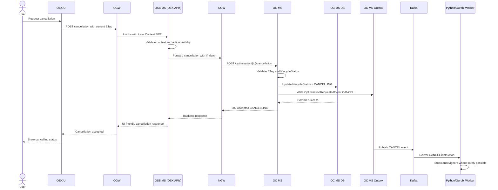
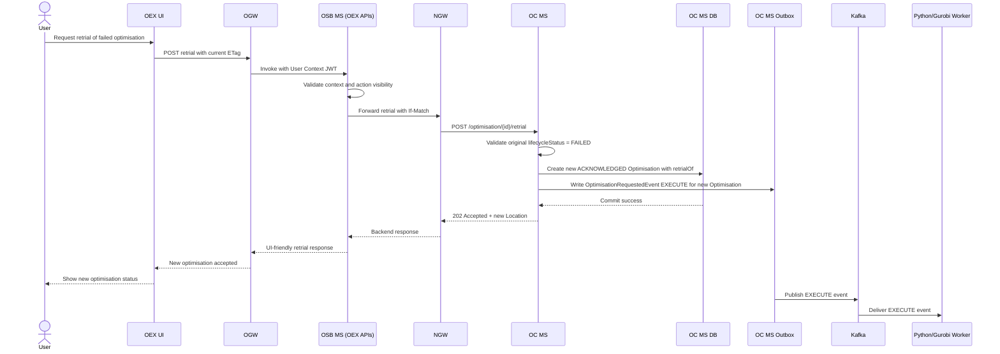
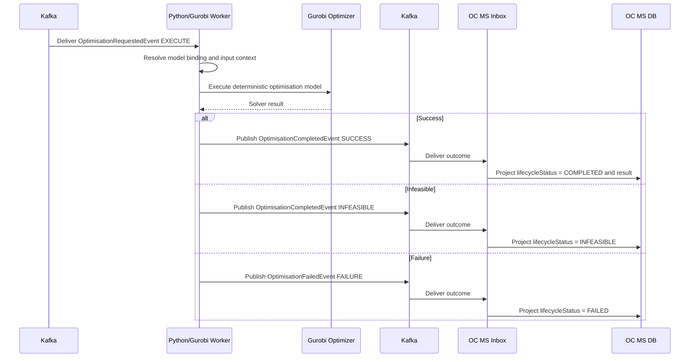

# End-to-End Solution Brief — Optimisation Platform

> **Status:** Draft

## Table of contents:
- [1. Business context:](#1-business-context)
- [2. Solution summary:](#2-solution-summary)
- [3. Solution elaboration:](#3-solution-elaboration)
  - [3.1 Use case view:](#31-use-case-view)
  - [3.3 Process view:](#33-process-view)
- [4. Capability matrix:](#4-capability-matrix)
- [5. Solution security:](#5-solution-security)
  - [5.1 User authentication and access governance:](#51-user-authentication-and-access-governance)
  - [5.2 OEX internal access path:](#52-oex-internal-access-path)
  - [5.3 OEX to optimisation backend access:](#53-oex-to-optimisation-backend-access)
  - [5.4 NGW to OD MS / OC MS security:](#54-ngw-to-od-ms-oc-ms-security)
  - [5.5 OC MS to OD MS service-to-service security:](#55-oc-ms-to-od-ms-service-to-service-security)
  - [5.6 Kafka security:](#56-kafka-security)
  - [5.7 API concurrency control:](#57-api-concurrency-control)
  - [5.8 Event security and integrity:](#58-event-security-and-integrity)
  - [5.9 Sensitive information boundary:](#59-sensitive-information-boundary)
- [6. Important quality attributes:](#6-important-quality-attributes)
  - [6.1 Availability:](#61-availability)
  - [6.2 Scalability:](#62-scalability)
  - [6.3 Performance:](#63-performance)
- [7. Risks:](#7-risks)
- [8. Assumptions:](#8-assumptions)
- [9. Constraints:](#9-constraints)
- [10. Appendix:](#10-appendix)
  - [10.1 OD MS endpoint summary:](#101-od-ms-endpoint-summary)
  - [10.2 OC MS endpoint summary:](#102-oc-ms-endpoint-summary)
  - [10.3 Runtime lifecycle states:](#103-runtime-lifecycle-states)
  - [10.4 Kafka topics:](#104-kafka-topics)
  - [10.5 Event types:](#105-event-types)
  - [10.6 Worker instructions:](#106-worker-instructions)
  - [10.7 Outcome values:](#107-outcome-values)
  - [10.8 Outcome mapping:](#108-outcome-mapping)
  - [10.9 Key artifacts:](#109-key-artifacts)
- [Optimisation validation and outcome clarification:](#optimisation-validation-and-outcome-clarification)
- [Contract definition versus runtime values:](#contract-definition-versus-runtime-values)
- [Definition versus runtime contract naming:](#definition-versus-runtime-contract-naming)
- [Infrastructure security controls across solution briefs:](#infrastructure-security-controls-across-solution-briefs)
- [Logical view baseline:](#logical-view-baseline)
- [Runtime process view baseline:](#runtime-process-view-baseline)
- [Use case sequence diagrams:](#use-case-sequence-diagrams)
  - [Discover optimisation capability sequence:](#discover-optimisation-capability-sequence)
  - [Manage optimisation catalogue sequence:](#manage-optimisation-catalogue-sequence)
  - [Create runtime optimisation sequence:](#create-runtime-optimisation-sequence)
  - [Monitor optimisation sequence:](#monitor-optimisation-sequence)
  - [Cancellation optimisation sequence:](#cancellation-optimisation-sequence)
  - [Retrial failed optimisation sequence:](#retrial-failed-optimisation-sequence)
  - [Execute optimisation sequence:](#execute-optimisation-sequence)

> **Status:** Draft

## 1. Business context:

The optimisation platform provides a reusable capability for running deterministic optimisation problems using Gurobi-backed models.

The platform is not limited to the intent-management domain. It is designed as a generic optimisation capability that can be used by OEX, platform services, planning tools, assurance functions, intent-management flows, and other authorised entities that need to run optimisation.

The business need is to allow authorised consumers to discover available optimisation capabilities, understand the required request contract, submit optimisation requests asynchronously, monitor execution state, cancellation active requests where needed, retrial failed requests, and retrieve final outcomes without exposing internal solver details or Gurobi model implementation.

The solution separates the **definition of optimisation capabilities** from the **execution and lifecycle control of optimisation runs**.

---

## 2. Solution summary:

- The solution provides a reusable, asynchronous optimisation platform backed by deterministic Gurobi models.

- It uses two core microservices:
  - **OD MS** owns `OptimisationSpecification` and exposes the caller-facing request contract.
  - **OC MS** owns runtime `Optimisation` lifecycle, cancellation, retrial, event integration, and result projection.

- Consumers may include **OEX**, platform services, planning tools, assurance functions, intent-management flows, or other authorised entities that need to run optimisation.

- OEX layer:
  - **OEX UI** provides the user-facing optimisation experience.
  - **OGW** is the user-context-aware gateway that invokes OSB MS using mTLS and User Context JWT.
  - **OSB MS / Optimisation Screen Builder MS** is the context-aware OEX facade/backend-for-frontend for optimisation journeys. It shapes OEX screens and actions using the User Context JWT, initially proxies runtime optimisation journeys to OC MS through NGW, and later supports governed OD MS catalogue/specification journeys through NGW.


- Operator access to OEX is governed by the ACG approval process and Microsoft Entra ID SSO.

- OGW exposes OEX APIs for the OEX UI using user-context-aware OAuth2. OSB MS (OEX APIs) calls OSB MS using mTLS and User Context JWT. OSB MS reaches backend OD MS and OC MS APIs through NGW using mTLS and OAuth2 system-to-system.

- OC MS validates only request structure and the OD MS request contract, then returns `202 Accepted` and drives execution asynchronously through Kafka.

- Kafka carries worker instructions and outcomes, with a dedicated DLQ for unprocessable events.

- The Python/Gurobi worker consumes `EXECUTE` or `CANCEL` instructions, runs or cancels optimisation work, and returns `SUCCESS`, `INFEASIBLE`, or `FAILURE` outcomes.

- NGW-exposed backend APIs are TMF-compliant. OGW-exposed OEX APIs, private MS-to-MS APIs, private MS-to-MS events, and internal Kafka events do not need to be TMF-compliant.

---

## 3. Solution elaboration:

The solution is structured around a clean separation of responsibility.

OD MS acts as the governed catalogue of optimisation capabilities. It exposes only what callers need to know to submit valid optimisation requests. It does not expose Gurobi objectives, candidate resource rules, solver configuration, model bindings, or internal formulation details.

OC MS acts as the runtime controller. It accepts requests, validates the request shape and request contract, creates runtime optimisation resources, manages lifecycle state, publishes worker instructions, consumes worker outcomes, and projects final results.

The Python/Gurobi worker is responsible for executing the internal deterministic optimisation model. It consumes events from Kafka, executes or cancels work based on the instruction, and publishes outcome events back to Kafka.

### 3.1 Use case view:

| **Use case** | **Actor** | **Summary** | **Outcome** |
|---|---|---|---|
| Manage optimisation catalogue | Optimisation domain engineer | Create, update, activate, retire, and govern `OptimisationSpecification` records after agreement with broader E2E teams. This is an internal governed capability within the optimisation domain, not a general consumer capability. | Only approved optimisation domain engineers can define or change catalogue entries, and catalogue changes are governed before specifications become ACTIVE. |
| Discover optimisation capability | User / OEX / platform service | Retrieve available `OptimisationSpecification` records from OD MS and understand required constraints, targets, and context. | Caller knows which optimisation capability to use and the required request contract. |
| Create runtime optimisation | User / OEX / platform service | Submit a runtime `Optimisation` request to OC MS using an ACTIVE specification and valid constraints, targets, and context. | OC MS returns `202 Accepted` and creates an `ACKNOWLEDGED` optimisation. |
| Monitor optimisation | User / OEX / platform service | Read current lifecycle state and result when available. | Caller can see whether the optimisation is pending, processing, completed, infeasible, failed, cancelling, or cancelled. |
| Cancellation optimisation | User / OEX / platform service | Request cancellation for an eligible active optimisation. | OC MS moves the resource to `CANCELLING` and instructs the worker to cancellation where safely possible. |
| Retrial failed optimisation | User / OEX / platform service | Retrial a `FAILED` optimisation by creating a new linked optimisation. | A new `ACKNOWLEDGED` optimisation is created with `retrialOf` pointing to the failed one. |
| Execute optimisation | Python/Gurobi worker | Consume worker instruction and execute the deterministic optimisation model. | Worker emits `SUCCESS`, `INFEASIBLE`, or `FAILURE` outcome. |

Note: In this optimisation platform, the governed specification resource is `OptimisationSpecification`.


### 3.3 Process view:

Each use case has a matching process view. These process views show the main path and ownership boundary for each use case.

#### 3.3.1 Discover optimisation capability:

```text
User
-> OEX UI
-> OGW
-> OSB MS (OEX APIs)
-> NGW
-> OD MS
-> OD MS DB
-> NGW
-> OSB MS (OEX APIs)
-> OGW
-> OEX UI
-> User views available optimisation capabilities
```

Purpose:

```text
OD MS is the source of truth for OptimisationSpecification discovery.
OSB MS context-filters and shapes the capability view for OEX UI.
No runtime Optimisation is created.
No OC MS Outbox, Kafka, Python/Gurobi Worker, or Gurobi Optimizer is involved.
```

#### 3.3.2 Manage optimisation catalogue:

```text
User
-> OEX UI
-> OGW
-> OSB MS (OEX APIs)
-> NGW
-> OD MS
-> OD MS DB
-> NGW
-> OSB MS (OEX APIs)
-> OGW
-> OEX UI
-> User views catalogue-management result
```

Purpose:

```text
This is an internal governed capability.
Only approved optimisation domain engineers can create, update, activate, retire, or govern OptimisationSpecification records.
Catalogue changes require agreement with broader E2E teams before becoming ACTIVE.
OD MS owns catalogue state and governance.
OC MS, Kafka, Python/Gurobi Worker, and Gurobi Optimizer are not involved.
```

#### 3.3.3 Create runtime optimisation:

```text
User
-> OEX UI
-> OGW
-> OSB MS (OEX APIs)
-> NGW
-> OC MS
-> OD MS
-> OC MS DB
-> OC MS Outbox
-> Kafka
-> Python/Gurobi Worker
-> Gurobi Optimizer
```

Purpose:

```text
OSB MS shapes the request using User Context JWT.
OC MS validates the runtime request against the ACTIVE OptimisationSpecification from OD MS.
OC MS persists the accepted Optimisation in OC MS DB.
OC MS writes an EXECUTE instruction to OC MS Outbox.
OC MS Outbox publishes to Kafka.
Python/Gurobi Worker consumes the event and invokes Gurobi Optimizer.
```

#### 3.3.4 Monitor optimisation:

```text
User
-> OEX UI
-> OGW
-> OSB MS (OEX APIs)
-> NGW
-> OC MS
-> OC MS DB
-> NGW
-> OSB MS (OEX APIs)
-> OGW
-> OEX UI
-> User views current lifecycle/result
```

Purpose:

```text
OC MS is the source of truth for runtime Optimisation lifecycle and result projection.
OSB MS returns a UI-friendly status/result view.
No new worker instruction is created.
No OC MS Outbox event is emitted for read-only monitoring.
```

#### 3.3.5 Cancellation optimisation:

```text
User
-> OEX UI
-> OGW
-> OSB MS (OEX APIs)
-> NGW
-> OC MS
-> OC MS DB
-> OC MS Outbox
-> Kafka
-> Python/Gurobi Worker
-> OC MS Inbox
-> OC MS DB
-> User polls GET /optimisation/{id}
```

Purpose:

```text
OSB MS exposes the cancellation action only when user context and runtime state allow it.
OC MS validates If-Match and lifecycleStatus.
OC MS updates lifecycleStatus to CANCELLING.
OC MS writes a CANCEL instruction to OC MS Outbox.
Worker stops, cancels, or ignores work where safely possible.
OC MS later projects CANCELLED when confirmed or safely resolved.
```

#### 3.3.6 Retrial failed optimisation:

```text
User
-> OEX UI
-> OGW
-> OSB MS (OEX APIs)
-> NGW
-> OC MS
-> OC MS DB
-> OC MS Outbox
-> Kafka
-> Python/Gurobi Worker
-> Gurobi Optimizer
-> User polls GET /optimisation/{id}
```

Purpose:

```text
OSB MS exposes retrial only when user context and runtime state allow it.
OC MS validates the original Optimisation lifecycleStatus = FAILED.
OC MS creates a new ACKNOWLEDGED Optimisation with retrialOf pointing to the failed one.
Retrial does not move the failed Optimisation back to PROCESSING.
OC MS writes a new EXECUTE instruction to OC MS Outbox.
```

#### 3.3.7 Execute optimisation:

```text
Kafka
-> Python/Gurobi Worker
-> Gurobi Optimizer
-> Kafka
-> OC MS Inbox
-> OC MS DB
-> User polls GET /optimisation/{id}
```

Purpose:

```text
This is the asynchronous worker execution path after OC MS has accepted the runtime Optimisation.
Python/Gurobi Worker consumes EXECUTE instructions.
Gurobi Optimizer executes the model.
Worker publishes SUCCESS, INFEASIBLE, or FAILURE outcome.
OC MS Inbox consumes the outcome and projects lifecycle/result into OC MS DB.
User observes the result through the monitor/polling path.
```


---

## 4. Capability matrix:

| **Component** | **Responsibility** |
|---|---|
| **Microsoft Entra ID** | Provides SSO authentication for users before they access OEX. Supplies identity context used by the user-facing access path. |
| **ACG approval process** | Governs operator access to OEX. Users must be approved through the organisational access-control process before they can use the OEX optimisation experience. |
| **OGW** | User-context-aware gateway for OEX APIs and OEX UI integration. Uses user SSO OAuth2 from the UI/OEX API path and propagates user identity context into the OEX layer. |
| **OEX UI** | Provides the user/operator-facing experience for discovering optimisation capabilities, submitting requests, monitoring state, cancelling, retrying, and viewing results. |
| **OSB MS (OEX APIs)** | Secures internal OEX access to OSB MS using mTLS and User Context JWT. Preserves user context across the OEX backend interaction. |
| **OSB MS** | Builds and orchestrates the OEX screen/backend experience. Integrates with NGW using mTLS and OAuth2 system-to-system to call backend optimisation APIs. |
| **NGW** | NAAS Gateway exposing backend optimisation domain APIs for OD MS and OC MS. Provides the controlled backend API entry point for OSB MS and other authorised system consumers. NGW-exposed backend APIs are TMF-compliant. |
| **Optimisation-Definition-MS / OD MS** | Owns the definition side of the optimisation platform through `OptimisationSpecification`. Publishes caller-facing request contracts, manages `DRAFT`, `ACTIVE`, and `RETIRED` specification lifecycle, and ensures only one ACTIVE specification exists per `specificationKey`. Does not expose solver/model internals. |
| **OD MS Database** | Stores `OptimisationSpecification` records, version metadata, lifecycle state, request contracts, timestamps, ETag/revision data, and retained retired specifications for audit/history. |
| **Optimisation-Controller-MS / OC MS** | Owns runtime `Optimisation` resources. Accepts requests, validates the generic wrapper and OD MS request contract, manages lifecycle, cancellation, retrial, outbox/inbox integration, and result projection. Performs syntactic and contract validation only. |
| **OC MS Database** | Stores runtime `Optimisation` resources, accepted constraints, targets, and context, optional `sourceContext`, lifecycle state, status reasons, result projections, retrial links, timestamps, ETag/revision data, outbox records, and inbox records. |
| **OC MS Outbox Relay** | Publishes persisted OC MS outbox records to Kafka after DB commit. Publishes `OptimisationRequestedEvent` with `instruction = EXECUTE` or `instruction = CANCEL`. |
| **Kafka topic** | Main internal event stream for worker instructions and outcomes between OC MS and the Python/Gurobi worker. Uses CloudEvents-style Kafka headers. |
| **Kafka DLQ** | Holds events that cannot be safely processed after retrial handling. Preserves original event payload and failure metadata for operational investigation and replay decisions. |
| **Python / Gurobi Worker** | Consumes `OptimisationRequestedEvent`. For `EXECUTE`, resolves the internal deterministic model binding, resolves required data, executes optimisation, and emits an outcome. For `CANCEL`, cancels/stops/ignores processing where safely possible. |
| **Internal deterministic optimisation models** | Own solver-specific logic that is not exposed externally. Encapsulate objective formulation, constraints, candidate-resource rules, model binding, solver configuration, and Gurobi formulation. |
| **Gurobi Optimizer** | Executes the mathematical optimisation model prepared by the worker/model layer. Produces solve outcomes that the worker maps into `SUCCESS`, `INFEASIBLE`, or `FAILURE`. |
| **Analytics platform / data sources** | Provides authorised datasets required by the worker/model layer, such as topology snapshots, traffic forecasts, capacity information, inventory data, or other optimisation context datasets. |
| **OC MS Inbox Consumer** | Consumes worker outcome events, applies idempotency and stale/late-event handling, maps outcomes to lifecycle states, and projects result/failure details into the runtime `Optimisation` resource. |
| **Operational support / monitoring** | Monitors service health, Kafka lag, outbox/inbox processing, worker failures, solver failures, DLQ records, retrial counts, stale/late events, and optimisation lifecycle/result trends. |

---

## 5. Solution security:

### 5.1 User authentication and access governance:

Users access the OEX experience through the organisational ACG approval process and SSO using Microsoft Entra ID.

```text
User
-> ACG approval process
-> Microsoft Entra ID SSO
-> OGW
-> OEX UI
```

OGW is the user-context-aware gateway for the OEX channel. It uses user SSO OAuth2 from the UI/OEX API path and propagates user identity context into the OEX layer.

### 5.2 OEX internal access path:

OSB MS (OEX APIs) integrates with the OSB MS using:

```text
mTLS
User Context JWT
```

This preserves user context while securely invoking OEX backend experience services.

```text
OGW / OEX APIs
-> OSB MS(OEX API)
```

### 5.3 OEX to optimisation backend access:

OSB MS integrates with NGW using:

```text
mTLS
OAuth2 system-to-system
```

NGW exposes backend optimisation domain APIs for OD MS and OC MS.

```text
OSB MS
-> NGW
-> OD MS / OC MS
```

OD MS and OC MS are not directly exposed to end users or the UI layer.

### 5.4 NGW to OD MS / OC MS security:

NGW integrates with OD MS and OC MS using:

```text
mTLS
```

This secures backend API access from the gateway to the optimisation domain services.

### 5.5 OC MS to OD MS service-to-service security:

OC MS calls OD MS to validate referenced `OptimisationSpecification` resources. This internal service-to-service communication is secured using mTLS through service mesh.

```text
OC MS
-> mTLS
-> OD MS
```

OC MS uses this call to validate:

```text
OptimisationSpecification exists
OptimisationSpecification lifecycleStatus = ACTIVE
constraints[], targets[], and context[] match the OD MS request contract
```

### 5.6 Kafka security:

OC MS and the Python/Gurobi worker integrate through Kafka.

Recommended controls:

```text
TLS for broker connectivity
service identity for producers and consumers
topic-level ACLs
separate consumer groups
DLQ access restricted to operational support
```

Producer/consumer permissions:

```text
OC MS:
  produce worker instruction events
  consume worker outcome events
  produce DLQ records when needed

Python/Gurobi Worker:
  consume worker instruction events
  produce worker outcome events
  produce DLQ records when needed
```

### 5.7 API concurrency control:

ETags are used for unsafe runtime actions.

```text
POST /optimisation/{id}/cancellation
POST /optimisation/{id}/retrial
```

Both require:

```text
If-Match
```

Failure rules:

```text
Missing If-Match -> 428 Precondition Required
Stale/wrong If-Match -> 412 Precondition Failed
```

Runtime `Optimisation` does not expose a `version` field. ETag is used only as the HTTP concurrency mechanism.

### 5.8 Event security and integrity:

Internal Kafka events use CloudEvents-style headers:

```text
ce-specversion
ce-id
ce-type
ce-source
ce-time
ce-subject
ce-datacontenttype
ce-correlationid
ce-eventversion
content-type
```

Kafka events do not use TMF REST fields such as:

```text
@type
@baseType
@schemaLocation
```

Those fields are reserved for public REST resource representations.

### 5.9 Sensitive information boundary:

The public APIs and Kafka events do not expose:

```text
Gurobi model formulation
solver configuration
objective internals
candidate-resource rules
internal model bindings
resource-selection logic
```

OD MS exposes only the caller-facing request contract.

OC MS exposes runtime state and generic result outputs.

The worker and internal model layer own the solver-specific details.

---

## 6. Important quality attributes:

### 6.1 Availability:

OD MS and OC MS should be deployed as independently scalable and highly available services.

OD MS availability is important for capability discovery and request validation. OC MS availability is critical for runtime optimisation creation, lifecycle reads, cancellation, retrial, and event projection.

Kafka availability is critical for asynchronous worker instruction and outcome exchange. The outbox/inbox patterns reduce data-loss risk during transient service or Kafka failures.

Runtime optimisation records remain durable in OC MS DB even if worker execution is delayed. DLQ provides a controlled path for poison or unprocessable events.

### 6.2 Scalability:

OD MS scales primarily for read-heavy capability discovery.

OC MS scales for runtime API traffic, outbox relay throughput, and inbox outcome processing.

Python/Gurobi workers scale horizontally based on optimisation workload, queue depth, and solver runtime characteristics.

Kafka consumer groups allow worker scaling and OC MS inbox scaling.

Large or long-running optimisation jobs are handled asynchronously and do not block REST API request threads.

### 6.3 Performance:

`POST /optimisation` returns `202 Accepted` after syntactic and OD-MS-contract validation only.

Solver execution is asynchronous and decoupled from REST request latency.

`GET /optimisation/{id}` provides polling of lifecycle and result state.

`GET /optimisation` returns summary-only records by default to avoid large list payloads.

Runtime `result` is omitted until available.

OD MS specification responses may use caching where appropriate. OC MS runtime responses do not use response `Cache-Control` for now.

---

## 7. Risks:

| **Risk** | **Impact** | **Mitigation** |
|---|---|---|
| Long-running Gurobi executions | Delayed optimisation outcomes and increased worker capacity pressure. | Use asynchronous execution, worker scaling, queue monitoring, timeout controls, and operational alerting. |
| Best-effort cancellation | A running optimisation may not stop immediately or may produce a late outcome. | Use `CANCELLING` state, worker cancellation handling, and late outcome idempotency rules. |
| Kafka consumer lag | Execution or result projection may be delayed. | Monitor consumer lag, scale workers/inbox consumers, and alert on thresholds. |
| Invalid or stale context datasets | Poor, infeasible, or failed optimisation outcomes. | Use request contract validation, dataset versioning, worker diagnostics, and operational monitoring. |
| DLQ growth | Indicates poison messages, schema drift, or repeated processing failures. | Monitor DLQ, preserve failure metadata, and define replay/remediation procedures. |
| Misconfigured internal model binding | OD MS may expose a valid request contract while worker execution fails. | Add deployment validation, contract tests between OD MS and worker model binding, and pre-production model checks. |
| Overexposure of solver details | Sensitive optimisation logic could leak externally. | Keep OD MS limited to caller-facing request contracts and keep solver details internal. |
| Incorrect specification activation | Wrong `ACTIVE` specification may affect all new requests for a `specificationKey`. | Use ETag/If-Match, lifecycle governance, review/approval, and only one ACTIVE version per key. |
| Complex access path through OEX gateways | Misconfiguration could break user context propagation or backend access. | Use clear contract testing across OGW, OSB MS (OEX APIs), Screen Builder MS, NGW, OD MS, and OC MS. |

---

## 8. Assumptions:

- Operators access OEX only after ACG approval.

- User/operator authentication uses Microsoft Entra ID SSO.

- OGW is the user-context-aware gateway for OEX APIs and OEX UI integration.

- OSB MS (OEX APIs) integrates with OSB MS using mTLS and User Context JWT.

- OSB MS integrates with NGW using mTLS and OAuth2 system-to-system.

- NGW exposes OD MS and OC MS APIs to authorised backend consumers.

- NGW integrates with OD MS and OC MS using mTLS.

- OC MS calls OD MS using mTLS for internal service-to-service validation.

- Kafka is available as the event backbone.

- Python/Gurobi worker has authorised access to required analytics/data sources.

- The worker owns internal deterministic model binding and Gurobi execution details.

- Runtime `Optimisation` is asynchronous by design.

- `sourceContext` is optional and may be omitted for generic optimisation requests.

- Runtime `Optimisation` does not expose a business `version` field.

---

## 9. Constraints:

- NGW-exposed backend APIs are TMF-compliant.

- OGW-exposed OEX APIs, private MS-to-MS APIs, private MS-to-MS events, and internal Kafka events do not need to be TMF-compliant.

- Do not expose Gurobi model formulation, solver configuration, objective internals, candidate-resource rules, or model binding through public APIs.

- OD MS exposes only the caller-facing `OptimisationSpecification` request contract.

- OC MS performs syntactic and OD-MS-contract validation only.

- Runtime `Optimisation` does not expose a `version` field.

- Runtime `Optimisation` does not support client-side `PUT` or `DELETE`.

- Cancellation is represented through `lifecycleStatus = CANCELLING` and an `OptimisationRequestedEvent` with `instruction = CANCEL`.

- Only one `ACTIVE` `OptimisationSpecification` is allowed per `specificationKey`.

- ETag / If-Match is required for unsafe runtime operations such as cancellation and retrial.

- Internal Kafka events do not use TMF REST `@type`, `@baseType`, or `@schemaLocation`.

---

## 10. Appendix:

### 10.1 OD MS endpoint summary:

```http
GET    /optimisationSpecification
POST   /optimisationSpecification
GET    /optimisationSpecification/{id}
PUT    /optimisationSpecification/{id}
DELETE /optimisationSpecification/{id}
```

### 10.2 OC MS endpoint summary:

```http
GET  /optimisation
POST /optimisation
GET  /optimisation/{id}
POST /optimisation/{id}/cancellation
POST /optimisation/{id}/retrial
```

Unsupported:

```http
PUT    /optimisation/{id}
DELETE /optimisation/{id}
```

### 10.3 Runtime lifecycle states:

```text
ACKNOWLEDGED
QUEUED
PROCESSING
COMPLETED
INFEASIBLE
FAILED
CANCELLING
CANCELLED
```

### 10.4 Kafka topics:

```text
t7.optimisation.events
t7.optimisation.events.dlq
```

### 10.5 Event types:

```text
OptimisationRequestedEvent
OptimisationCompletedEvent
OptimisationFailedEvent
```

### 10.6 Worker instructions:

```text
EXECUTE
CANCEL
```

### 10.7 Outcome values:

```text
SUCCESS
INFEASIBLE
FAILURE
```

### 10.8 Outcome mapping:

```text
SUCCESS -> COMPLETED
INFEASIBLE -> INFEASIBLE
FAILURE -> FAILED
```

### 10.9 Key artifacts:

```text
contextdump.md
od-ms-specification.md
oc-ms-specification.md
optimisation-full-recovery-pack.md
optimisation-logical-view.drawio
optimisation-e2e-solution-brief.md
```

---


TMF/TIO alignment note:
Backend optimisation API examples use platform-readable constraint fields such as `constraintType: maximum` with `ontologyPredicate: icm:atMost` where semantic traceability to TMF/TIO upper-bound intent expressions is useful.

---

## Optimisation validation and outcome clarification:

The active design distinguishes request-contract validation from optimiser outcome.

```text
OC MS validates:
  required fields
  enum/value-type rules
  request contract shape
  cardinality rules such as candidateResources minItems = 2

OC MS does not evaluate:
  solver feasibility
  candidate ranking
  metric-vs-constraint fit
  objective trade-offs

Worker/model returns:
  SUCCESS
  INFEASIBLE
  FAILURE
```

Use `422 OPTIMISATION_CONTRACT_VIOLATION` for contract/cardinality failures, such as fewer than 2 candidate resources for a selection optimisation. Use `INFEASIBLE` only when the request is valid and the worker/model determines no feasible solution exists.

---

## Contract definition versus runtime values:

OD MS defines the optimisation request contract, including the allowed candidate resource structure under `context[]`.

OC MS carries the actual runtime `constraints[]`, `targets[]`, and `context[]` values accepted from the caller. For resource/path selection, the runtime context should include or reference candidate resources as defined by OD MS.

---

## Definition versus runtime contract naming:

OD MS defines the optimisation request contract using:

```text
constraintSpecifications[]
targetSpecifications[]
contextSpecifications[]
```

OC MS carries the runtime request instance using:

```text
constraints[]
targets[]
context[]
```

This keeps the design clear: OD MS defines what is allowed; OC MS stores and returns what was accepted at runtime.

---

## Infrastructure security controls across solution briefs:

The E2E solution brief and each individual service design brief must explicitly capture security controls for every service-to-infrastructure integration.

This applies to:

```text
service-to-database
service-to-cache
service-to-Kafka
service-to-object-storage
service-to-search-index
service-to-queue
service-to-platform-service
```

Required controls:

```text
Authentication:
  Every connecting workload uses an approved service identity.

Authorisation:
  Access is least privilege.
  Permissions are scoped to the required resource and operation.
  No broad wildcard, cluster-wide, schema-wide, or admin/root access by default.

Encrypted connectivity:
  Transport is encrypted.
  mTLS is used where supported and appropriate.
  Kafka broker connectivity uses TLS/mTLS where supported; Kafka ACLs enforce topic/consumer-group authorisation.

Secret and certificate management:
  Credentials, keys, tokens, and certificates are stored in approved secret management.
  Rotation is supported without application code changes where possible.

Environment separation:
  Principals, roles, credentials, topics, schemas, and namespaces are environment-scoped.

Audit and monitoring:
  Authentication failures, authorisation denials, privileged operations, replay/admin actions, Kafka lag, DLQ growth, and unusual infrastructure access are logged and monitored.

Ownership:
  Each design brief identifies the owning service, resource owner, allowed operations, and operational support path.
```

Current application:

```text
OD MS design brief:
  captures OD MS -> OD MS DB controls.
  states OD MS has no direct Kafka integration in the current baseline.

OC MS design brief:
  captures OC MS -> OC MS DB controls.
  captures OC MS -> OD MS mTLS controls.
  captures OC MS -> Kafka controls for outbox/inbox.

E2E solution brief:
  captures common cross-cutting infrastructure security controls.
  summarises database, Kafka, cache/future-infrastructure, identity, encryption, ACL, secret-management, and audit requirements.
```

---

## Logical view baseline:

The logical view shows the main optimisation platform components and their domain boundaries. It is intentionally higher level than the process view.

Logical view diagram:

```mermaid
flowchart LR
    User[User]
    Entra[Microsoft Entra ID SSO]
    OEX[OEX UI]
    OGW[OGW]
    OSB[OSB MS<br/>(OEX API)]
    NGW[NGW]
    OD[OD MS<br/>OptimisationSpecification]
    OC[OC MS<br/>Runtime Optimisation]
    Kafka[Kafka]
    Worker[Python/Gurobi Worker]
    Gurobi[Gurobi Optimizer]

    User --> Entra
    Entra --> OEX
    OEX --> OGW
    OGW --> OSB
    OSB --> NGW
    NGW --> OD
    NGW --> OC
    OC --> Kafka
    Kafka --> Worker
    Worker --> Gurobi
    Worker --> Kafka
    Kafka --> OC
```

Logical integration model:

```text
User
-> Microsoft Entra ID SSO
-> OEX UI
-> OGW
-> OSB MS(OEX API)
-> NGW
-> OD MS / OC MS
-> Kafka
-> Python/Gurobi Worker
-> Gurobi Optimizer
```

Definition-management logical path:

```text
User
-> Microsoft Entra ID SSO
-> OEX UI
-> OGW
-> OSB MS(OEX API)
-> NGW
-> OD MS
```

Runtime-optimisation logical path:

```text
User
-> Microsoft Entra ID SSO
-> OEX UI
-> OGW
-> OSB MS(OEX API)
-> NGW
-> OC MS
-> Kafka
-> Python/Gurobi Worker
-> Gurobi Optimizer
```

Logical responsibilities:

| Component | Responsibility |
|---|---|
| User | Uses OEX UI to discover capabilities, submit runtime optimisation requests, monitor outcomes, or perform governed catalogue-management journeys when authorised. |
| Microsoft Entra ID SSO | Provides enterprise authentication for the OEX user journey. |
| OEX UI | User-facing optimisation experience. |
| OGW | Gateway that invokes OSB MS using mTLS and User Context JWT. |
| OSB MS(OEX API) | Optimisation-specific OEX API/facade. It uses User Context JWT to shape the OEX experience and calls backend optimisation APIs through NGW. |
| NGW | Backend gateway for TMF-compliant OD MS and OC MS APIs. |
| OD MS | Owns OptimisationSpecification catalogue, lifecycle, governance, and request-contract definitions. |
| OC MS | Owns runtime Optimisation lifecycle, validation, cancellation, retrial, outbox/inbox, result projection, and ETag concurrency. |
| Kafka | Internal asynchronous event backbone for worker instructions and outcomes. |
| Python/Gurobi Worker | Consumes execution instructions, binds the deterministic model, invokes Gurobi, and publishes outcomes. |
| Gurobi Optimizer | Solver/runtime optimisation engine. |

Boundary rules:

```text
OSB MS is not the source of truth for OptimisationSpecification or runtime Optimisation.
OD MS is the source of truth for OptimisationSpecification.
OC MS is the source of truth for runtime Optimisation.
Kafka, Python/Gurobi Worker, and Gurobi Optimizer participate only in runtime execution flows after OC MS accepts the request.
```

API compliance rule:

```text
NGW-exposed OD MS and OC MS APIs are TMF-compliant.

OSB MS(OEX API) APIs exposed behind OGW are private/OEX experience APIs and do not need to be TMF-compliant.

Private MS-to-MS APIs and Kafka events are internal contracts unless separately exposed.
```


---

## Runtime process view baseline:

For readability, the runtime process view is shown as:

```text
User
-> OEX UI
-> OGW
-> OSB MS (OEX APIs)
-> NGW
-> OC MS
-> OD MS
-> OC MS DB
-> OC MS Outbox
-> Kafka
-> Python/Gurobi Worker
-> Gurobi Optimizer
-> Kafka
-> OC MS Inbox
-> OC MS DB
-> User polls GET /optimisation/{id}
```

Meaning:

```text
OSB MS (OEX APIs):
  OSB MS is the optimisation-specific OEX backend/API facade behind OGW.

OC MS DB:
  Runtime Optimisation persistence.

OC MS Outbox:
  Durable event publication pattern for worker instructions.

OC MS Inbox:
  Durable/idempotent worker outcome consumption and projection.
```


---

## Use case sequence diagrams:

Each use case in the use case view has a matching sequence diagram below.

### Discover optimisation capability sequence:



### Manage optimisation catalogue sequence:



### Create runtime optimisation sequence:



### Monitor optimisation sequence:



### Cancellation optimisation sequence:



### Retrial failed optimisation sequence:



### Execute optimisation sequence:


