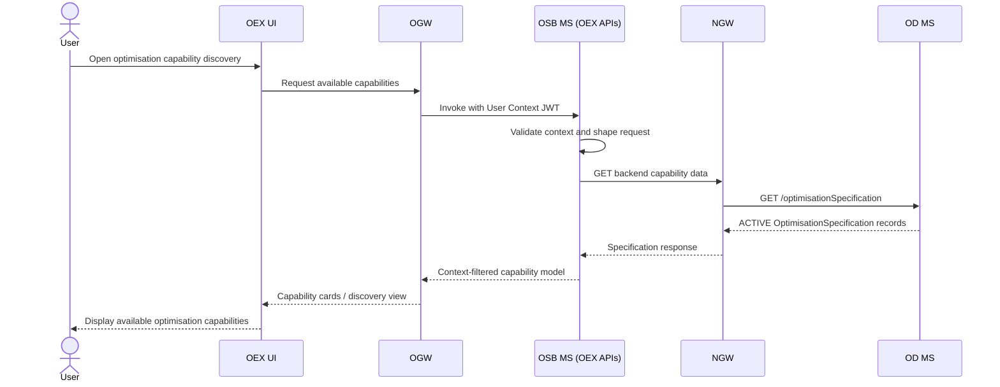
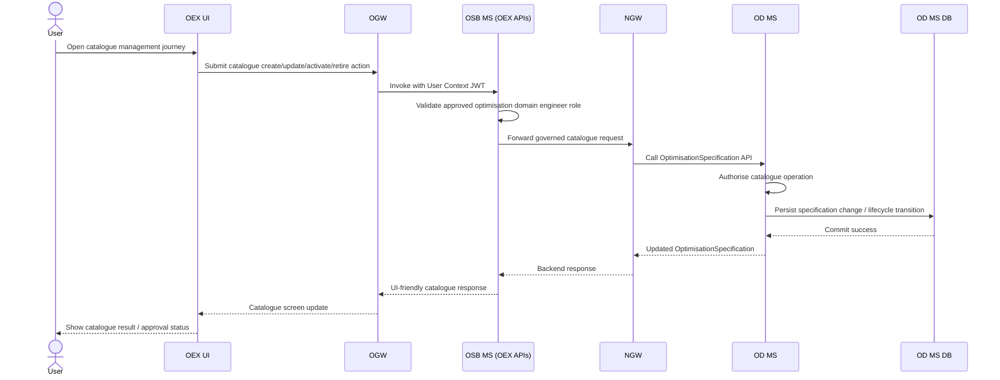
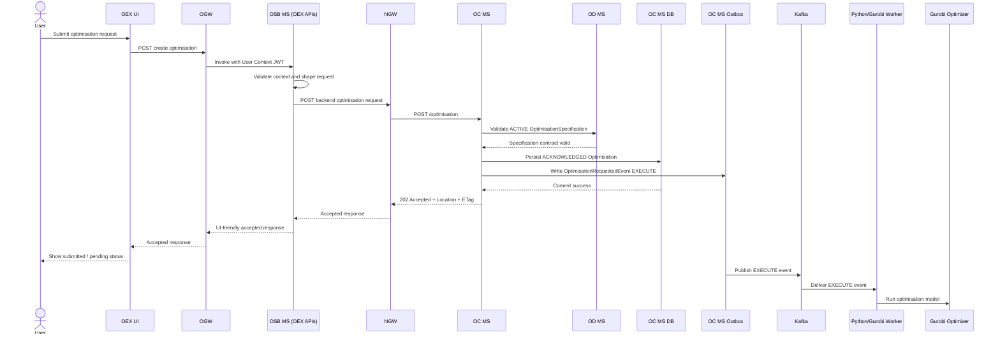
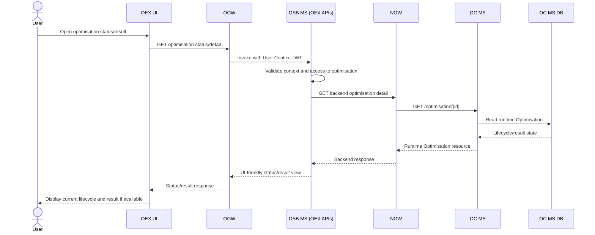
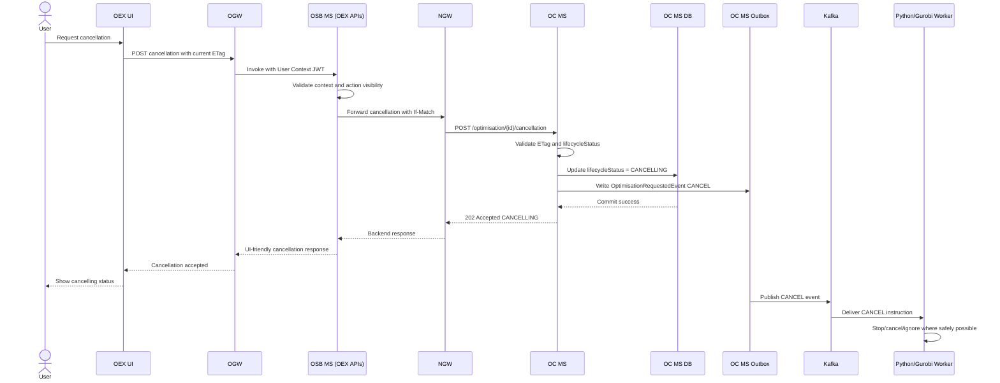
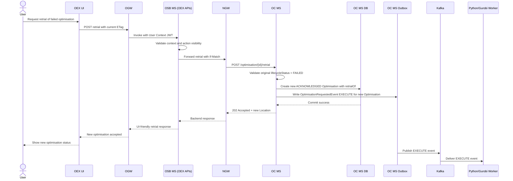
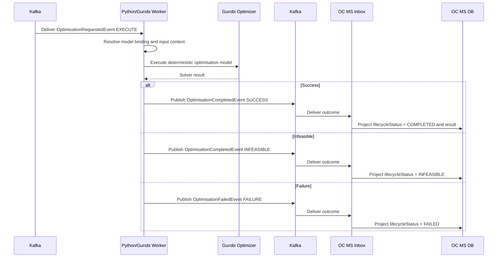

# Optimisation Full Recovery Pack

Generated: 2026-05-08T09:53:26

This file combines the current optimisation architecture recovery material into one place.

It contains:
- The cumulative baseline/context dump
- The current OD MS / Optimisation-Definition-MS specification
- The current OC MS / Optimisation-Controller-MS specification
- The current OSB MS / Optimisation-Screen-Builder-MS specification
- The current E2E optimisation solution brief

---

# Part: Cumulative Context Dump

# Context Dump

This file is the running baseline dump for this conversation. New baselines are appended to the end unless explicitly requested otherwise.

---

## Baseline: Reference books for Gurobi optimisation architecture exercise

The following uploaded books are accepted as the reference base for the Spring Boot + Kafka + Python/Gurobi optimisation exercise:

1. **REST in Practice** — use for REST API/resource design, HTTP methods, resource naming, status codes, representations, links, and web integration principles.
2. **Microservices Patterns** — use for Spring Boot/microservice structure, service boundaries, hexagonal architecture, inbound/outbound adapters, asynchronous messaging, transactional outbox, polling publisher / transaction-log tailing, duplicate handling, and microservice-owned persistence.
3. **Designing Data-Intensive Applications** — use for reliability, scalability, maintainability, transactions, fault tolerance, distributed systems, stream processing, dataflow, correctness, and persistence trade-offs.
4. **Building Event-Driven Microservices, 2nd Edition** — use for Kafka/event-stream design, event-driven microservices, event schemas/data contracts, eventification, request-response/event-driven integration, transactional outbox, durable event flow, and eventual consistency.

Reference usage rule:

```text
REST API shape:
  REST in Practice

Spring Boot microservice structure:
  Microservices Patterns

Outbox/inbox, asynchronous messaging, Kafka relay:
  Microservices Patterns + Building Event-Driven Microservices

Event schema, event contract, event stream design:
  Building Event-Driven Microservices

Database, transactions, reliability, consistency, scalability:
  Designing Data-Intensive Applications

Optimisation execution:
  Gurobi documentation / API reference
```

Current REST endpoint direction remains:

```http
POST /optimisation
GET  /optimisation/{optimisationId}
GET  /optimisation
POST /optimisation/{optimisationId}/cancel
POST /optimisation/{optimisationId}/retry
```

Design interpretation:

- `/optimisation` is the REST resource collection.
- `POST /optimisation` creates or accepts a new asynchronous optimisation job.
- `GET /optimisation/{optimisationId}` retrieves current status and final result when available.
- `202 Accepted` is the preferred response for creation because the Python/Gurobi optimisation work completes asynchronously.
- Spring Boot REST controller is treated as the inbound adapter into the optimisation request service.
- Spring Boot writes the optimisation request and outbox event in one local transaction.
- Outbox relay publishes the request event to Kafka.
- Python/Gurobi worker consumes through an inbox/idempotency boundary, processes with Gurobi, writes result state and a result outbox event, and publishes back to Kafka.
- Spring Boot consumes the result event through an inbox/idempotency boundary and updates the optimisation resource state exposed to the client.

---

---

## Baseline Update — REST HATEOAS, ETag Concurrency, and Cache-Control Position

For the Gurobi optimisation architecture exercise, the active REST interface baseline is:

- Follow full HATEOAS principles for REST interfaces.
- Resource representations must include hypermedia links/actions for valid next transitions.
- Clients should discover available state transitions from the representation instead of hardcoding workflow URLs.
- Available links/actions must vary by resource state.
- Aim for Richardson Maturity Model Level 3 where practical.
- Mutable optimisation resource responses must include an `ETag`.
- State-changing operations that depend on current resource state must require `If-Match` with the latest ETag.
- If `If-Match` is missing where required, return `428 Precondition Required`.
- If `If-Match` is stale, wrong, or does not match the current resource version, return `412 Precondition Failed`.
- Use ETags as the concurrency control mechanism for actions such as cancel, retry, update, or other resource-state transitions.
- Do not include `Cache-Control` headers in REST responses for now unless explicitly requested for a specific endpoint/response later.
- Client request-side `Cache-Control: no-cache` may be used by the caller when it wants to force revalidation or bypass cached reuse, but response-side `Cache-Control` is not part of the active baseline for now.

Example GET response:

```http
HTTP/1.1 200 OK
Content-Type: application/json
ETag: "opt-12345-v3"
```

Example state-changing request:

```http
POST /optimisation/opt-12345/cancellation
If-Match: "opt-12345-v3"
```

Example missing precondition response:

```http
HTTP/1.1 428 Precondition Required
```

Example stale ETag response:

```http
HTTP/1.1 412 Precondition Failed
```

---

# Baselined OD MS / Optimisation-Definition-MS REST Specification

## OD MS summary

Optimisation-Definition-MS (OD MS) owns the definition side of the optimisation platform. Its responsibility is to publish and govern the externally visible optimisation capability contract, called `OptimisationSpecification`.

OD MS does not expose the Gurobi model, objective logic, candidate-resource rules, solver configuration, model binding, or internal optimisation formulation. It only exposes what a caller needs to know to create a valid runtime optimisation through OC MS.

```text
OD MS owns:
  OptimisationSpecification

OD MS does not own:
  Runtime Optimisation execution
  Kafka outbox/inbox processing
  Gurobi solver execution
  Optimisation result projection
```

In one sentence:

```text
OD MS is the governed catalogue of optimisation capabilities; it tells callers what inputs they must provide, while the platform privately owns how those inputs are translated into deterministic Gurobi execution.
```

## OD MS endpoint set

```http
# List/search OptimisationSpecification resources.
GET /optimisationSpecification

# Create a new OptimisationSpecification.
# ID is generated by OD MS.
POST /optimisationSpecification

# Retrieve one OptimisationSpecification.
GET /optimisationSpecification/{id}

# Full replacement/update.
# Allowed only while lifecycleStatus is DRAFT.
PUT /optimisationSpecification/{id}

# Delete a DRAFT OptimisationSpecification.
# ACTIVE and RETIRED specifications cannot be deleted.
DELETE /optimisationSpecification/{id}
```

## OptimisationSpecification lifecycle

```text
DRAFT
ACTIVE
RETIRED
```

```text
DRAFT:
  Specification is being prepared.
  It can be updated or deleted with If-Match.

ACTIVE:
  Specification can be used by OC MS to create runtime Optimisation resources.
  ACTIVE specifications are immutable.
  PUT and DELETE are not allowed.

RETIRED:
  Specification is no longer usable for new runtime Optimisation resources.
  It remains available for audit/history and existing Optimisation references.
```

No normal lifecycle state called:

```text
DELETED
ARCHIVED
```

## Version activation rule

```text
Only one ACTIVE OptimisationSpecification is allowed per specificationKey.

When a DRAFT specification is promoted to ACTIVE, OD MS must transactionally retire the previous ACTIVE specification with the same specificationKey.
```

Example:

```jsonc
{
  // Stable family/key shared by all versions of the same optimisation capability.
  "specificationKey": "hospital-surgical-slice-path-optimisation",

  // Version of this specific specification.
  "version": "1.1",

  // Promoting this version to ACTIVE retires the previous ACTIVE version
  // with the same specificationKey.
  "lifecycleStatus": "ACTIVE"
}
```

Transactional activation logic:

```text
1. Validate If-Match for the target DRAFT specification.
2. Validate target specification is currently DRAFT.
3. Validate requested lifecycleStatus is ACTIVE.
4. Find current ACTIVE specification with the same specificationKey.
5. Move old ACTIVE specification to RETIRED.
6. Move target DRAFT specification to ACTIVE.
7. Update ETags and lastUpdate timestamps for changed resources.
8. Commit atomically.
```

## Public OptimisationSpecification shape

The public OD MS resource exposes only the caller-facing input contract.

It exposes:

```text
id
href
specificationKey
type
baseType
schemaLocation
name
description
version
lifecycleStatus
creationDate
lastUpdate
inputs
_links
```

It does not expose by default:

```text
supportedInputModes
allowedObjectives
candidateResourceRules
solverConfiguration
modelBinding
resultSchema
inputType
sourceType
operator
inputTypeVocabulary
operatorVocabulary
full Gurobi formulation
internal objective logic
resource selection logic
```

Example resource:

```jsonc
{
  // Server-generated identity.
  "id": "os-7f3a9c21",
  "href": "/optimisationSpecification/os-7f3a9c21",

  // Stable capability family key.
  // Only one ACTIVE version is allowed per specificationKey.
  "specificationKey": "hospital-surgical-slice-path-optimisation",

  // TMF-aligned typing.
  "type": "OptimisationSpecification",
  "baseType": "EntitySpecification",
  "schemaLocation": "/schema/OptimisationSpecification.schema.json",

  // Public capability metadata.
  "name": "Hospital surgical slice path optimisation",
  "description": "Optimisation capability for hospital surgical slice path selection.",
  "version": "1.0",

  // Specification lifecycle.
  // DRAFT, ACTIVE, or RETIRED.
  "lifecycleStatus": "ACTIVE",

  // Server-owned timestamps.
  "creationDate": "2026-05-02T01:00:00Z",
  "lastUpdate": "2026-05-02T02:00:00Z",

  // Public caller-facing input contract only.
  // This exposes what external callers must or may feed into POST /optimisation.
  // It does not expose objective logic, candidate rules, solver config, model binding, or Gurobi formulation.
  "context": [
    {
      // Required latency threshold the caller must provide.
      // The deterministic optimisation model knows how to apply it.
      "name": "latency",
      "description": "Maximum acceptable latency threshold.",
      "valueType": "number",
      "unit": "ms",
      "required": true
    },
    {
      // Required reliability threshold the caller must provide.
      // The deterministic optimisation model knows how to apply it.
      "name": "reliability",
      "description": "Minimum acceptable reliability threshold.",
      "valueType": "number",
      "unit": "percent",
      "required": true
    },
    {
      // Optional caller-provided topology snapshot reference.
      // The platform/model knows how to resolve and use it if supplied.
      "name": "topologySnapshot",
      "description": "Optional reference to the topology snapshot to use for optimisation.",
      "valueType": "object",
      "required": false
    },
    {
      // Optional caller-provided traffic forecast reference.
      // The platform/model knows how to resolve and use it if supplied.
      "name": "trafficForecast",
      "description": "Optional reference to the traffic forecast to use for optimisation.",
      "valueType": "object",
      "required": false
    }
  ],

  // HATEOAS controls vary by lifecycleStatus.
  "_links": {
    "self": {
      "href": "/optimisationSpecification/os-7f3a9c21",
      "method": "GET"
    },
    "createOptimisation": {
      "href": "/optimisation",
      "method": "POST"
    }
  }
}
```

## POST /optimisationSpecification

Creates a new `OptimisationSpecification`.

OD MS generates:

```text
id
href
creationDate
lastUpdate
ETag
```

### Request

```http
POST /optimisationSpecification
Content-Type: application/json
```

```jsonc
{
  // Stable family/key shared by all versions of this optimisation capability.
  // OD MS uses this to enforce one ACTIVE version per capability family.
  "specificationKey": "hospital-surgical-slice-path-optimisation",

  // Human-readable capability name.
  // Caller does not send id; OD MS generates id/href.
  "name": "Hospital surgical slice path optimisation",

  // External description of what this optimisation capability does.
  // Do not expose Gurobi model internals here.
  "description": "Optimisation capability for hospital surgical slice path selection.",

  // Version of this externally visible optimisation capability contract.
  "version": "1.0",

  // New specifications normally start as DRAFT.
  // DRAFT can be edited. ACTIVE is immutable.
  "lifecycleStatus": "DRAFT",

  // Public caller-facing input contract only.
  // This tells external callers what they need to feed into POST /optimisation.
  "context": [
    {
      // Required latency threshold the caller must provide.
      "name": "latency",
      "description": "Maximum acceptable latency threshold.",
      "valueType": "number",
      "unit": "ms",
      "required": true
    },
    {
      // Required reliability threshold the caller must provide.
      "name": "reliability",
      "description": "Minimum acceptable reliability threshold.",
      "valueType": "number",
      "unit": "percent",
      "required": true
    },
    {
      // Optional caller-provided topology snapshot reference.
      "name": "topologySnapshot",
      "description": "Optional reference to the topology snapshot to use for optimisation.",
      "valueType": "object",
      "required": false
    },
    {
      // Optional caller-provided traffic forecast reference.
      "name": "trafficForecast",
      "description": "Optional reference to the traffic forecast to use for optimisation.",
      "valueType": "object",
      "required": false
    }
  ],

  // TMF-aligned typing.
  "type": "OptimisationSpecification",
  "baseType": "EntitySpecification",
  "schemaLocation": "/schema/OptimisationSpecification.schema.json"
}
```

### Successful response

```http
HTTP/1.1 201 Created
Location: /optimisationSpecification/os-7f3a9c21
ETag: "os-7f3a9c21-v1"
Content-Type: application/json
```

```jsonc
{
  // Server-generated identity.
  "id": "os-7f3a9c21",
  "href": "/optimisationSpecification/os-7f3a9c21",

  "specificationKey": "hospital-surgical-slice-path-optimisation",

  "type": "OptimisationSpecification",
  "baseType": "EntitySpecification",
  "schemaLocation": "/schema/OptimisationSpecification.schema.json",

  "name": "Hospital surgical slice path optimisation",
  "description": "Optimisation capability for hospital surgical slice path selection.",
  "version": "1.0",
  "lifecycleStatus": "DRAFT",

  // Server-owned timestamps.
  "creationDate": "2026-05-02T01:00:00Z",
  "lastUpdate": "2026-05-02T01:00:00Z",

  // Accepted public input contract.
  "context": [
    {
      "name": "latency",
      "description": "Maximum acceptable latency threshold.",
      "valueType": "number",
      "unit": "ms",
      "required": true
    },
    {
      "name": "reliability",
      "description": "Minimum acceptable reliability threshold.",
      "valueType": "number",
      "unit": "percent",
      "required": true
    },
    {
      "name": "topologySnapshot",
      "description": "Optional reference to the topology snapshot to use for optimisation.",
      "valueType": "object",
      "required": false
    },
    {
      "name": "trafficForecast",
      "description": "Optional reference to the traffic forecast to use for optimisation.",
      "valueType": "object",
      "required": false
    }
  ],

  // DRAFT state exposes replace and delete.
  "_links": {
    "self": {
      "href": "/optimisationSpecification/os-7f3a9c21",
      "method": "GET"
    },
    "replace": {
      "href": "/optimisationSpecification/os-7f3a9c21",
      "method": "PUT"
    },
    "delete": {
      "href": "/optimisationSpecification/os-7f3a9c21",
      "method": "DELETE"
    }
  }
}
```

## GET /optimisationSpecification/{id}

Retrieves one `OptimisationSpecification`.

### Request

```http
# Client may send Cache-Control: no-cache when it wants to bypass/revalidate cache.
# No If-None-Match in the active baseline.
GET /optimisationSpecification/os-7f3a9c21
Cache-Control: no-cache
```

### Response

```http
HTTP/1.1 200 OK
Content-Type: application/json
ETag: "os-7f3a9c21-v3"
Cache-Control: max-age=3600
```

```jsonc
{
  // Server-generated identity.
  "id": "os-7f3a9c21",
  "href": "/optimisationSpecification/os-7f3a9c21",

  "specificationKey": "hospital-surgical-slice-path-optimisation",

  "type": "OptimisationSpecification",
  "baseType": "EntitySpecification",
  "schemaLocation": "/schema/OptimisationSpecification.schema.json",

  "name": "Hospital surgical slice path optimisation",
  "description": "Optimisation capability for hospital surgical slice path selection.",
  "version": "1.0",

  // ACTIVE specs can be used by OC MS to create runtime Optimisation resources.
  "lifecycleStatus": "ACTIVE",

  "creationDate": "2026-05-02T01:00:00Z",
  "lastUpdate": "2026-05-02T02:00:00Z",

  "context": [
    {
      // Required latency threshold the caller must provide.
      "name": "latency",
      "description": "Maximum acceptable latency threshold.",
      "valueType": "number",
      "unit": "ms",
      "required": true
    },
    {
      // Required reliability threshold the caller must provide.
      "name": "reliability",
      "description": "Minimum acceptable reliability threshold.",
      "valueType": "number",
      "unit": "percent",
      "required": true
    },
    {
      // Optional caller-provided topology snapshot reference.
      "name": "topologySnapshot",
      "description": "Optional reference to the topology snapshot to use for optimisation.",
      "valueType": "object",
      "required": false
    },
    {
      // Optional caller-provided traffic forecast reference.
      "name": "trafficForecast",
      "description": "Optional reference to the traffic forecast to use for optimisation.",
      "valueType": "object",
      "required": false
    }
  ],

  // ACTIVE exposes createOptimisation.
  // ACTIVE does not expose replace/delete because ACTIVE specifications are immutable.
  "_links": {
    "self": {
      "href": "/optimisationSpecification/os-7f3a9c21",
      "method": "GET"
    },
    "createOptimisation": {
      "href": "/optimisation",
      "method": "POST"
    }
  }
}
```

## GET /optimisationSpecification

Lists/searches `OptimisationSpecification` resources.

List response is summary-only by default. Caller follows `self` to get the full input contract.

### Request

```http
# Client may use Cache-Control: no-cache when it wants to bypass/revalidate cache.
GET /optimisationSpecification?lifecycleStatus=ACTIVE&offset=0&limit=20
Cache-Control: no-cache
```

### Response

```http
HTTP/1.1 200 OK
Content-Type: application/json
Cache-Control: max-age=3600
X-Total-Count: 1
X-Result-Count: 1
```

```jsonc
[
  {
    // Summary item only.
    "id": "os-7f3a9c21",
    "href": "/optimisationSpecification/os-7f3a9c21",

    "specificationKey": "hospital-surgical-slice-path-optimisation",

    "type": "OptimisationSpecification",
    "baseType": "EntitySpecification",
    "schemaLocation": "/schema/OptimisationSpecification.schema.json",

    "name": "Hospital surgical slice path optimisation",
    "description": "Optimisation capability for hospital surgical slice path selection.",
    "version": "1.0",
    "lifecycleStatus": "ACTIVE",

    "creationDate": "2026-05-02T01:00:00Z",
    "lastUpdate": "2026-05-02T02:00:00Z",

    // Client follows self to retrieve the full input contract.
    "_links": {
      "self": {
        "href": "/optimisationSpecification/os-7f3a9c21",
        "method": "GET"
      },
      "createOptimisation": {
        "href": "/optimisation",
        "method": "POST"
      }
    }
  }
]
```

## PUT /optimisationSpecification/{id}

Full replacement only.

Allowed only when current lifecycle state is `DRAFT`.

Can also promote `DRAFT -> ACTIVE`.

### Request

```http
PUT /optimisationSpecification/os-7f3a9c21
If-Match: "os-7f3a9c21-v1"
Content-Type: application/json
```

```jsonc
{
  // Full replacement of the DRAFT specification.
  // No id/href in request body; id comes from the path.
  "specificationKey": "hospital-surgical-slice-path-optimisation",

  "name": "Hospital surgical slice path optimisation",
  "description": "Optimisation capability for hospital surgical slice path selection.",
  "version": "1.0",

  // PUT may promote DRAFT to ACTIVE.
  // Once ACTIVE, future PUT/DELETE is not allowed.
  // When promoted to ACTIVE, OD MS retires the previous ACTIVE version
  // with the same specificationKey in the same transaction.
  "lifecycleStatus": "ACTIVE",

  "context": [
    {
      "name": "latency",
      "description": "Maximum acceptable latency threshold.",
      "valueType": "number",
      "unit": "ms",
      "required": true
    },
    {
      "name": "reliability",
      "description": "Minimum acceptable reliability threshold.",
      "valueType": "number",
      "unit": "percent",
      "required": true
    },
    {
      "name": "topologySnapshot",
      "description": "Optional reference to the topology snapshot to use for optimisation.",
      "valueType": "object",
      "required": false
    },
    {
      "name": "trafficForecast",
      "description": "Optional reference to the traffic forecast to use for optimisation.",
      "valueType": "object",
      "required": false
    }
  ],

  "type": "OptimisationSpecification",
  "baseType": "EntitySpecification",
  "schemaLocation": "/schema/OptimisationSpecification.schema.json"
}
```

### Successful response

```http
HTTP/1.1 200 OK
Content-Type: application/json
ETag: "os-7f3a9c21-v2"
Cache-Control: max-age=3600
```

```jsonc
{
  "id": "os-7f3a9c21",
  "href": "/optimisationSpecification/os-7f3a9c21",

  "specificationKey": "hospital-surgical-slice-path-optimisation",

  "type": "OptimisationSpecification",
  "baseType": "EntitySpecification",
  "schemaLocation": "/schema/OptimisationSpecification.schema.json",

  "name": "Hospital surgical slice path optimisation",
  "description": "Optimisation capability for hospital surgical slice path selection.",
  "version": "1.0",
  "lifecycleStatus": "ACTIVE",

  "creationDate": "2026-05-02T01:00:00Z",
  "lastUpdate": "2026-05-02T02:30:00Z",

  "context": [
    {
      "name": "latency",
      "description": "Maximum acceptable latency threshold.",
      "valueType": "number",
      "unit": "ms",
      "required": true
    },
    {
      "name": "reliability",
      "description": "Minimum acceptable reliability threshold.",
      "valueType": "number",
      "unit": "percent",
      "required": true
    },
    {
      "name": "topologySnapshot",
      "description": "Optional reference to the topology snapshot to use for optimisation.",
      "valueType": "object",
      "required": false
    },
    {
      "name": "trafficForecast",
      "description": "Optional reference to the traffic forecast to use for optimisation.",
      "valueType": "object",
      "required": false
    }
  ],

  // ACTIVE exposes createOptimisation only.
  "_links": {
    "self": {
      "href": "/optimisationSpecification/os-7f3a9c21",
      "method": "GET"
    },
    "createOptimisation": {
      "href": "/optimisation",
      "method": "POST"
    }
  }
}
```

### PUT failure responses

```http
HTTP/1.1 428 Precondition Required
Content-Type: application/json
```

```jsonc
{
  // If-Match is mandatory for unsafe updates.
  "code": "PRECONDITION_REQUIRED",
  "reason": "IF_MATCH_REQUIRED",
  "message": "If-Match header is required when updating an OptimisationSpecification.",
  "status": "428",
  "type": "Error"
}
```

```http
HTTP/1.1 412 Precondition Failed
Content-Type: application/json
```

```jsonc
{
  // Supplied ETag does not match the current resource version.
  "code": "PRECONDITION_FAILED",
  "reason": "ETAG_MISMATCH",
  "message": "The supplied ETag does not match the current OptimisationSpecification version.",
  "status": "412",
  "type": "Error"
}
```

```http
HTTP/1.1 409 Conflict
Content-Type: application/json
```

```jsonc
{
  // ACTIVE and RETIRED specifications are immutable.
  "code": "CONFLICT",
  "reason": "SPECIFICATION_IMMUTABLE",
  "message": "Only DRAFT OptimisationSpecification resources can be updated.",
  "status": "409",
  "type": "Error"
}
```

## DELETE /optimisationSpecification/{id}

Delete is only for DRAFT cleanup.

### Request

```http
DELETE /optimisationSpecification/os-7f3a9c21
If-Match: "os-7f3a9c21-v1"
```

### Successful response

```http
HTTP/1.1 204 No Content
```

### DELETE rules

```text
DELETE /optimisationSpecification/{id}
  Requires If-Match.
  Allowed only when lifecycleStatus is DRAFT.
  Removes a draft specification that has not become ACTIVE.
  Not allowed for ACTIVE.
  Not allowed for RETIRED.
```

### DELETE failure responses

```http
HTTP/1.1 428 Precondition Required
Content-Type: application/json
```

```jsonc
{
  // If-Match is mandatory for unsafe delete operations.
  "code": "PRECONDITION_REQUIRED",
  "reason": "IF_MATCH_REQUIRED",
  "message": "If-Match header is required when deleting an OptimisationSpecification.",
  "status": "428",
  "type": "Error"
}
```

```http
HTTP/1.1 412 Precondition Failed
Content-Type: application/json
```

```jsonc
{
  // Supplied ETag does not match the current resource version.
  "code": "PRECONDITION_FAILED",
  "reason": "ETAG_MISMATCH",
  "message": "The supplied ETag does not match the current OptimisationSpecification version.",
  "status": "412",
  "type": "Error"
}
```

```http
HTTP/1.1 409 Conflict
Content-Type: application/json
```

```jsonc
{
  // ACTIVE and RETIRED specifications are retained for governance and audit.
  "code": "CONFLICT",
  "reason": "SPECIFICATION_IMMUTABLE",
  "message": "Only DRAFT OptimisationSpecification resources can be deleted.",
  "status": "409",
  "type": "Error"
}
```

## HATEOAS by lifecycle state

### DRAFT

```jsonc
"_links": {
  "self": {
    "href": "/optimisationSpecification/os-7f3a9c21",
    "method": "GET"
  },
  "replace": {
    "href": "/optimisationSpecification/os-7f3a9c21",
    "method": "PUT"
  },
  "delete": {
    "href": "/optimisationSpecification/os-7f3a9c21",
    "method": "DELETE"
  }
}
```

### ACTIVE

```jsonc
"_links": {
  "self": {
    "href": "/optimisationSpecification/os-7f3a9c21",
    "method": "GET"
  },
  "createOptimisation": {
    "href": "/optimisation",
    "method": "POST"
  }
}
```

### RETIRED

```jsonc
"_links": {
  "self": {
    "href": "/optimisationSpecification/os-7f3a9c21",
    "method": "GET"
  }
}
```

## Header rules

```text
GET /optimisationSpecification/{id}
  Response:
    ETag required
    Cache-Control: max-age=3600

GET /optimisationSpecification
  Response:
    Cache-Control: max-age=3600
    X-Total-Count and X-Result-Count for pagination

GET request cache bypass:
  Client may send Cache-Control: no-cache

No If-None-Match in the active baseline.

ETag is used for unsafe concurrency only:
  PUT /optimisationSpecification/{id}
  DELETE /optimisationSpecification/{id}
  POST /optimisation/{id}/cancellation
  POST /optimisation/{id}/retrial

Missing If-Match on unsafe operation:
  428 Precondition Required

Stale/wrong If-Match:
  412 Precondition Failed
```

## Key OD MS baseline summary

```text
OD MS owns OptimisationSpecification.

OptimisationSpecification is a public capability/input contract, not a public Gurobi model definition.

Expose only:
  id
  href
  specificationKey
  type
  baseType
  schemaLocation
  name
  description
  version
  lifecycleStatus
  creationDate
  lastUpdate
  inputs
  _links

Do not expose by default:
  supportedInputModes
  allowedObjectives
  candidateResourceRules
  solverConfiguration
  modelBinding
  resultSchema
  inputType
  sourceType
  operator
  inputTypeVocabulary
  operatorVocabulary

POST uses server-generated IDs only.

Use lifecycleStatus:
  DRAFT
  ACTIVE
  RETIRED

Only DRAFT specifications are editable/deletable.

ACTIVE specifications are immutable.

When a DRAFT version is promoted to ACTIVE:
  previous ACTIVE version with the same specificationKey is moved to RETIRED.

Only one ACTIVE specification is allowed per specificationKey.

RETIRED specifications are retained for audit/history and existing Optimisation references.

No DELETED or ARCHIVED lifecycle status in the active baseline.
```

---

## Baseline appended 2026-05-02T04:29:57 - Runtime Optimisation result visibility rule

For the optimisation architecture exercise, runtime `Optimisation` resources do not expose `result: null` or `resultPending`.

Use `lifecycleStatus` to indicate progress.

Result visibility rule:

```text
If lifecycleStatus is ACKNOWLEDGED, QUEUED, PROCESSING, or CANCELLING:
  result is omitted.

If lifecycleStatus is COMPLETED, INFEASIBLE, or FAILED:
  result/outcome details may be included.

If lifecycleStatus is CANCELLED:
  result is omitted, but cancellation/status reason may be included if useful.
```

Rationale:

```text
The lifecycle state already tells the caller whether the optimisation is pending, running, completed, infeasible, failed, cancelling, or cancelled.

Do not duplicate that state with result:null or resultPending:true.
```

Example active state:

```jsonc
{
  // Runtime lifecycle tells the caller the optimisation is still in progress.
  "lifecycleStatus": "PROCESSING",

  // No result field is included until a worker outcome exists.
  "_links": {
    "self": {
      "href": "/optimisation/opt-12345",
      "method": "GET"
    },
    "cancel": {
      "href": "/optimisation/opt-12345/cancellation",
      "method": "POST"
    }
  }
}
```

---

## Baseline appended 2026-05-03T07:55:57 - Rebuilt OD MS specification as clean definition model

Rebuilt OD MS specification to remove runtime request-instance drift.

Validation intent:
- OD MS contains `constraintSpecifications[]`, `targetSpecifications[]`, and `contextSpecifications[]`.
- OD MS does not contain runtime `constraints[]`, `targets[]`, or `context[]` instance sections.
- OD MS does not contain actual candidate IDs such as path-001/path-002.
- OD MS does not contain runtime request values such as `"value": 20` or `"value": 99.9`.
- OD MS defines candidate resource schema and minItems cardinality only.

---

## Baseline appended 2026-05-03T08:08:22 - Shared location moved to topologySnapshot level

Baselined the shared versus candidate-specific context rule.

Rule:
- Put shared context attributes at `context.topologySnapshot` level.
- Use `candidateResources[].resourceAttributes` only for attributes that vary per candidate.
- Do not repeat the same `locationId` under every candidate if all candidate paths belong to the same optimisation scope/location.

For the current examples:
- `location.locationId = melbourne-hospital` is placed at `topologySnapshot` level.
- Repeated candidate-level `resourceAttributes.locationId` blocks are removed from OC MS runtime examples.

---

## Baseline appended 2026-05-03T10:53:26 - Corrected E2E logical integration sequence

Baselined the E2E logical integration sequence as:

```text
User
-> Microsoft Entra ID SSO
-> OEX UI
-> OEX APIs
-> OGW
-> OEX Screen Builder MS
-> NGW
-> OD MS / OC MS
-> Kafka
-> Python/Gurobi Worker
-> Gurobi Optimizer
```

Rules:
- User authentication starts with Microsoft Entra ID SSO.
- OEX UI calls OEX APIs.
- OEX APIs are exposed through OGW.
- OGW routes to OEX Screen Builder MS.
- OEX Screen Builder MS integrates with NGW.
- NGW exposes TMF-compliant backend APIs for OD MS and OC MS.
- Runtime OC MS execution continues through Kafka, Python/Gurobi Worker, and Gurobi Optimizer.
- OD MS definition-management flows stop at OD MS and do not continue to Kafka/worker/optimizer unless a runtime optimisation is created through OC MS.

---

## Baseline appended 2026-05-03T10:56:14 - E2E flows updated to corrected OEX/OGW/Screen Builder/NGW sequence

Updated the active E2E process flows to follow the agreed sequence:

```text
User
-> Microsoft Entra ID SSO
-> OEX UI
-> OEX APIs
-> OGW
-> OEX Screen Builder MS
-> NGW
-> OD MS / OC MS
-> Kafka
-> Python/Gurobi Worker
-> Gurobi Optimizer
```

Key corrections:
- OEX UI appears before OEX APIs.
- OEX APIs are exposed through OGW.
- OGW routes to OEX Screen Builder MS.
- OEX Screen Builder MS calls NGW.
- NGW exposes TMF-compliant OD MS / OC MS backend APIs.
- Runtime OC MS flows continue to Kafka, Python/Gurobi Worker, and Gurobi Optimizer.
- OD MS definition flows stop at OD MS unless a runtime optimisation is created through OC MS.

---

## Baseline appended 2026-05-03T11:37:21 - Standardised User and UI wording

Updated active OD MS, OC MS, and E2E solution brief wording:
- Use `User` instead of `User`.
- Use `UI` instead of `UI`.

---

## Baseline appended 2026-05-03T21:47:00 - Infrastructure security controls captured in individual and E2E briefs

Confirmed that infrastructure access security controls must be captured in both:
- individual service design briefs
- the E2E solution brief

Updated:
- OD MS design brief with OD MS -> OD MS DB controls, plus cache/Kafka future-integration notes.
- OC MS design brief with OC MS -> OC MS DB, OC MS -> OD MS, and OC MS -> Kafka controls.
- E2E solution brief with cross-cutting infrastructure security requirements for service-to-database, service-to-cache, service-to-Kafka, and other platform infrastructure integrations.

---

## Baseline appended 2026-05-03T21:51:41 - Users wording and E2E summary security baseline

Updated wording:
- Replaced `Users` and common variants with `Users`.

Updated E2E solution summary to include the infrastructure security baseline:
- service-to-database, service-to-cache, service-to-Kafka, and other platform infrastructure integrations must explicitly capture security controls.
- required controls include authenticated service identity, least-privilege authorisation, encrypted connectivity, resource-level scoping, no broad wildcard/admin/root access, approved secret/certificate management and rotation, environment separation, audit/monitoring, and clear ownership of allowed operations.
- MS-to-Kafka controls include secured broker connectivity, service identity, Kafka ACLs, restricted DLQ permissions, CloudEvents-style headers, idempotent consumers, and monitoring/audit.
- MS-to-DB controls include authenticated, authorised, encrypted, least-privilege access with per-service database identities/roles.

---

## Baseline appended 2026-05-03T23:57:53 - Applied global cleanup fixes

Applied cleanup across all current optimisation artefacts.

Final active conventions:
```text
Runtime process:
  User -> OEX -> OGW -> OSB MS -> NGW -> OC MS -> OD MS -> OC DB -> Outbox -> Kafka -> Worker -> Gurobi -> Kafka

OSB access path:
User
-> OEX UI
-> OGW
-> OSB MS
-> NGW
-> OC MS
-> OD MS
```

Cleanup rules applied:
- No product-specific service mesh name for mTLS.
- No `OWG` wording; use `OWG` only where that separate gateway is still intentionally referenced.
- No stale `OEX APIs -> OWG -> OSB MS` hop in the OSB runtime process.
- No `User`; use `User` in the current baseline.
- No stale `/cancel` or `/retry` endpoint paths.
- No `cancellation` typo.
- Use `Gurobi Optimizer` consistently.

---

## Baseline appended 2026-05-04T00:02:50 - Added OSB MS under OEX layer in E2E solution summary

Updated the E2E solution summary to explicitly include the OEX layer:
- OEX UI provides the user-facing optimisation experience.
- OGW invokes OSB MS using mTLS and User Context JWT.
- OSB MS / Optimisation Screen Builder MS is the context-aware OEX facade/backend-for-frontend.
- OSB MS shapes screens/actions using User Context JWT, initially proxies runtime optimisation journeys to OC MS through NGW, and later supports governed OD MS catalogue/specification journeys through NGW.

---

## Baseline appended 2026-05-08T05:59:04 - Logical view updated with OSB MS(OEX API)

Updated logical view baseline to:

```text
User
-> Microsoft Entra ID SSO
-> OEX UI
-> OGW
-> OSB MS(OEX API)
-> NGW
-> OD MS / OC MS
-> Kafka
-> Python/Gurobi Worker
-> Gurobi Optimizer
```

Definition logical path:
```text
User
-> Microsoft Entra ID SSO
-> OEX UI
-> OGW
-> OSB MS(OEX API)
-> NGW
-> OD MS
```

Runtime logical path:
```text
User
-> Microsoft Entra ID SSO
-> OEX UI
-> OGW
-> OSB MS(OEX API)
-> NGW
-> OC MS
-> Kafka
-> Python/Gurobi Worker
-> Gurobi Optimizer
```

Naming:
- Use `OSB MS(OEX API)` in logical views to show that OSB MS is the optimisation-specific OEX API/facade behind OGW.

---

## Baseline appended 2026-05-08T06:02:45 - Re-applied visible logical and runtime process views

Re-applied the visible logical view and runtime process view.

Logical view:
```text
User
-> Microsoft Entra ID SSO
-> OEX UI
-> OGW
-> OSB MS(OEX API)
-> NGW
-> OD MS / OC MS
-> Kafka
-> Python/Gurobi Worker
-> Gurobi Optimizer
```

Runtime process view:
```text
User
-> OEX UI
-> OGW
-> OSB MS (OEX APIs)
-> NGW
-> OC MS
-> OD MS
-> OC MS DB
-> OC MS Outbox
-> Kafka
-> Python/Gurobi Worker
-> Gurobi Optimizer
-> Kafka
-> OC MS Inbox
-> OC MS DB
-> User polls GET /optimisation/{id}
```

---

## Baseline appended 2026-05-08T07:03:00 - Removed stale logical path with OWG

Removed stale E2E logical view:

```text
User
-> Microsoft Entra ID SSO
-> OEX UI
-> OGW
-> OSB MS(OEX API)
-> NGW
-> OD MS / OC MS
-> Kafka
-> Python/Gurobi Worker
-> Gurobi Optimizer
```

Replaced with:

```text
User
-> Microsoft Entra ID SSO
-> OEX UI
-> OGW
-> OSB MS(OEX API)
-> NGW
-> OD MS / OC MS
-> Kafka
-> Python/Gurobi Worker
-> Gurobi Optimizer
```

---

## Baseline appended 2026-05-08T07:05:13 - Removed stale process view with OEX APIs and OWG

Removed stale process view:

```text
User
-> OEX UI
-> OGW
-> OSB MS (OEX APIs)
-> NGW
-> OC MS
-> OD MS
-> OC MS DB
-> OC MS Outbox
-> Kafka
-> Python/Gurobi Worker
-> Gurobi Optimizer
-> Kafka
-> OC MS Inbox
-> OC MS DB
-> User polls GET /optimisation/{id}
```

Replaced with:

```text
User
-> OEX UI
-> OGW
-> OSB MS (OEX APIs)
-> NGW
-> OC MS
-> OD MS
-> OC MS DB
-> OC MS Outbox
-> Kafka
-> Python/Gurobi Worker
-> Gurobi Optimizer
-> Kafka
-> OC MS Inbox
-> OC MS DB
-> User polls GET /optimisation/{id}
```

---

## Baseline appended 2026-05-08T08:12:37 - Re-added specification catalogue use case to E2E use case view

Re-added the governed specification/catalogue use case to the E2E use case view.

Use case:
```text
Manage optimisation catalogue
```

Clarification:
- In this optimisation platform, the governed specification resource is `OptimisationSpecification`.
- The use case covers create/update/activate/retire/govern `OptimisationSpecification` records.
- Access is restricted to approved optimisation domain engineers after agreement with broader E2E teams.

---

## Baseline appended 2026-05-08T08:21:59 - Added one-to-one use case sequence diagrams

Added a one-to-one sequence diagram section to the E2E solution brief.

Diagrams added for:
- Discover optimisation capability
- Manage optimisation catalogue
- Create runtime optimisation
- Monitor optimisation
- Cancellation optimisation
- Retrial failed optimisation
- Execute optimisation

Each diagram matches an E2E use case and uses the current OSB path: OEX UI -> OGW -> OSB MS (OEX APIs) -> NGW -> OD/OC.

---

## Baseline appended 2026-05-08T08:37:48 - Added one-to-one process views for all use cases

Added one-to-one process views for all seven E2E use cases:
- Discover optimisation capability
- Manage optimisation catalogue
- Create runtime optimisation
- Monitor optimisation
- Cancellation optimisation
- Retrial failed optimisation
- Execute optimisation

These are separate from the sequence diagrams and show ownership/process boundaries for each use case.

---

## Baseline appended 2026-05-08T09:50:50 - Moved seven process views under 3.3

Moved the seven one-to-one use-case process views into the E2E solution brief `### 3.3 Process view:` section and removed the separate duplicate process-view section.

3.3 now includes:
- 3.3.1 Discover optimisation capability
- 3.3.2 Manage optimisation catalogue
- 3.3.3 Create runtime optimisation
- 3.3.4 Monitor optimisation
- 3.3.5 Cancellation optimisation
- 3.3.6 Retrial failed optimisation
- 3.3.7 Execute optimisation

---

## Baseline appended 2026-05-08T09:53:26 - Removed heading numbers from artefacts

Removed numeric prefixes from Markdown headings across current artefacts.

Examples:
```text
## Business context:
### Process view:
#### Discover optimisation capability:
```

are now:
```text
## Business context:
### Process view:
#### Discover optimisation capability:
```


---

# Part: Current OD MS Specification

# OD MS / Optimisation-Definition-MS Specification:

## Service purpose:

Optimisation-Definition-MS / OD MS owns the governed catalogue of optimisation capabilities.

OD MS defines what optimisation requests are allowed to look like. It does not execute optimisation, does not hold runtime request values, and does not store actual candidate resources from a request.

OD MS is the definition/specification service. OC MS is the runtime execution/controller service.

## Ownership:

OD MS owns:

```text
OptimisationSpecification resource
Optimisation capability metadata
Request contract definition
Constraint specification definitions
Target specification definitions
Context specification definitions
Candidate resource schema
Candidate resource cardinality rules
Specification lifecycle
Specification versioning
Specification list/retrieve/create/update operations
```

OD MS does not own:

```text
Runtime Optimisation resources
Runtime constraints[] values
Runtime targets[] values
Runtime context[] values
Actual candidate resource instances
Candidate-resource selection
Solver feasibility evaluation
Gurobi model execution
Runtime optimisation outcome
```

## Definition versus runtime model:

OD MS uses specification/definition sections:

```text
constraintSpecifications[]:
  Defines allowed hard-constraint fields.
  Does not contain caller-supplied runtime values.

targetSpecifications[]:
  Defines allowed optimisation goals and default/allowed priority ordering.
  Does not contain runtime optimisation results.

contextSpecifications[]:
  Defines required context objects and their schemas.
  Defines candidate resource shape, cardinality, resourceAttributes, and metrics.
  Does not contain actual runtime candidate IDs.
```

OC MS uses runtime instance sections:

```text
constraints[]:
  Actual caller-supplied constraint values.

targets[]:
  Actual caller-supplied or defaulted target goals/priorities.

context[]:
  Actual caller-supplied context values, including candidateResources when embedded.
```

Validation mapping:

```text
OC MS runtime constraints[] -> OD MS constraintSpecifications[]
OC MS runtime targets[] -> OD MS targetSpecifications[]
OC MS runtime context[] -> OD MS contextSpecifications[]
```

## Endpoint set:

OD MS exposes:

```http
GET    /optimisationSpecification
POST   /optimisationSpecification
GET    /optimisationSpecification/{id}
PUT    /optimisationSpecification/{id}
PATCH  /optimisationSpecification/{id}
DELETE /optimisationSpecification/{id}
```

OD MS does not expose runtime optimisation operations. Runtime operations belong to OC MS.

## OptimisationSpecification resource shape:

Canonical fields:

```text
id
href
name
description
version
lifecycleStatus
creationDate
lastUpdate
validFor
constraintSpecifications[]
targetSpecifications[]
contextSpecifications[]
_links
@type
@baseType
@schemaLocation
```

## Lifecycle model:

```text
DRAFT
ACTIVE
DEPRECATED
RETIRED
```

Rules:

```text
DRAFT:
  Editable.

ACTIVE:
  Can be used by OC MS for runtime Optimisation creation.
  Should be immutable except lifecycle transition metadata.

DEPRECATED:
  Existing runtime use may continue where already accepted.
  New runtime use should be prevented unless explicitly allowed by policy.

RETIRED:
  Not available for new runtime Optimisation creation.
```

## Canonical OptimisationSpecification example:

```json
{
  "id": "os-7f3a9c21",
  "href": "/optimisationSpecification/os-7f3a9c21",
  "name": "Hospital surgical slice path optimisation",
  "description": "Defines the request contract for hospital surgical slice path selection optimisation.",
  "version": "1.0",
  "lifecycleStatus": "ACTIVE",
  "creationDate": "2026-05-02T01:00:00Z",
  "lastUpdate": "2026-05-02T02:00:00Z",
  "validFor": {
    "startDateTime": "2026-05-02T00:00:00Z"
  },
  "constraintSpecifications": [
    {
      "name": "maxLatency",
      "constraintType": "maximum",
      "ontologyPredicate": "icm:atMost",
      "valueType": "number",
      "required": true,
      "unit": "ms",
      "description": "Maximum allowed latency for a candidate resource."
    },
    {
      "name": "minReliability",
      "constraintType": "minimum",
      "ontologyPredicate": "icm:atLeast",
      "valueType": "number",
      "required": true,
      "unit": "percent",
      "description": "Minimum required reliability for a candidate resource."
    }
  ],
  "targetSpecifications": [
    {
      "name": "cost",
      "goal": "minimise",
      "required": true,
      "priority": 1,
      "description": "Primary optimisation target is to minimise cost among valid candidates."
    },
    {
      "name": "latency",
      "goal": "minimise",
      "required": false,
      "priority": 2,
      "description": "Secondary optimisation target is to minimise latency among valid candidates."
    },
    {
      "name": "reliability",
      "goal": "maximise",
      "required": false,
      "priority": 3,
      "description": "Tertiary optimisation target is to maximise reliability among valid candidates."
    }
  ],
  "contextSpecifications": [
    {
      "name": "topologySnapshot",
      "valueType": "object",
      "required": true,
      "description": "Topology snapshot containing or referencing the candidate resource set available for optimisation.",
      "schema": {
        "type": "object",
        "required": [
          "dataset",
          "version",
          "candidateResourceSetId",
          "candidateResources"
        ],
        "properties": {
          "dataset": {
            "type": "string"
          },
          "version": {
            "type": "string"
          },
          "candidateResourceSetId": {
            "type": "string"
          },
          "candidateResources": {
            "type": "array",
            "minItems": 2,
            "description": "Candidate resources available to the optimiser. At least two candidate options are required for resource/path/option-selection optimisation unless the capability is explicitly feasibility-validation-only.",
            "items": {
              "type": "object",
              "required": [
                "resourceId",
                "resourceType",
                "metrics"
              ],
              "properties": {
                "resourceId": {
                  "type": "string"
                },
                "resourceType": {
                  "type": "string"
                },
                "resourceClass": {
                  "type": "string"
                },
                "resourceAttributes": {
                  "type": "object",
                  "description": "Stable descriptive properties of the resource, such as locationId or pathClass."
                },
                "metrics": {
                  "type": "array",
                  "description": "Measured or computed values used for evaluation/optimisation, such as latency, reliability, cost, or utilisation.",
                  "items": {
                    "type": "object",
                    "required": [
                      "name",
                      "value"
                    ],
                    "properties": {
                      "name": {
                        "type": "string"
                      },
                      "value": {},
                      "unit": {
                        "type": "string"
                      }
                    }
                  }
                }
              }
            }
          }
        }
      }
    }
  ],
  "_links": {
    "self": {
      "href": "/optimisationSpecification/os-7f3a9c21",
      "method": "GET"
    },
    "createOptimisation": {
      "href": "/optimisation",
      "method": "POST"
    }
  },
  "@type": "OptimisationSpecification",
  "@baseType": "EntitySpecification",
  "@schemaLocation": "/schema/OptimisationSpecification.schema.json"
}
```

## TMF/TIO alignment:

Upper-bound constraints use platform-readable contract fields with TMF/TIO traceability:

```json
{
  "name": "maxLatency",
  "constraintType": "maximum",
  "ontologyPredicate": "icm:atMost",
  "valueType": "number",
  "required": true,
  "unit": "ms"
}
```

Lower-bound constraints use the same pattern:

```json
{
  "name": "minReliability",
  "constraintType": "minimum",
  "ontologyPredicate": "icm:atLeast",
  "valueType": "number",
  "required": true,
  "unit": "percent"
}
```

Do not use a platform contract field named `operator` for these upper/lower bound constraints.

## Contract validation rules:

OC MS validates runtime Optimisation requests against the ACTIVE OptimisationSpecification.

OC MS validates:

```text
required fields
value types
supported constraint names
supported target names
supported context names
constraintType values
target goal values
context object schema
cardinality rules such as candidateResources minItems = 2
```

OC MS does not validate:

```text
solver feasibility
candidate ranking
metric-vs-constraint fit
objective trade-off evaluation
best-candidate selection
```

## Contract violation response:

Use `422 Unprocessable Entity` when the JSON is structurally valid but violates the ACTIVE OptimisationSpecification request contract.

Example:

```http
HTTP/1.1 422 Unprocessable Entity
Content-Type: application/json
```

```json
{
  "code": "OPTIMISATION_CONTRACT_VIOLATION",
  "reason": "Optimisation request violates specification contract",
  "message": "topologySnapshot.candidateResources must contain at least 2 candidate resources for this optimisation capability.",
  "status": 422,
  "@type": "Error"
}
```

## Relationship to OC MS:

```text
OD MS:
  defines what is allowed.

OC MS:
  stores what was accepted at runtime.

Worker/model:
  decides feasibility and returns SUCCESS, INFEASIBLE, or FAILURE.
```

## Baseline validation note:

This OD MS specification intentionally does not include actual runtime candidate resources such as path identifiers, candidate metric values, selected resources, or runtime constraint values. Those belong in OC MS runtime Optimisation examples.

---

## Shared versus candidate-specific context attributes:

Shared context attributes should be modelled at the `topologySnapshot` level.

Candidate-specific attributes should be modelled under `candidateResources[].resourceAttributes` only when they vary per candidate.

For this example, `location.locationId` belongs at `topologySnapshot` level because all candidate paths belong to the same optimisation scope/location.

Do not repeat the same `locationId` under every candidate resource.

Example runtime context shape:

```json
{
  "name": "topologySnapshot",
  "valueType": "object",
  "value": {
    "dataset": "topology-snapshot",
    "version": "2026-05-02T10:00:00Z",
    "candidateResourceSetId": "candidate-paths-surgical-melbourne-20260502T100000Z",
    "location": {
      "locationId": "melbourne-hospital"
    },
    "candidateResources": [
      {
        "resourceId": "path-001",
        "resourceType": "deliveryResource",
        "resourceClass": "low-latency-path",
        "metrics": []
      }
    ]
  }
}
```

---

## Definition E2E access path baseline:

OD MS definition access follows this path:

```text
User
-> Microsoft Entra ID SSO
-> OEX UI
-> OEX APIs
-> OGW
-> OSB MS
-> NGW
-> OD MS
```

OD MS sits behind NGW. OD MS does not participate in Kafka, Python/Gurobi Worker, or Gurobi Optimizer runtime execution flows.

---

## OD MS infrastructure security controls:

OD MS integrations must explicitly capture service-to-infrastructure security controls.

### OD MS -> OD MS Database:

```text
Authentication:
  OD MS connects using an authenticated OD MS service identity.

Authorisation:
  OD MS is authorised only for the OD MS database/schema/tables required for OptimisationSpecification storage and retrieval.
  No broad database admin/root access by default.

Encrypted connectivity:
  OD MS database connectivity uses encrypted transport.
  mTLS or platform-approved encrypted database connectivity is used where supported by the selected database platform.

Secrets and certificates:
  Database credentials, keys, and certificates are stored in approved secret management.
  Rotation must be supported without application code changes where possible.

Environment separation:
  OD MS database principals, roles, schemas, and credentials are environment-scoped.
  Non-production OD MS identities must not access production OD MS data.

Audit and monitoring:
  Authentication failures, authorisation denials, privileged operations, schema changes, and unusual access patterns are logged and monitored.

Ownership:
  OD MS owns application-level access to OptimisationSpecification data.
  Database/platform teams own database platform controls.
```

### OD MS -> platform cache, if introduced later:

```text
OD MS does not require a cache in the current baseline.

If a cache is introduced later, the OD MS design brief must capture:
  authenticated service identity
  least-privilege cache namespace/keyspace access
  encrypted connectivity
  approved secret/certificate management
  environment-scoped cache roles
  audit/monitoring of denied access and privileged operations
```

### OD MS -> Kafka:

```text
OD MS does not integrate directly with Kafka in the current baseline.

If OD MS later becomes a Kafka producer or consumer, the OD MS design brief must capture:
  service identity
  TLS/mTLS broker connectivity
  topic-level ACLs
  consumer-group permissions where applicable
  DLQ permissions where applicable
  secret/certificate management
  monitoring and audit controls
```

---

## Observability and monitoring telemetry baseline:

Each service design brief and the E2E solution brief must capture observability as more than application logging.

Observability includes:

```text
application logs
metrics
distributed traces
audit/security events
dependency telemetry
alertable operational signals
```

Correlation and trace propagation:

```text
accept correlation id / request id from the upstream caller where provided
generate a correlation id when missing
propagate correlation id to downstream service, database, cache, Kafka, and platform calls where applicable
propagate trace context where platform standards support it
preserve useful downstream correlation identifiers in logs/telemetry where approved
```

Application log baseline:

```text
request id / correlation id
service name
operation or endpoint
safe subject/user/service reference where applicable
resource id where applicable
dependency called
dependency status code or outcome
latency
authorisation decision result where applicable
error code/reason
```

Monitoring telemetry baseline:

```text
request count by endpoint/operation and status
latency by endpoint/operation and dependency
error rate by endpoint/operation and dependency
dependency failure counts
timeout and retry counts where applicable
authorisation allow/deny counts where applicable
token or credential validation failure counts where applicable
database connection and query failure counts where applicable
Kafka produce/consume failure counts where applicable
Kafka lag and DLQ growth where applicable
outbox/inbox backlog where applicable
cache hit/miss/error counts where applicable
```

Distributed tracing baseline:

```text
trace inbound service requests
trace outbound dependency calls
include correlation id and safe business/resource identifiers as trace attributes where approved
do not include sensitive token claims, secrets, credentials, or full private payloads in traces
```

Security/audit baseline:

```text
authentication failures
authorisation failures
privileged operation attempts
catalogue write/activation/retirement attempts where applicable
unsafe runtime action attempts such as cancellation and retrial where applicable
Kafka replay/DLQ actions where applicable
database privileged access or schema-change actions where applicable
```

Sensitive claims, full tokens, secrets, credentials, private payload data, and personal data beyond approved identifiers must not be logged or emitted as telemetry attributes.

---

## OD MS observability focus:

OD MS observability must include specification/catalogue lifecycle monitoring.

Additional OD MS signals:

```text
OptimisationSpecification create/update/activate/retire attempts
catalogue authorisation allow/deny counts
ACTIVE specification lookup counts
specification validation failures
ETag / If-Match precondition failures
OD MS database dependency latency and failures
```

---

## Runtime process view participation baseline:

OD MS participates as the OptimisationSpecification definition source in the runtime process view:

```text
User
-> OEX UI
-> OGW
-> OSB MS (OEX APIs)
-> NGW
-> OC MS
-> OD MS
-> OC MS DB
-> OC MS Outbox
-> Kafka
-> Python/Gurobi Worker
-> Gurobi Optimizer
-> Kafka
-> OC MS Inbox
-> OC MS DB
-> User polls GET /optimisation/{id}
```

OD MS role:

```text
OC MS -> OD MS:
  OC MS calls OD MS over mTLS to validate the referenced ACTIVE OptimisationSpecification and request contract.

OD MS does not own runtime persistence, OC MS Outbox, Kafka worker execution, OC MS Inbox, or result projection.
```

---

## Logical view baseline:

OD MS definition logical path:

```text
User
-> Microsoft Entra ID SSO
-> OEX UI
-> OGW
-> OSB MS(OEX API)
-> NGW
-> OD MS
```

OD MS also participates in runtime validation as the specification source:

```text
OC MS -> OD MS
```

OD MS does not participate in Kafka, Python/Gurobi Worker, Gurobi Optimizer, OC MS Inbox, or runtime result projection.


---

# Part: Current OC MS Specification

# Optimisation-Controller-MS / OC MS Specification

## OC MS summary:

**Optimisation-Controller-MS (OC MS)** owns the runtime `Optimisation` resource. It is a generic optimisation controller, not an intent-only controller.

```text
OC MS owns:
  Runtime Optimisation resource
  Runtime lifecycle
  Syntactic and OD-MS-contract validation
  OC MS outbox write
  Publishing worker instruction events to t7.optimisation.events
  Inbox consumption of worker outcome events
  Runtime result projection

OC MS does not own:
  OptimisationSpecification definitions
  Gurobi model formulation
  Python/Gurobi solver execution
  Analytics platform datasets
```

OC MS accepts runtime optimisation requests, validates only the wrapper and OD MS request contract, persists the request, emits a worker instruction event, then later projects worker outcomes back into the runtime resource.

## OC MS endpoint set:

```http
# List/search runtime Optimisation resources.
GET /optimisation

# Create a runtime Optimisation.
POST /optimisation

# Retrieve runtime Optimisation state/result.
GET /optimisation/{id}

# Request cancellation of an active runtime Optimisation.
POST /optimisation/{id}/cancellation

# Retrial a failed runtime Optimisation by creating a new linked Optimisation.
POST /optimisation/{id}/retrial
```

Not supported:

```http
PUT /optimisation/{id}
DELETE /optimisation/{id}
```

Runtime `Optimisation` is an execution/audit record, not an editable draft definition.

## Runtime lifecycle:

```text
ACKNOWLEDGED
QUEUED
PROCESSING
COMPLETED
INFEASIBLE
FAILED
CANCELLING
CANCELLED
```

```text
ACKNOWLEDGED:
  OC MS accepted the request, persisted the Optimisation resource, and wrote the outbox event.

QUEUED:
  OptimisationRequestedEvent has been published or is waiting for worker processing.

PROCESSING:
  Python/Gurobi worker has started processing.

COMPLETED:
  Worker completed successfully and produced a usable result.

INFEASIBLE:
  Worker completed correctly, but no valid solution exists.

FAILED:
  Technical/runtime failure occurred.

CANCELLING:
  Cancellation command has been accepted and worker should stop/ignore where safely possible.

CANCELLED:
  Optimisation is confirmed cancelled.
```

Runtime `Optimisation` does **not** expose a `version` field. ETag is used in HTTP headers for unsafe concurrency.

## Lifecycle transitions:

```text
ACKNOWLEDGED -> QUEUED
QUEUED -> PROCESSING

PROCESSING -> COMPLETED
PROCESSING -> INFEASIBLE
PROCESSING -> FAILED

ACKNOWLEDGED -> CANCELLING -> CANCELLED
QUEUED -> CANCELLING -> CANCELLED
PROCESSING -> CANCELLING -> CANCELLED

FAILED -> retrial creates a new Optimisation

COMPLETED -> terminal
INFEASIBLE -> terminal by default
CANCELLED -> terminal
```

## HATEOAS by lifecycle:

```text
ACKNOWLEDGED / QUEUED / PROCESSING:
  self
  cancellation

CANCELLING:
  self

FAILED:
  self
  retrial

COMPLETED / INFEASIBLE / CANCELLED:
  self
```

## POST /optimisation:

```http
POST /optimisation
Content-Type: application/json
```

```jsonc
{
  // Optional source context.
  // Intent is only one possible source context.
  "sourceContext": {
    "domain": "intent-management",
    "resource": {
      "id": "intent-789",
      "href": "/intentManagement/v5/intent/intent-789",
      "@type": "IntentRef",
      "@referredType": "Intent"
    }
  },

  // Required ACTIVE OptimisationSpecification from OD MS.
  "optimisationSpecification": {
    "id": "os-7f3a9c21",
    "href": "/optimisationSpecification/os-7f3a9c21",
    "@type": "OptimisationSpecificationRef",
    "@referredType": "OptimisationSpecification"
  },

  "name": "Hospital surgical slice path optimisation request",
  "description": "Optimise path selection for hospital surgical slice intent.",
  "priority": "1",

  // Capability-specific caller-fed constraints, targets, and context.
  // Validated syntactically against OD MS OptimisationSpecification constraintSpecifications, targetSpecifications, and contextSpecifications.
  "constraints": [
    {
      "name": "maxLatency",
      "constraintType": "maximum",
      "ontologyPredicate": "icm:atMost",
      "valueType": "number",
      "value": 20,
      "unit": "ms"
    },
    {
      "name": "minReliability",
      "constraintType": "minimum",
      "ontologyPredicate": "icm:atLeast",
      "valueType": "number",
      "value": 99.9,
      "unit": "percent"
    }
  ],
    "targets": [
      {
        "name": "cost",
        "goal": "minimise",
        "priority": 1
      },
      {
        "name": "latency",
        "goal": "minimise",
        "priority": 2
      },
      {
        "name": "reliability",
        "goal": "maximise",
        "priority": 3
      }
    ],
    "context": [
      {
        "name": "topologySnapshot",
        "valueType": "object",
        "value": {
          "dataset": "topology-snapshot",
          "version": "2026-05-02T10:00:00Z",
          "candidateResourceSetId": "candidate-paths-surgical-melbourne-20260502T100000Z",
          "candidateResources": [
            {
              "resourceId": "path-001",
              "resourceType": "deliveryResource",
              "resourceClass": "low-latency-path",
              "resourceAttributes": {
                "locationId": "melbourne-hospital"
              },
              "metrics": [
                {
                  "name": "latency",
                  "value": 18,
                  "unit": "ms"
                },
                {
                  "name": "reliability",
                  "value": 99.95,
                  "unit": "percent"
                },
                {
                  "name": "cost",
                  "value": 70,
                  "unit": "costUnit"
                }
              ]
            },
            {
              "resourceId": "path-002",
              "resourceType": "deliveryResource",
              "resourceClass": "high-reliability-path",
              "resourceAttributes": {
                "locationId": "melbourne-hospital"
              },
              "metrics": [
                {
                  "name": "latency",
                  "value": 24,
                  "unit": "ms"
                },
                {
                  "name": "reliability",
                  "value": 99.995,
                  "unit": "percent"
                },
                {
                  "name": "cost",
                  "value": 90,
                  "unit": "costUnit"
                }
              ]
            }
          ]
        }
      }
    ]

  // TMF-aligned REST resource typing.
  "@type": "Optimisation",
  "@baseType": "Entity",
  "@schemaLocation": "/schema/Optimisation.schema.json"
}
```

Successful response:

```http
HTTP/1.1 202 Accepted
Location: /optimisation/opt-12345
ETag: "opt-12345-rev1"
Content-Type: application/json
```

```jsonc
{
  "id": "opt-12345",
  "href": "/optimisation/opt-12345",

  "@type": "Optimisation",
  "@baseType": "Entity",
  "@schemaLocation": "/schema/Optimisation.schema.json",

  "sourceContext": {
    "domain": "intent-management",
    "resource": {
      "id": "intent-789",
      "href": "/intentManagement/v5/intent/intent-789",
      "@type": "IntentRef",
      "@referredType": "Intent"
    }
  },

  "name": "Hospital surgical slice path optimisation request",
  "description": "Optimise path selection for hospital surgical slice intent.",
  "priority": "1",

  "lifecycleStatus": "ACKNOWLEDGED",
  "creationDate": "2026-05-02T03:00:00Z",
  "lastUpdate": "2026-05-02T03:00:00Z",
  "statusChangeDate": "2026-05-02T03:00:00Z",

  "optimisationSpecification": {
    "id": "os-7f3a9c21",
    "href": "/optimisationSpecification/os-7f3a9c21",
    "@type": "OptimisationSpecificationRef",
    "@referredType": "OptimisationSpecification"
  },

  "constraints": [
    {
      "name": "maxLatency",
      "constraintType": "maximum",
      "ontologyPredicate": "icm:atMost",
      "valueType": "number",
      "value": 20,
      "unit": "ms"
    },
    {
      "name": "minReliability",
      "constraintType": "minimum",
      "ontologyPredicate": "icm:atLeast",
      "valueType": "number",
      "value": 99.9,
      "unit": "percent"
    }
  ],
    "targets": [
      {
        "name": "cost",
        "goal": "minimise",
        "priority": 1
      },
      {
        "name": "latency",
        "goal": "minimise",
        "priority": 2
      },
      {
        "name": "reliability",
        "goal": "maximise",
        "priority": 3
      }
    ],
    "context": [
      {
        "name": "topologySnapshot",
        "valueType": "object",
        "value": {
          "dataset": "topology-snapshot",
          "version": "2026-05-02T10:00:00Z",
          "candidateResourceSetId": "candidate-paths-surgical-melbourne-20260502T100000Z",
          "candidateResources": [
            {
              "resourceId": "path-001",
              "resourceType": "deliveryResource",
              "resourceClass": "low-latency-path",
              "resourceAttributes": {
                "locationId": "melbourne-hospital"
              },
              "metrics": [
                {
                  "name": "latency",
                  "value": 18,
                  "unit": "ms"
                },
                {
                  "name": "reliability",
                  "value": 99.95,
                  "unit": "percent"
                },
                {
                  "name": "cost",
                  "value": 70,
                  "unit": "costUnit"
                }
              ]
            },
            {
              "resourceId": "path-002",
              "resourceType": "deliveryResource",
              "resourceClass": "high-reliability-path",
              "resourceAttributes": {
                "locationId": "melbourne-hospital"
              },
              "metrics": [
                {
                  "name": "latency",
                  "value": 24,
                  "unit": "ms"
                },
                {
                  "name": "reliability",
                  "value": 99.995,
                  "unit": "percent"
                },
                {
                  "name": "cost",
                  "value": 90,
                  "unit": "costUnit"
                }
              ]
            }
          ]
        }
      }
    ]

  "_links": {
    "self": {
      "href": "/optimisation/opt-12345",
      "method": "GET"
    },
    "cancellation": {
      "href": "/optimisation/opt-12345/cancellation",
      "method": "POST"
    }
  }
}
```

`202 Accepted` means OC MS accepted the request for asynchronous execution. It does not mean the optimisation is feasible, started, solvable, or guaranteed to produce a valid result.

## OC MS validation boundary:

```text
OC MS validates:
  generic REST wrapper using its static API/OpenAPI contract
  referenced OptimisationSpecification exists in OD MS
  referenced OptimisationSpecification lifecycleStatus is ACTIVE
  runtime constraints[], targets[], and context[] against the referenced ACTIVE OptimisationSpecification contract definitions.constraints, targets, and context

OC MS does not validate:
  optimisation semantics
  solver feasibility
  candidate selection
  objective interpretation
  Gurobi model validity
  resource-selection correctness
```

After acceptance, OC MS persists the runtime resource and writes `OptimisationRequestedEvent` with `instruction = EXECUTE` to its outbox in the same transaction.

## GET /optimisation/{id}:

```http
GET /optimisation/opt-12345
```

```http
HTTP/1.1 200 OK
Content-Type: application/json
ETag: "opt-12345-rev2"
```

Active-state example:

```jsonc
{
  "id": "opt-12345",
  "href": "/optimisation/opt-12345",

  "@type": "Optimisation",
  "@baseType": "Entity",
  "@schemaLocation": "/schema/Optimisation.schema.json",

  "name": "Hospital surgical slice path optimisation request",
  "description": "Optimise path selection for hospital surgical slice intent.",
  "priority": "1",

  "lifecycleStatus": "PROCESSING",
  "creationDate": "2026-05-02T03:00:00Z",
  "lastUpdate": "2026-05-02T03:01:00Z",
  "statusChangeDate": "2026-05-02T03:01:00Z",

  "optimisationSpecification": {
    "id": "os-7f3a9c21",
    "href": "/optimisationSpecification/os-7f3a9c21",
    "@type": "OptimisationSpecificationRef",
    "@referredType": "OptimisationSpecification"
  },

  "constraints": [
    {
      "name": "maxLatency",
      "constraintType": "maximum",
      "ontologyPredicate": "icm:atMost",
      "valueType": "number",
      "value": 20,
      "unit": "ms"
    },
    {
      "name": "minReliability",
      "constraintType": "minimum",
      "ontologyPredicate": "icm:atLeast",
      "valueType": "number",
      "value": 99.9,
      "unit": "percent"
    }
  ],
    "targets": [
      {
        "name": "cost",
        "goal": "minimise",
        "priority": 1
      },
      {
        "name": "latency",
        "goal": "minimise",
        "priority": 2
      },
      {
        "name": "reliability",
        "goal": "maximise",
        "priority": 3
      }
    ],
    "context": [
      {
        "name": "topologySnapshot",
        "valueType": "object",
        "value": {
          "dataset": "topology-snapshot",
          "version": "2026-05-02T10:00:00Z",
          "candidateResourceSetId": "candidate-paths-surgical-melbourne-20260502T100000Z",
          "candidateResources": [
            {
              "resourceId": "path-001",
              "resourceType": "deliveryResource",
              "resourceClass": "low-latency-path",
              "resourceAttributes": {
                "locationId": "melbourne-hospital"
              },
              "metrics": [
                {
                  "name": "latency",
                  "value": 18,
                  "unit": "ms"
                },
                {
                  "name": "reliability",
                  "value": 99.95,
                  "unit": "percent"
                },
                {
                  "name": "cost",
                  "value": 70,
                  "unit": "costUnit"
                }
              ]
            },
            {
              "resourceId": "path-002",
              "resourceType": "deliveryResource",
              "resourceClass": "high-reliability-path",
              "resourceAttributes": {
                "locationId": "melbourne-hospital"
              },
              "metrics": [
                {
                  "name": "latency",
                  "value": 24,
                  "unit": "ms"
                },
                {
                  "name": "reliability",
                  "value": 99.995,
                  "unit": "percent"
                },
                {
                  "name": "cost",
                  "value": 90,
                  "unit": "costUnit"
                }
              ]
            }
          ]
        }
      }
    ]

  // No result field while lifecycleStatus is ACKNOWLEDGED, QUEUED, PROCESSING, or CANCELLING.
  "_links": {
    "self": {
      "href": "/optimisation/opt-12345",
      "method": "GET"
    },
    "cancellation": {
      "href": "/optimisation/opt-12345/cancellation",
      "method": "POST"
    }
  }
}
```

Completed-state example:

```jsonc
{
  "id": "opt-12345",
  "href": "/optimisation/opt-12345",

  "@type": "Optimisation",
  "@baseType": "Entity",
  "@schemaLocation": "/schema/Optimisation.schema.json",

  "lifecycleStatus": "COMPLETED",
  "creationDate": "2026-05-02T03:00:00Z",
  "lastUpdate": "2026-05-02T03:03:00Z",
  "statusChangeDate": "2026-05-02T03:03:00Z",

  "result": {
    "outcome": "SUCCESS",
    "summary": "Optimisation completed successfully.",
    "outputs": [
      {
        "name": "selectedResource",
        "valueType": "object",
        "value": {
          "resourceId": "path-001",
          "resourceType": "deliveryResource"
        }
      },
      {
        "name": "objectiveValue",
        "valueType": "number",
        "value": 70,
        "unit": "costUnit"
      }
    ]
  },

  "_links": {
    "self": {
      "href": "/optimisation/opt-12345",
      "method": "GET"
    }
  }
}
```

Rules:

```text
GET /optimisation/{id}:
  ETag required
  no response Cache-Control for runtime Optimisation for now
  no version field
  result omitted until worker outcome exists
  generic result.outputs[] when outcome exists
```

## GET /optimisation:

```http
GET /optimisation?lifecycleStatus=PROCESSING&offset=0&limit=20
```

```http
HTTP/1.1 200 OK
Content-Type: application/json
X-Total-Count: 52
X-Result-Count: 20
```

```jsonc
[
  {
    // Summary only. Follow self for full constraints/targets/context/result.
    "id": "opt-12345",
    "href": "/optimisation/opt-12345",

    "@type": "Optimisation",
    "@baseType": "Entity",
    "@schemaLocation": "/schema/Optimisation.schema.json",

    "name": "Hospital surgical slice path optimisation request",
    "description": "Optimise path selection for hospital surgical slice intent.",
    "priority": "1",

    "lifecycleStatus": "PROCESSING",
    "creationDate": "2026-05-02T03:00:00Z",
    "lastUpdate": "2026-05-02T03:01:00Z",
    "statusChangeDate": "2026-05-02T03:01:00Z",

    "optimisationSpecification": {
      "id": "os-7f3a9c21",
      "href": "/optimisationSpecification/os-7f3a9c21",
      "@type": "OptimisationSpecificationRef",
      "@referredType": "OptimisationSpecification"
    },

    "_links": {
      "self": {
        "href": "/optimisation/opt-12345",
        "method": "GET"
      },
      "cancellation": {
        "href": "/optimisation/opt-12345/cancellation",
        "method": "POST"
      }
    }
  }
]
```

Rules:

```text
GET /optimisation:
  summary-only by default
  no full constraints/targets/context by default
  no result by default
  no per-item ETag by default
  no response Cache-Control for runtime Optimisation for now
  includes X-Total-Count and X-Result-Count
```

Optional filters:

```text
lifecycleStatus
optimisationSpecificationId
sourceDomain
createdFrom
createdTo
offset
limit
```

## POST /optimisation/{id}/cancellation:

```http
POST /optimisation/opt-12345/cancellation
If-Match: "opt-12345-rev2"
Content-Type: application/json
```

```jsonc
{
  // Optional human-readable cancellation reason.
  "reason": "Caller no longer requires this optimisation."
}
```

Successful response:

```http
HTTP/1.1 202 Accepted
ETag: "opt-12345-rev3"
Content-Type: application/json
```

```jsonc
{
  "id": "opt-12345",
  "href": "/optimisation/opt-12345",

  "@type": "Optimisation",
  "@baseType": "Entity",
  "@schemaLocation": "/schema/Optimisation.schema.json",

  "lifecycleStatus": "CANCELLING",
  "statusReason": "Caller no longer requires this optimisation.",
  "lastUpdate": "2026-05-02T03:02:00Z",
  "statusChangeDate": "2026-05-02T03:02:00Z",

  "_links": {
    "self": {
      "href": "/optimisation/opt-12345",
      "method": "GET"
    }
  }
}
```

Allowed source states:

```text
ACKNOWLEDGED
QUEUED
PROCESSING
```

OC MS writes `OptimisationRequestedEvent` with `instruction = CANCEL` to its outbox in the same transaction.

## POST /optimisation/{id}/retrial:

```http
POST /optimisation/opt-12345/retrial
If-Match: "opt-12345-rev5"
Content-Type: application/json
```

```jsonc
{
  // Optional retrial reason for audit.
  "reason": "Retrial after temporary solver execution failure."
}
```

Successful response:

```http
HTTP/1.1 202 Accepted
Location: /optimisation/opt-67890
ETag: "opt-67890-rev1"
Content-Type: application/json
```

```jsonc
{
  "id": "opt-67890",
  "href": "/optimisation/opt-67890",

  "@type": "Optimisation",
  "@baseType": "Entity",
  "@schemaLocation": "/schema/Optimisation.schema.json",

  "retrialOf": {
    "id": "opt-12345",
    "href": "/optimisation/opt-12345",
    "@type": "OptimisationRef",
    "@referredType": "Optimisation"
  },

  "statusReason": "Retrial after temporary solver execution failure.",

  "lifecycleStatus": "ACKNOWLEDGED",
  "creationDate": "2026-05-02T03:10:00Z",
  "lastUpdate": "2026-05-02T03:10:00Z",
  "statusChangeDate": "2026-05-02T03:10:00Z",

  "optimisationSpecification": {
    "id": "os-7f3a9c21",
    "href": "/optimisationSpecification/os-7f3a9c21",
    "@type": "OptimisationSpecificationRef",
    "@referredType": "OptimisationSpecification"
  },

  "constraints": [
    {
      "name": "maxLatency",
      "constraintType": "maximum",
      "ontologyPredicate": "icm:atMost",
      "valueType": "number",
      "value": 20,
      "unit": "ms"
    },
    {
      "name": "minReliability",
      "constraintType": "minimum",
      "ontologyPredicate": "icm:atLeast",
      "valueType": "number",
      "value": 99.9,
      "unit": "percent"
    }
  ],
    "targets": [
      {
        "name": "cost",
        "goal": "minimise",
        "priority": 1
      },
      {
        "name": "latency",
        "goal": "minimise",
        "priority": 2
      },
      {
        "name": "reliability",
        "goal": "maximise",
        "priority": 3
      }
    ],
    "context": [
      {
        "name": "topologySnapshot",
        "valueType": "object",
        "value": {
          "dataset": "topology-snapshot",
          "version": "2026-05-02T10:00:00Z",
          "candidateResourceSetId": "candidate-paths-surgical-melbourne-20260502T100000Z",
          "candidateResources": [
            {
              "resourceId": "path-001",
              "resourceType": "deliveryResource",
              "resourceClass": "low-latency-path",
              "resourceAttributes": {
                "locationId": "melbourne-hospital"
              },
              "metrics": [
                {
                  "name": "latency",
                  "value": 18,
                  "unit": "ms"
                },
                {
                  "name": "reliability",
                  "value": 99.95,
                  "unit": "percent"
                },
                {
                  "name": "cost",
                  "value": 70,
                  "unit": "costUnit"
                }
              ]
            },
            {
              "resourceId": "path-002",
              "resourceType": "deliveryResource",
              "resourceClass": "high-reliability-path",
              "resourceAttributes": {
                "locationId": "melbourne-hospital"
              },
              "metrics": [
                {
                  "name": "latency",
                  "value": 24,
                  "unit": "ms"
                },
                {
                  "name": "reliability",
                  "value": 99.995,
                  "unit": "percent"
                },
                {
                  "name": "cost",
                  "value": 90,
                  "unit": "costUnit"
                }
              ]
            }
          ]
        }
      }
    ]

  "_links": {
    "self": {
      "href": "/optimisation/opt-67890",
      "method": "GET"
    },
    "cancellation": {
      "href": "/optimisation/opt-67890/cancellation",
      "method": "POST"
    }
  }
}
```

Rules:

```text
Allowed source state:
  FAILED

Not allowed by default:
  COMPLETED
  INFEASIBLE
  CANCELLED
  CANCELLING
  ACKNOWLEDGED
  QUEUED
  PROCESSING
```

Retrial creates a **new** `Optimisation`; it does not mutate the failed one back into processing.

## Event model:

Use one topic:

```text
t7.optimisation.events
```

Worker request event:

```text
OptimisationRequestedEvent
```

Worker branches on:

```text
body.instruction
```

Initial instructions:

```text
EXECUTE
CANCEL
```

Do not use separate cancellation event types:

```text
OptimisationCancelRequestedEvent
OptimisationControlEvent
```

Outcome events:

```text
OptimisationCompletedEvent
OptimisationFailedEvent
```

## OptimisationRequestedEvent / EXECUTE:

Kafka headers:

```text
ce-specversion: 1.0
ce-id: evt-12345
ce-type: au.com.mycsp.optimisation.requested.v1
ce-source: optimisation-controller-ms
ce-time: 2026-05-02T03:00:00Z
ce-subject: optimisation/opt-12345
ce-datacontenttype: application/json
ce-correlationid: corr-12345
ce-eventversion: 1.0
content-type: application/json
```

Payload:

```jsonc
{
  "eventId": "evt-12345",
  "eventType": "OptimisationRequestedEvent",
  "eventVersion": "1.0",
  "source": "optimisation-controller-ms",
  "eventTime": "2026-05-02T03:00:00Z",
  "correlationId": "corr-12345",

  "body": {
    "optimisationId": "opt-12345",
    "optimisationHref": "/optimisation/opt-12345",
    "instruction": "EXECUTE",

    "optimisationSpecification": {
      "id": "os-7f3a9c21",
      "href": "/optimisationSpecification/os-7f3a9c21"
    },

    "constraints": [
    {
      "name": "maxLatency",
      "constraintType": "maximum",
      "ontologyPredicate": "icm:atMost",
      "valueType": "number",
      "value": 20,
      "unit": "ms"
    },
    {
      "name": "minReliability",
      "constraintType": "minimum",
      "ontologyPredicate": "icm:atLeast",
      "valueType": "number",
      "value": 99.9,
      "unit": "percent"
    }
  ],
      "targets": [
        {
          "name": "cost",
          "goal": "minimise",
          "priority": 1
        },
        {
          "name": "latency",
          "goal": "minimise",
          "priority": 2
        },
        {
          "name": "reliability",
          "goal": "maximise",
          "priority": 3
        }
      ],
      "context": [
        {
          "name": "topologySnapshot",
          "valueType": "object",
          "value": {
            "dataset": "topology-snapshot",
            "version": "2026-05-02T10:00:00Z",
            "candidateResourceSetId": "candidate-paths-surgical-melbourne-20260502T100000Z"
          }
        }
      ]
  }
}
```

## OptimisationRequestedEvent / CANCEL:

Kafka headers:

```text
ce-specversion: 1.0
ce-id: evt-67890
ce-type: au.com.mycsp.optimisation.requested.v1
ce-source: optimisation-controller-ms
ce-time: 2026-05-02T03:02:00Z
ce-subject: optimisation/opt-12345
ce-datacontenttype: application/json
ce-correlationid: corr-12345
ce-eventversion: 1.0
content-type: application/json
```

Payload:

```jsonc
{
  "eventId": "evt-67890",
  "eventType": "OptimisationRequestedEvent",
  "eventVersion": "1.0",
  "source": "optimisation-controller-ms",
  "eventTime": "2026-05-02T03:02:00Z",
  "correlationId": "corr-12345",

  "body": {
    "optimisationId": "opt-12345",
    "optimisationHref": "/optimisation/opt-12345",
    "instruction": "CANCEL",
    "reason": "Caller no longer requires this optimisation."
  }
}
```

## Worker outcome events:

Outcome values:

```text
SUCCESS
INFEASIBLE
FAILURE
```

Mapping:

```text
SUCCESS -> COMPLETED
INFEASIBLE -> INFEASIBLE
FAILURE -> FAILED
```

No `solutionStatus` by default.

## OptimisationCompletedEvent / SUCCESS:

```jsonc
{
  "eventId": "evt-22345",
  "eventType": "OptimisationCompletedEvent",
  "eventVersion": "1.0",
  "source": "gurobi-worker",
  "eventTime": "2026-05-02T03:03:00Z",
  "correlationId": "corr-12345",

  "body": {
    "optimisationId": "opt-12345",
    "optimisationHref": "/optimisation/opt-12345",
    "outcome": "SUCCESS",
    "summary": "Optimisation completed successfully.",
    "completedAt": "2026-05-02T03:03:00Z",
    "outputs": [
      {
        "name": "selectedResource",
        "valueType": "object",
        "value": {
          "resourceId": "path-001",
          "resourceType": "deliveryResource"
        }
      }
    ]
  }
}
```

## OptimisationCompletedEvent / INFEASIBLE:

```jsonc
{
  "eventId": "evt-22346",
  "eventType": "OptimisationCompletedEvent",
  "eventVersion": "1.0",
  "source": "gurobi-worker",
  "eventTime": "2026-05-02T03:03:00Z",
  "correlationId": "corr-12345",

  "body": {
    "optimisationId": "opt-12345",
    "optimisationHref": "/optimisation/opt-12345",
    "outcome": "INFEASIBLE",
    "summary": "No feasible solution exists for the supplied constraints, targets, and context.",
    "completedAt": "2026-05-02T03:03:00Z"
  }
}
```

## OptimisationFailedEvent / FAILURE:

```jsonc
{
  "eventId": "evt-32345",
  "eventType": "OptimisationFailedEvent",
  "eventVersion": "1.0",
  "source": "gurobi-worker",
  "eventTime": "2026-05-02T03:03:00Z",
  "correlationId": "corr-12345",

  "body": {
    "optimisationId": "opt-12345",
    "optimisationHref": "/optimisation/opt-12345",
    "outcome": "FAILURE",
    "failureType": "SOLVER_EXECUTION_ERROR",
    "failureReason": "Gurobi solver execution failed before producing a result.",
    "failedAt": "2026-05-02T03:03:00Z"
  }
}
```

Late outcome rule:

```text
If OC MS has already moved the Optimisation to CANCELLING or CANCELLED:
  OC MS must not blindly apply a late SUCCESS, INFEASIBLE, or FAILURE outcome.
  It should handle the event idempotently as stale/late according to operational policy.
```

## Header/concurrency rules:

```text
POST /optimisation:
  returns Location and ETag

GET /optimisation/{id}:
  returns ETag
  no response Cache-Control for runtime resources for now

GET /optimisation:
  no per-item ETag by default
  includes X-Total-Count and X-Result-Count

POST /optimisation/{id}/cancellation:
  requires If-Match
  missing If-Match -> 428
  stale/wrong If-Match -> 412

POST /optimisation/{id}/retrial:
  requires If-Match
  missing If-Match -> 428
  stale/wrong If-Match -> 412
```

---

## TMF/TIO constraint representation baseline:

For upper-bound constraints in runtime Optimisation requests, responses, and worker instruction events, use:

```json
{
  "name": "maxLatency",
  "constraintType": "maximum",
  "ontologyPredicate": "icm:atMost",
  "valueType": "number",
  "value": 20,
  "unit": "ms"
}
```

Do not use a platform contract field named `operator` for this upper-bound constraint.

---

## OC MS happy and unhappy path validation/outcome baseline:

### Happy-path constraints:

The runtime Optimisation request should include both latency and reliability constraints in examples:

```json
"constraints": [
    {
      "name": "maxLatency",
      "constraintType": "maximum",
      "ontologyPredicate": "icm:atMost",
      "valueType": "number",
      "value": 20,
      "unit": "ms"
    },
    {
      "name": "minReliability",
      "constraintType": "minimum",
      "ontologyPredicate": "icm:atLeast",
      "valueType": "number",
      "value": 99.9,
      "unit": "percent"
    }
  ]
```

Happy-path rule:

```text
OC MS validates the request shape against the ACTIVE OptimisationSpecification.
This includes required fields, enum/value-type validation, and cardinality rules such as candidateResources minItems = 2.
OC MS does not evaluate which candidate wins.
```

### Unhappy-path contract violation example:

This request is structurally valid JSON, but violates the ACTIVE OptimisationSpecification request contract because `candidateResources` has only one candidate where `minItems = 2` is required for this selection optimisation.

```http
HTTP/1.1 422 Unprocessable Entity
Content-Type: application/json
```

```json
{
  "code": "OPTIMISATION_CONTRACT_VIOLATION",
  "reason": "Optimisation request violates specification contract",
  "message": "topologySnapshot.candidateResources must contain at least 2 candidate resources for this optimisation capability.",
  "status": 422,
  "@type": "Error"
}
```

Rule:

```text
Cardinality failure is a request contract violation, not an optimisation outcome.

OC MS performs structural and request-contract validation, including cardinality checks such as candidateResources minItems = 2.

OC MS does not perform solver feasibility, candidate ranking, metric-vs-constraint evaluation, or objective trade-off evaluation.
```


### Unhappy-path optimiser outcome example:

This request satisfies the OD MS request contract shape and cardinality. It has at least two candidate resources, so OC MS accepts it and sends it to the worker/model. The worker/model may still return `INFEASIBLE` if no candidate satisfies the optimisation constraints.

```json
{
  "eventId": "evt-22346",
  "eventType": "OptimisationCompletedEvent",
  "eventVersion": "1.0",
  "source": "gurobi-worker",
  "eventTime": "2026-05-02T03:03:00Z",
  "correlationId": "corr-12345",
  "body": {
    "optimisationId": "opt-12345",
    "optimisationHref": "/optimisation/opt-12345",
    "outcome": "INFEASIBLE",
    "summary": "No feasible solution exists for the supplied constraints and context.",
    "completedAt": "2026-05-02T03:03:00Z"
  }
}
```

Rule:

```text
A valid request can still produce INFEASIBLE.

INFEASIBLE is an optimisation outcome produced by the worker/model.

It is not a request contract validation error.
```

---

## Runtime context versus specification contract clarification:

OD MS defines the allowed structure of `constraints[]`, `targets[]`, and `context[]`.

OC MS runtime requests and responses carry the actual accepted values for those sections.

Therefore:
```text
OD MS:
  defines the candidate resource schema, including candidateResources, resourceAttributes, and metrics.

OC MS:
  carries the actual candidateResources inside context.topologySnapshot.
  carries the actual constraints[] values supplied by the caller.
  validates structure/cardinality against OD MS.
  does not perform candidate ranking or metric-vs-constraint feasibility evaluation.
```

The presence of `constraints[]` in OC MS is expected. In OC MS it is not the definition; it is the runtime request instance.

---

## OD definition versus OC runtime model baseline:

OD MS defines the contract using:

```text
constraintSpecifications[]
targetSpecifications[]
contextSpecifications[]
```

OC MS runtime Optimisation resources carry actual accepted values using:

```text
constraints[]
targets[]
context[]
```

OC MS validation mapping:

```text
runtime constraints[] -> OD constraintSpecifications[]
runtime targets[] -> OD targetSpecifications[]
runtime context[] -> OD contextSpecifications[]
```

OC MS validates structure, required fields, enum/value type rules, and cardinality against the ACTIVE OptimisationSpecification. This includes candidateResources minItems = 2 for selection optimisation.

OC MS does not perform solver feasibility, candidate ranking, metric-vs-constraint evaluation, or objective trade-off evaluation.

---

## Runtime E2E access path baseline:

OC MS runtime access follows this path before backend asynchronous execution:

```text
User
-> Microsoft Entra ID SSO
-> OEX UI
-> OEX APIs
-> OGW
-> OSB MS
-> NGW
-> OC MS
-> Kafka
-> Python/Gurobi Worker
-> Gurobi Optimizer
```

OC MS sits behind NGW. OC MS does not directly authenticate end users. User authentication and user-context-aware routing occur through Entra ID SSO, OEX UI/APIs, OGW, OSB MS, and NGW.

OC MS validates the runtime request against OD MS, persists the Optimisation, emits Kafka events, and consumes worker outcomes.

---

## MS-to-Kafka security baseline:

Microservice-to-Kafka integration is secured independently from REST API mTLS.

Kafka producers and consumers must use secured broker connectivity and workload identity controls.

Baseline controls:

```text
Broker connectivity:
  TLS encrypted connection to Kafka brokers.

Service authentication:
  Service identity for each producer and consumer.
  Use platform-approved Kafka authentication mechanism, such as mTLS client certificates, SASL/SCRAM, or cloud-managed workload identity.
  Do not hard-code Kafka credentials in application configuration.

Authorisation:
  Kafka ACLs are applied per service identity.
  OC MS can produce worker instruction events.
  OC MS can consume worker outcome events through the OC MS Inbox.
  Python/Gurobi Worker can consume worker instruction events.
  Python/Gurobi Worker can produce worker outcome events.
  DLQ produce/access permissions are restricted to approved services and operations support.

Topic boundary:
  Services receive least-privilege access only to required topics.
  Runtime events use the agreed optimisation topic and DLQ.
  No broad cluster-wide produce/consume permissions by default.

Consumer isolation:
  Dedicated consumer groups for OC MS Inbox and Python/Gurobi Worker.
  Consumer group names are governed and environment-scoped.

Event integrity:
  Use CloudEvents-style Kafka headers for event identity, type, source, subject, correlation, and event version.
  Downstream consumers must be idempotent using ce-id / eventId.
  Producers must not mutate events after publish.
  Consumers must validate event type, event version, and required body fields before processing.

Secret/certificate handling:
  Kafka credentials, keys, and certificates are stored in approved secret management.
  Rotation is supported without application code changes where possible.
  Expired or revoked credentials must fail closed.

Observability and audit:
  Produce/consume failures are logged with correlation id and event id.
  Authentication/authorisation failures are monitored.
  Kafka lag, DLQ growth, and replay attempts are observable.
  Operational access to DLQ payloads is restricted and audited.
```

MS-to-Kafka security is not TMF-specific. Kafka events are internal contracts unless separately exposed.

---

## Runtime process view baseline:

For readability, the runtime process view is shown as:

```text
User
-> OEX UI
-> OGW
-> OSB MS (OEX APIs)
-> NGW
-> OC MS
-> OD MS
-> OC MS DB
-> OC MS Outbox
-> Kafka
-> Python/Gurobi Worker
-> Gurobi Optimizer
-> Kafka
-> OC MS Inbox
-> OC MS DB
-> User polls GET /optimisation/{id}
```

Detailed flow:

```text
1. User opens the OEX UI and initiates an optimisation journey.
2. OEX UI calls OGW.
3. OGW invokes OSB MS (OEX APIs) using mTLS and User Context JWT.
4. OSB MS validates the User Context JWT and shapes the OEX request/action model.
5. OSB MS calls NGW using mTLS and OAuth2 system-to-system.
6. NGW routes the request to OC MS.
7. OC MS calls OD MS over mTLS to validate the referenced ACTIVE OptimisationSpecification and request contract.
8. OC MS validates constraints[], targets[], and context[] against the OD MS request contract.
9. OC MS persists the accepted runtime Optimisation with lifecycleStatus = ACKNOWLEDGED in OC MS DB.
10. OC MS writes OptimisationRequestedEvent with instruction = EXECUTE to OC MS Outbox in the same transaction.
11. OC MS Outbox relay publishes the event to Kafka.
12. Python/Gurobi Worker consumes the event from Kafka.
13. Python/Gurobi Worker resolves internal deterministic model binding.
14. Python/Gurobi Worker invokes Gurobi Optimizer.
15. Worker publishes OptimisationCompletedEvent or OptimisationFailedEvent back to Kafka.
16. OC MS Inbox consumes the worker outcome event.
17. OC MS Inbox updates OC MS DB with lifecycle and result projection.
18. User polls GET /optimisation/{id} through OEX UI -> OGW -> OSB MS (OEX APIs) -> NGW -> OC MS to retrieve current status/result.
```

Meaning:

```text
OSB MS (OEX APIs):
  OSB MS is the optimisation-specific OEX backend/API facade behind OGW.

OC MS DB:
  Runtime Optimisation persistence.

OC MS Outbox:
  Durable event publication pattern for worker instructions.

OC MS Inbox:
  Durable/idempotent worker outcome consumption and projection.
```

---

## Logical view baseline:

OC MS runtime logical path:

```text
User
-> Microsoft Entra ID SSO
-> OEX UI
-> OGW
-> OSB MS(OEX API)
-> NGW
-> OC MS
-> Kafka
-> Python/Gurobi Worker
-> Gurobi Optimizer
```

OC MS owns runtime Optimisation resources. It validates runtime requests against OD MS definitions, persists accepted executions, emits Kafka instructions, consumes worker outcomes, and projects lifecycle/result state.


---

# Part: Current OSB MS Specification

# OSB MS / Optimisation Screen Builder MS Design:

## Service purpose:

OSB MS means Optimisation Screen Builder MS.

OSB MS is the context-aware OEX facade / backend-for-frontend service for optimisation experiences.

OSB MS sits behind OGW and receives user context from the User Context JWT passed by OGW. It shapes the OEX optimisation experience and calls backend optimisation domain APIs through NGW.

OSB MS initially supports runtime optimisation journeys through OC MS. It later supports catalogue/specification journeys through OD MS.

## Access path:

The agreed access path is:

```text
User
-> OEX UI
-> OGW
-> OSB MS
-> NGW
-> OC MS
-> OD MS
```

Meaning:

```text
User:
  Uses OEX UI.

OEX UI -> OGW:
  OEX UI reaches the optimisation experience through OGW.

OGW -> OSB MS:
  OGW invokes OSB MS using mTLS and User Context JWT.

OSB MS -> NGW:
  OSB MS calls NGW using mTLS and OAuth2 system-to-system.

NGW -> OC MS / OD MS:
  NGW exposes the backend TMF-compliant optimisation APIs.
```

## Ownership boundary:

OSB MS owns:

```text
OEX-friendly optimisation experience APIs
context-aware view shaping
capability cards and landing-page models
request-form models derived from OD MS specifications
runtime optimisation list/detail view models
context-aware action exposure such as cancellation and retrial
user-context based filtering of visible capabilities and records
catalogue-management screen support for approved optimisation domain engineers when enabled
```

OSB MS does not own:

```text
OptimisationSpecification source of truth
runtime Optimisation lifecycle source of truth
Kafka outbox/inbox processing
solver execution
Gurobi model binding
optimisation result projection
OD MS catalogue governance
OC MS runtime lifecycle governance
```

Source-of-truth ownership:

```text
OD MS:
  owns OptimisationSpecification definitions.

OC MS:
  owns runtime Optimisation resources.

OSB MS:
  owns OEX experience/context-aware facade behaviour.
```

## API compliance:

OSB APIs are private/OEX experience APIs and do not need to be TMF-compliant.

NGW-exposed backend OD MS and OC MS APIs remain TMF-compliant.

OSB MS must not expose backend OD/OC resource contracts directly unless the UI journey explicitly needs that shape.

## Recommended namespace:

```http
/optimisationExperience/v1
```

Avoid using backend resource namespaces directly from OSB:

```http
/optimisation
/optimisationSpecification
```

Those belong to OC MS and OD MS behind NGW.

## Phase one endpoint set:

```http
GET  /optimisationExperience/v1/home
GET  /optimisationExperience/v1/capabilities
GET  /optimisationExperience/v1/capabilities/{capabilityId}/request-form

POST /optimisationExperience/v1/optimisations
GET  /optimisationExperience/v1/optimisations
GET  /optimisationExperience/v1/optimisations/{id}

POST /optimisationExperience/v1/optimisations/{id}/cancellation
POST /optimisationExperience/v1/optimisations/{id}/retrial
```

## Endpoint purpose:

| Endpoint | Purpose |
|---|---|
| `GET /optimisationExperience/v1/home` | Returns OEX optimisation landing-page model. |
| `GET /optimisationExperience/v1/capabilities` | Returns context-filtered optimisation capabilities visible to the user. |
| `GET /optimisationExperience/v1/capabilities/{capabilityId}/request-form` | Returns UI form model generated from the ACTIVE OptimisationSpecification. |
| `POST /optimisationExperience/v1/optimisations` | Creates runtime optimisation by calling NGW -> OC MS. |
| `GET /optimisationExperience/v1/optimisations` | Lists runtime optimisations visible to the user/context. |
| `GET /optimisationExperience/v1/optimisations/{id}` | Returns UI-friendly runtime optimisation detail. |
| `POST /optimisationExperience/v1/optimisations/{id}/cancellation` | Context-aware cancellation action mapped to OC MS cancellation. |
| `POST /optimisationExperience/v1/optimisations/{id}/retrial` | Context-aware retrial action mapped to OC MS retrial. |

## Phase two catalogue endpoint set:

Catalogue management is internal and governed.

```http
GET  /optimisationExperience/v1/catalogue
GET  /optimisationExperience/v1/catalogue/{specificationId}
GET  /optimisationExperience/v1/catalogue/{specificationId}/editor-form

POST /optimisationExperience/v1/catalogue
PUT  /optimisationExperience/v1/catalogue/{specificationId}

POST /optimisationExperience/v1/catalogue/{specificationId}/activation
POST /optimisationExperience/v1/catalogue/{specificationId}/retirement
```

## Catalogue security rule:

Only approved optimisation domain engineers can access catalogue write, activation, and retirement journeys.

OSB MS checks user context and role claims from the User Context JWT.

OD MS remains the source of truth and must enforce backend authorisation as well.

Catalogue changes are made only after agreement with the broader E2E teams that own, consume, or are impacted by the optimisation capability.

General users and runtime consumers cannot self-author new OptimisationSpecification records through OSB MS.

## Context awareness:

OSB MS uses the User Context JWT passed by OGW to shape the experience.

Examples:

```text
filter visible optimisation capabilities
filter visible runtime optimisation records
determine whether cancellation action is shown
determine whether retrial action is shown
hide catalogue-management journeys unless the user has approved optimisation domain engineer access
carry source/user context to backend calls where approved
shape UI labels, warnings, allowed actions, and screen sections
```

OSB MS must not trust UI-supplied role decisions. It must use trusted claims from the User Context JWT and backend authorisation decisions from OD MS / OC MS.

## Runtime optimisation flow:

```text
User
-> OEX UI
-> OGW
-> OSB MS
-> NGW
-> OC MS
```

Detailed flow:

```text
1. User opens the OEX UI and initiates an optimisation journey.
2. OEX UI calls OGW.
3. OGW invokes OSB MS (OEX APIs) using mTLS and User Context JWT.
4. OSB MS validates the User Context JWT and shapes the OEX request/action model.
5. OSB MS calls NGW using mTLS and OAuth2 system-to-system.
6. NGW routes the request to OC MS.
7. OC MS calls OD MS over mTLS to validate the referenced ACTIVE OptimisationSpecification and request contract.
8. OC MS validates constraints[], targets[], and context[] against the OD MS request contract.
9. OC MS persists the accepted runtime Optimisation with lifecycleStatus = ACKNOWLEDGED in OC MS DB.
10. OC MS writes OptimisationRequestedEvent with instruction = EXECUTE to OC MS Outbox in the same transaction.
11. OC MS Outbox relay publishes the event to Kafka.
12. Python/Gurobi Worker consumes the event from Kafka.
13. Python/Gurobi Worker resolves internal deterministic model binding.
14. Python/Gurobi Worker invokes Gurobi Optimizer.
15. Worker publishes OptimisationCompletedEvent or OptimisationFailedEvent back to Kafka.
16. OC MS Inbox consumes the worker outcome event.
17. OC MS Inbox updates OC MS DB with lifecycle and result projection.
18. User polls GET /optimisation/{id} through OEX UI -> OGW -> OSB MS (OEX APIs) -> NGW -> OC MS to retrieve current status/result.
```


## Catalogue/specification flow:

```text
User
-> OEX UI
-> OGW
-> OSB MS
-> NGW
-> OD MS
```

Detailed flow:

```text
1. User opens the OEX UI and initiates an optimisation journey.
2. OEX UI calls OGW.
3. OGW invokes OSB MS (OEX APIs) using mTLS and User Context JWT.
4. OSB MS validates the User Context JWT and shapes the OEX request/action model.
5. OSB MS calls NGW using mTLS and OAuth2 system-to-system.
6. NGW routes the request to OC MS.
7. OC MS calls OD MS over mTLS to validate the referenced ACTIVE OptimisationSpecification and request contract.
8. OC MS validates constraints[], targets[], and context[] against the OD MS request contract.
9. OC MS persists the accepted runtime Optimisation with lifecycleStatus = ACKNOWLEDGED in OC MS DB.
10. OC MS writes OptimisationRequestedEvent with instruction = EXECUTE to OC MS Outbox in the same transaction.
11. OC MS Outbox relay publishes the event to Kafka.
12. Python/Gurobi Worker consumes the event from Kafka.
13. Python/Gurobi Worker resolves internal deterministic model binding.
14. Python/Gurobi Worker invokes Gurobi Optimizer.
15. Worker publishes OptimisationCompletedEvent or OptimisationFailedEvent back to Kafka.
16. OC MS Inbox consumes the worker outcome event.
17. OC MS Inbox updates OC MS DB with lifecycle and result projection.
18. User polls GET /optimisation/{id} through OEX UI -> OGW -> OSB MS (OEX APIs) -> NGW -> OC MS to retrieve current status/result.
```


## Security baseline:

### OGW -> OSB MS:

```text
mTLS
User Context JWT
```

Controls:

```text
OGW authenticates to OSB MS.
OSB MS validates User Context JWT signature, issuer, audience, expiry, and required claims.
OSB MS rejects missing, expired, malformed, or unauthorised context tokens.
OSB MS uses the User Context JWT only for authorised context-aware experience decisions.
```

### OSB MS -> NGW:

```text
mTLS
OAuth2 system-to-system
```

Controls:

```text
OSB MS authenticates to NGW as an approved service identity.
NGW authorises OSB MS to call only required backend optimisation APIs.
OSB MS does not bypass NGW to call OD MS or OC MS directly unless explicitly approved by architecture/security governance.
```

### Infrastructure access:

OSB MS should not require a database, cache, or Kafka integration in the initial baseline.

If OSB MS later integrates with any database, cache, Kafka topic, object storage, queue, search index, or other platform infrastructure, the OSB MS design brief must explicitly capture:

```text
authenticated service identity
least-privilege authorisation
encrypted connectivity, including mTLS where supported and appropriate
resource-level access scoping
no broad wildcard/admin/root access by default
approved secret/certificate management and rotation
environment-scoped principals/roles
audit and monitoring of access failures and privileged operations
clear ownership of producer/consumer/read/write permissions where relevant
```

## Backend mapping:

| OSB endpoint | Backend mapping |
|---|---|
| `GET /optimisationExperience/v1/home` | OSB aggregates/context-shapes from NGW -> OD MS and NGW -> OC MS as required. |
| `GET /optimisationExperience/v1/capabilities` | NGW -> OD MS `GET /optimisationSpecification`. |
| `GET /optimisationExperience/v1/capabilities/{capabilityId}/request-form` | NGW -> OD MS `GET /optimisationSpecification/{id}`, transformed into UI form model. |
| `POST /optimisationExperience/v1/optimisations` | NGW -> OC MS `POST /optimisation`. |
| `GET /optimisationExperience/v1/optimisations` | NGW -> OC MS `GET /optimisation`, context-filtered. |
| `GET /optimisationExperience/v1/optimisations/{id}` | NGW -> OC MS `GET /optimisation/{id}`, transformed into UI-friendly detail. |
| `POST /optimisationExperience/v1/optimisations/{id}/cancellation` | NGW -> OC MS `POST /optimisation/{id}/cancellation`. |
| `POST /optimisationExperience/v1/optimisations/{id}/retrial` | NGW -> OC MS `POST /optimisation/{id}/retrial`. |

## Concurrency handling:

OSB MS must preserve backend ETag semantics for unsafe runtime operations.

```text
OSB MS receives or stores the current ETag from OC MS response.
For cancellation and retrial, OSB MS forwards If-Match to OC MS through NGW.
OC MS remains the concurrency source of truth.
```

Failure mapping:

```text
Missing If-Match from backend requirement -> surface as precondition-required UI/action error.
Stale ETag -> surface as stale-resource UI/action error.
Backend 412/428 must not be hidden as generic failure.
```

## Error handling:

OSB MS should convert backend errors into UI-friendly error models while preserving useful error code, reason, correlation id, and status.

OSB MS must not hide backend distinction between:

```text
400 malformed request
401 unauthenticated
403 unauthorised
404 not found
412 precondition failed
422 optimisation contract violation
500/502/503/504 platform failure
```

For runtime optimisation:

```text
422 OPTIMISATION_CONTRACT_VIOLATION is a request-contract validation failure from OC MS.
INFEASIBLE is an optimisation outcome from the worker/model projected by OC MS.
```


## Phase baseline:

Phase one:

```text
home
capability discovery
request-form generation
runtime optimisation create/list/detail
cancellation
retrial
```

Phase two:

```text
catalogue list/detail/editor-form
catalogue create/update
catalogue activation
catalogue retirement
approved optimisation domain engineer journeys
```

## Baseline timestamp:

```text
2026-05-03T23:43:48
```

---

## Observability and monitoring telemetry baseline:

Each service design brief and the E2E solution brief must capture observability as more than application logging.

Observability includes:

```text
application logs
metrics
distributed traces
audit/security events
dependency telemetry
alertable operational signals
```

Correlation and trace propagation:

```text
accept correlation id / request id from the upstream caller where provided
generate a correlation id when missing
propagate correlation id to downstream service, database, cache, Kafka, and platform calls where applicable
propagate trace context where platform standards support it
preserve useful downstream correlation identifiers in logs/telemetry where approved
```

Application log baseline:

```text
request id / correlation id
service name
operation or endpoint
safe subject/user/service reference where applicable
resource id where applicable
dependency called
dependency status code or outcome
latency
authorisation decision result where applicable
error code/reason
```

Monitoring telemetry baseline:

```text
request count by endpoint/operation and status
latency by endpoint/operation and dependency
error rate by endpoint/operation and dependency
dependency failure counts
timeout and retry counts where applicable
authorisation allow/deny counts where applicable
token or credential validation failure counts where applicable
database connection and query failure counts where applicable
Kafka produce/consume failure counts where applicable
Kafka lag and DLQ growth where applicable
outbox/inbox backlog where applicable
cache hit/miss/error counts where applicable
```

Distributed tracing baseline:

```text
trace inbound service requests
trace outbound dependency calls
include correlation id and safe business/resource identifiers as trace attributes where approved
do not include sensitive token claims, secrets, credentials, or full private payloads in traces
```

Security/audit baseline:

```text
authentication failures
authorisation failures
privileged operation attempts
catalogue write/activation/retirement attempts where applicable
unsafe runtime action attempts such as cancellation and retrial where applicable
Kafka replay/DLQ actions where applicable
database privileged access or schema-change actions where applicable
```

Sensitive claims, full tokens, secrets, credentials, private payload data, and personal data beyond approved identifiers must not be logged or emitted as telemetry attributes.

---

## OSB MS observability focus:

OSB MS observability must include OEX experience, context-awareness, and downstream dependency monitoring.

Additional OSB MS signals:

```text
home/capability/request-form/render endpoint counts
runtime action counts for create/cancellation/retrial
User Context JWT validation failures
context-based filtering decisions
catalogue-management access attempts
NGW dependency latency and failures
OC MS / OD MS backend error surfacing counts
```

---

## Runtime process view baseline:

For readability, the runtime process view is shown as:

```text
User
-> OEX UI
-> OGW
-> OSB MS (OEX APIs)
-> NGW
-> OC MS
-> OD MS
-> OC MS DB
-> OC MS Outbox
-> Kafka
-> Python/Gurobi Worker
-> Gurobi Optimizer
-> Kafka
-> OC MS Inbox
-> OC MS DB
-> User polls GET /optimisation/{id}
```

Detailed flow:

```text
1. User opens the OEX UI and initiates an optimisation journey.
2. OEX UI calls OGW.
3. OGW invokes OSB MS (OEX APIs) using mTLS and User Context JWT.
4. OSB MS validates the User Context JWT and shapes the OEX request/action model.
5. OSB MS calls NGW using mTLS and OAuth2 system-to-system.
6. NGW routes the request to OC MS.
7. OC MS calls OD MS over mTLS to validate the referenced ACTIVE OptimisationSpecification and request contract.
8. OC MS validates constraints[], targets[], and context[] against the OD MS request contract.
9. OC MS persists the accepted runtime Optimisation with lifecycleStatus = ACKNOWLEDGED in OC MS DB.
10. OC MS writes OptimisationRequestedEvent with instruction = EXECUTE to OC MS Outbox in the same transaction.
11. OC MS Outbox relay publishes the event to Kafka.
12. Python/Gurobi Worker consumes the event from Kafka.
13. Python/Gurobi Worker resolves internal deterministic model binding.
14. Python/Gurobi Worker invokes Gurobi Optimizer.
15. Worker publishes OptimisationCompletedEvent or OptimisationFailedEvent back to Kafka.
16. OC MS Inbox consumes the worker outcome event.
17. OC MS Inbox updates OC MS DB with lifecycle and result projection.
18. User polls GET /optimisation/{id} through OEX UI -> OGW -> OSB MS (OEX APIs) -> NGW -> OC MS to retrieve current status/result.
```

Meaning:

```text
OSB MS (OEX APIs):
  OSB MS is the optimisation-specific OEX backend/API facade behind OGW.

OC MS DB:
  Runtime Optimisation persistence.

OC MS Outbox:
  Durable event publication pattern for worker instructions.

OC MS Inbox:
  Durable/idempotent worker outcome consumption and projection.
```

---

## Logical view baseline:

The logical integration model is:

```text
User
-> Microsoft Entra ID SSO
-> OEX UI
-> OGW
-> OSB MS(OEX API)
-> NGW
-> OD MS / OC MS
-> Kafka
-> Python/Gurobi Worker
-> Gurobi Optimizer
```

Definition-management logical path:

```text
User
-> Microsoft Entra ID SSO
-> OEX UI
-> OGW
-> OSB MS(OEX API)
-> NGW
-> OD MS
```

Runtime-optimisation logical path:

```text
User
-> Microsoft Entra ID SSO
-> OEX UI
-> OGW
-> OSB MS(OEX API)
-> NGW
-> OC MS
-> Kafka
-> Python/Gurobi Worker
-> Gurobi Optimizer
```

Logical responsibility split:

```text
OSB MS(OEX API):
  Provides the optimisation-specific OEX API/facade behind OGW.
  Uses User Context JWT to shape the OEX optimisation experience.
  Calls backend optimisation APIs through NGW.

OD MS:
  Owns OptimisationSpecification definitions using constraintSpecifications[], targetSpecifications[], and contextSpecifications[].

OC MS:
  Owns runtime Optimisation resources using constraints[], targets[], and context[].

Kafka / Python/Gurobi Worker / Gurobi Optimizer:
  Participate only in runtime execution flows after OC MS accepts the request.
```

API compliance rule:

```text
NGW-exposed OD MS and OC MS APIs are TMF-compliant.

OSB MS(OEX API) APIs exposed behind OGW are private/OEX experience APIs and do not need to be TMF-compliant.

Private MS-to-MS APIs and Kafka events are internal contracts unless separately exposed.
```


---

# Part: Current E2E Optimisation Solution Brief

# End-to-End Solution Brief — Optimisation Platform

## Business context:

The optimisation platform provides a reusable capability for running deterministic optimisation problems using Gurobi-backed models.

The platform is not limited to the intent-management domain. It is designed as a generic optimisation capability that can be used by OEX, platform services, planning tools, assurance functions, intent-management flows, and other authorised entities that need to run optimisation.

The business need is to allow authorised consumers to discover available optimisation capabilities, understand the required request contract, submit optimisation requests asynchronously, monitor execution state, cancellation active requests where needed, retrial failed requests, and retrieve final outcomes without exposing internal solver details or Gurobi model implementation.

The solution separates the **definition of optimisation capabilities** from the **execution and lifecycle control of optimisation runs**.

---

## Solution summary:

- The solution provides a reusable, asynchronous optimisation platform backed by deterministic Gurobi models.

- It uses two core microservices:
  - **OD MS** owns `OptimisationSpecification` and exposes the caller-facing request contract.
  - **OC MS** owns runtime `Optimisation` lifecycle, cancellation, retrial, event integration, and result projection.

- Consumers may include **OEX**, platform services, planning tools, assurance functions, intent-management flows, or other authorised entities that need to run optimisation.

- OEX layer:
  - **OEX UI** provides the user-facing optimisation experience.
  - **OGW** is the user-context-aware gateway that invokes OSB MS using mTLS and User Context JWT.
  - **OSB MS / Optimisation Screen Builder MS** is the context-aware OEX facade/backend-for-frontend for optimisation journeys. It shapes OEX screens and actions using the User Context JWT, initially proxies runtime optimisation journeys to OC MS through NGW, and later supports governed OD MS catalogue/specification journeys through NGW.


- Operator access to OEX is governed by the ACG approval process and Microsoft Entra ID SSO.

- OGW exposes OEX APIs for the OEX UI using user-context-aware OAuth2. OWG calls OSB MS using mTLS and User Context JWT. OSB MS reaches backend OD MS and OC MS APIs through NGW using mTLS and OAuth2 system-to-system.

- OC MS validates only request structure and the OD MS request contract, then returns `202 Accepted` and drives execution asynchronously through Kafka.

- Kafka carries worker instructions and outcomes, with a dedicated DLQ for unprocessable events.

- The Python/Gurobi worker consumes `EXECUTE` or `CANCEL` instructions, runs or cancels optimisation work, and returns `SUCCESS`, `INFEASIBLE`, or `FAILURE` outcomes.

- NGW-exposed backend APIs are TMF-compliant. OGW-exposed OEX APIs, private MS-to-MS APIs, private MS-to-MS events, and internal Kafka events do not need to be TMF-compliant.

---

## Solution elaboration:

The solution is structured around a clean separation of responsibility.

OD MS acts as the governed catalogue of optimisation capabilities. It exposes only what callers need to know to submit valid optimisation requests. It does not expose Gurobi objectives, candidate resource rules, solver configuration, model bindings, or internal formulation details.

OC MS acts as the runtime controller. It accepts requests, validates the request shape and request contract, creates runtime optimisation resources, manages lifecycle state, publishes worker instructions, consumes worker outcomes, and projects final results.

The Python/Gurobi worker is responsible for executing the internal deterministic optimisation model. It consumes events from Kafka, executes or cancels work based on the instruction, and publishes outcome events back to Kafka.

### Use case view:

| **Use case** | **Actor** | **Summary** | **Outcome** |
|---|---|---|---|
| Manage optimisation catalogue | Optimisation domain engineer | Create, update, activate, retire, and govern `OptimisationSpecification` records after agreement with broader E2E teams. This is an internal governed capability within the optimisation domain, not a general consumer capability. | Only approved optimisation domain engineers can define or change catalogue entries, and catalogue changes are governed before specifications become ACTIVE. |
| Discover optimisation capability | User / OEX / platform service | Retrieve available `OptimisationSpecification` records from OD MS and understand required constraints, targets, and context. | Caller knows which optimisation capability to use and the required request contract. |
| Create runtime optimisation | User / OEX / platform service | Submit a runtime `Optimisation` request to OC MS using an ACTIVE specification and valid constraints, targets, and context. | OC MS returns `202 Accepted` and creates an `ACKNOWLEDGED` optimisation. |
| Monitor optimisation | User / OEX / platform service | Read current lifecycle state and result when available. | Caller can see whether the optimisation is pending, processing, completed, infeasible, failed, cancelling, or cancelled. |
| Cancellation optimisation | User / OEX / platform service | Request cancellation for an eligible active optimisation. | OC MS moves the resource to `CANCELLING` and instructs the worker to cancellation where safely possible. |
| Retrial failed optimisation | User / OEX / platform service | Retrial a `FAILED` optimisation by creating a new linked optimisation. | A new `ACKNOWLEDGED` optimisation is created with `retrialOf` pointing to the failed one. |
| Execute optimisation | Python/Gurobi worker | Consume worker instruction and execute the deterministic optimisation model. | Worker emits `SUCCESS`, `INFEASIBLE`, or `FAILURE` outcome. |

Note: In this optimisation platform, the governed specification resource is `OptimisationSpecification`.


### Process view:

Each use case has a matching process view. These process views show the main path and ownership boundary for each use case.

#### Discover optimisation capability:

```text
User
-> OEX UI
-> OGW
-> OSB MS (OEX APIs)
-> NGW
-> OD MS
-> OD MS DB
-> NGW
-> OSB MS (OEX APIs)
-> OGW
-> OEX UI
-> User views available optimisation capabilities
```

Purpose:

```text
OD MS is the source of truth for OptimisationSpecification discovery.
OSB MS context-filters and shapes the capability view for OEX UI.
No runtime Optimisation is created.
No OC MS Outbox, Kafka, Python/Gurobi Worker, or Gurobi Optimizer is involved.
```

#### Manage optimisation catalogue:

```text
User
-> OEX UI
-> OGW
-> OSB MS (OEX APIs)
-> NGW
-> OD MS
-> OD MS DB
-> NGW
-> OSB MS (OEX APIs)
-> OGW
-> OEX UI
-> User views catalogue-management result
```

Purpose:

```text
This is an internal governed capability.
Only approved optimisation domain engineers can create, update, activate, retire, or govern OptimisationSpecification records.
Catalogue changes require agreement with broader E2E teams before becoming ACTIVE.
OD MS owns catalogue state and governance.
OC MS, Kafka, Python/Gurobi Worker, and Gurobi Optimizer are not involved.
```

#### Create runtime optimisation:

```text
User
-> OEX UI
-> OGW
-> OSB MS (OEX APIs)
-> NGW
-> OC MS
-> OD MS
-> OC MS DB
-> OC MS Outbox
-> Kafka
-> Python/Gurobi Worker
-> Gurobi Optimizer
```

Purpose:

```text
OSB MS shapes the request using User Context JWT.
OC MS validates the runtime request against the ACTIVE OptimisationSpecification from OD MS.
OC MS persists the accepted Optimisation in OC MS DB.
OC MS writes an EXECUTE instruction to OC MS Outbox.
OC MS Outbox publishes to Kafka.
Python/Gurobi Worker consumes the event and invokes Gurobi Optimizer.
```

#### Monitor optimisation:

```text
User
-> OEX UI
-> OGW
-> OSB MS (OEX APIs)
-> NGW
-> OC MS
-> OC MS DB
-> NGW
-> OSB MS (OEX APIs)
-> OGW
-> OEX UI
-> User views current lifecycle/result
```

Purpose:

```text
OC MS is the source of truth for runtime Optimisation lifecycle and result projection.
OSB MS returns a UI-friendly status/result view.
No new worker instruction is created.
No OC MS Outbox event is emitted for read-only monitoring.
```

#### Cancellation optimisation:

```text
User
-> OEX UI
-> OGW
-> OSB MS (OEX APIs)
-> NGW
-> OC MS
-> OC MS DB
-> OC MS Outbox
-> Kafka
-> Python/Gurobi Worker
-> OC MS Inbox
-> OC MS DB
-> User polls GET /optimisation/{id}
```

Purpose:

```text
OSB MS exposes the cancellation action only when user context and runtime state allow it.
OC MS validates If-Match and lifecycleStatus.
OC MS updates lifecycleStatus to CANCELLING.
OC MS writes a CANCEL instruction to OC MS Outbox.
Worker stops, cancels, or ignores work where safely possible.
OC MS later projects CANCELLED when confirmed or safely resolved.
```

#### Retrial failed optimisation:

```text
User
-> OEX UI
-> OGW
-> OSB MS (OEX APIs)
-> NGW
-> OC MS
-> OC MS DB
-> OC MS Outbox
-> Kafka
-> Python/Gurobi Worker
-> Gurobi Optimizer
-> User polls GET /optimisation/{id}
```

Purpose:

```text
OSB MS exposes retrial only when user context and runtime state allow it.
OC MS validates the original Optimisation lifecycleStatus = FAILED.
OC MS creates a new ACKNOWLEDGED Optimisation with retrialOf pointing to the failed one.
Retrial does not move the failed Optimisation back to PROCESSING.
OC MS writes a new EXECUTE instruction to OC MS Outbox.
```

#### Execute optimisation:

```text
Kafka
-> Python/Gurobi Worker
-> Gurobi Optimizer
-> Kafka
-> OC MS Inbox
-> OC MS DB
-> User polls GET /optimisation/{id}
```

Purpose:

```text
This is the asynchronous worker execution path after OC MS has accepted the runtime Optimisation.
Python/Gurobi Worker consumes EXECUTE instructions.
Gurobi Optimizer executes the model.
Worker publishes SUCCESS, INFEASIBLE, or FAILURE outcome.
OC MS Inbox consumes the outcome and projects lifecycle/result into OC MS DB.
User observes the result through the monitor/polling path.
```


---

## Capability matrix:

| **Component** | **Responsibility** |
|---|---|
| **Microsoft Entra ID** | Provides SSO authentication for users before they access OEX. Supplies identity context used by the user-facing access path. |
| **ACG approval process** | Governs operator access to OEX. Users must be approved through the organisational access-control process before they can use the OEX optimisation experience. |
| **OGW** | User-context-aware gateway for OEX APIs and OEX UI integration. Uses user SSO OAuth2 from the UI/OEX API path and propagates user identity context into the OEX layer. |
| **OEX UI** | Provides the user/operator-facing experience for discovering optimisation capabilities, submitting requests, monitoring state, cancelling, retrying, and viewing results. |
| **OWG** | Secures internal OEX access to OSB MS using mTLS and User Context JWT. Preserves user context across the OEX backend interaction. |
| **OSB MS** | Builds and orchestrates the OEX screen/backend experience. Integrates with NGW using mTLS and OAuth2 system-to-system to call backend optimisation APIs. |
| **NGW** | NAAS Gateway exposing backend optimisation domain APIs for OD MS and OC MS. Provides the controlled backend API entry point for OSB MS and other authorised system consumers. NGW-exposed backend APIs are TMF-compliant. |
| **Optimisation-Definition-MS / OD MS** | Owns the definition side of the optimisation platform through `OptimisationSpecification`. Publishes caller-facing request contracts, manages `DRAFT`, `ACTIVE`, and `RETIRED` specification lifecycle, and ensures only one ACTIVE specification exists per `specificationKey`. Does not expose solver/model internals. |
| **OD MS Database** | Stores `OptimisationSpecification` records, version metadata, lifecycle state, request contracts, timestamps, ETag/revision data, and retained retired specifications for audit/history. |
| **Optimisation-Controller-MS / OC MS** | Owns runtime `Optimisation` resources. Accepts requests, validates the generic wrapper and OD MS request contract, manages lifecycle, cancellation, retrial, outbox/inbox integration, and result projection. Performs syntactic and contract validation only. |
| **OC MS Database** | Stores runtime `Optimisation` resources, accepted constraints, targets, and context, optional `sourceContext`, lifecycle state, status reasons, result projections, retrial links, timestamps, ETag/revision data, outbox records, and inbox records. |
| **OC MS Outbox Relay** | Publishes persisted OC MS outbox records to Kafka after DB commit. Publishes `OptimisationRequestedEvent` with `instruction = EXECUTE` or `instruction = CANCEL`. |
| **Kafka topic** | Main internal event stream for worker instructions and outcomes between OC MS and the Python/Gurobi worker. Uses CloudEvents-style Kafka headers. |
| **Kafka DLQ** | Holds events that cannot be safely processed after retrial handling. Preserves original event payload and failure metadata for operational investigation and replay decisions. |
| **Python / Gurobi Worker** | Consumes `OptimisationRequestedEvent`. For `EXECUTE`, resolves the internal deterministic model binding, resolves required data, executes optimisation, and emits an outcome. For `CANCEL`, cancels/stops/ignores processing where safely possible. |
| **Internal deterministic optimisation models** | Own solver-specific logic that is not exposed externally. Encapsulate objective formulation, constraints, candidate-resource rules, model binding, solver configuration, and Gurobi formulation. |
| **Gurobi Optimizer** | Executes the mathematical optimisation model prepared by the worker/model layer. Produces solve outcomes that the worker maps into `SUCCESS`, `INFEASIBLE`, or `FAILURE`. |
| **Analytics platform / data sources** | Provides authorised datasets required by the worker/model layer, such as topology snapshots, traffic forecasts, capacity information, inventory data, or other optimisation context datasets. |
| **OC MS Inbox Consumer** | Consumes worker outcome events, applies idempotency and stale/late-event handling, maps outcomes to lifecycle states, and projects result/failure details into the runtime `Optimisation` resource. |
| **Operational support / monitoring** | Monitors service health, Kafka lag, outbox/inbox processing, worker failures, solver failures, DLQ records, retrial counts, stale/late events, and optimisation lifecycle/result trends. |

---

## Solution security:

### User authentication and access governance:

Users access the OEX experience through the organisational ACG approval process and SSO using Microsoft Entra ID.

```text
User
-> ACG approval process
-> Microsoft Entra ID SSO
-> OGW
-> OEX UI
```

OGW is the user-context-aware gateway for the OEX channel. It uses user SSO OAuth2 from the UI/OEX API path and propagates user identity context into the OEX layer.

### OEX internal access path:

OWG integrates with the OSB MS using:

```text
mTLS
User Context JWT
```

This preserves user context while securely invoking OEX backend experience services.

```text
OGW / OEX APIs
-> OSB MS(OEX API)
```

### OEX to optimisation backend access:

OSB MS integrates with NGW using:

```text
mTLS
OAuth2 system-to-system
```

NGW exposes backend optimisation domain APIs for OD MS and OC MS.

```text
OSB MS
-> NGW
-> OD MS / OC MS
```

OD MS and OC MS are not directly exposed to end users or the UI layer.

### NGW to OD MS / OC MS security:

NGW integrates with OD MS and OC MS using:

```text
mTLS
```

This secures backend API access from the gateway to the optimisation domain services.

### OC MS to OD MS service-to-service security:

OC MS calls OD MS to validate referenced `OptimisationSpecification` resources. This internal service-to-service communication is secured using mTLS through service mesh.

```text
OC MS
-> mTLS
-> OD MS
```

OC MS uses this call to validate:

```text
OptimisationSpecification exists
OptimisationSpecification lifecycleStatus = ACTIVE
constraints[], targets[], and context[] match the OD MS request contract
```

### Kafka security:

OC MS and the Python/Gurobi worker integrate through Kafka.

Recommended controls:

```text
TLS for broker connectivity
service identity for producers and consumers
topic-level ACLs
separate consumer groups
DLQ access restricted to operational support
```

Producer/consumer permissions:

```text
OC MS:
  produce worker instruction events
  consume worker outcome events
  produce DLQ records when needed

Python/Gurobi Worker:
  consume worker instruction events
  produce worker outcome events
  produce DLQ records when needed
```

### API concurrency control:

ETags are used for unsafe runtime actions.

```text
POST /optimisation/{id}/cancellation
POST /optimisation/{id}/retrial
```

Both require:

```text
If-Match
```

Failure rules:

```text
Missing If-Match -> 428 Precondition Required
Stale/wrong If-Match -> 412 Precondition Failed
```

Runtime `Optimisation` does not expose a `version` field. ETag is used only as the HTTP concurrency mechanism.

### Event security and integrity:

Internal Kafka events use CloudEvents-style headers:

```text
ce-specversion
ce-id
ce-type
ce-source
ce-time
ce-subject
ce-datacontenttype
ce-correlationid
ce-eventversion
content-type
```

Kafka events do not use TMF REST fields such as:

```text
@type
@baseType
@schemaLocation
```

Those fields are reserved for public REST resource representations.

### Sensitive information boundary:

The public APIs and Kafka events do not expose:

```text
Gurobi model formulation
solver configuration
objective internals
candidate-resource rules
internal model bindings
resource-selection logic
```

OD MS exposes only the caller-facing request contract.

OC MS exposes runtime state and generic result outputs.

The worker and internal model layer own the solver-specific details.

---

## Important quality attributes:

### Availability:

OD MS and OC MS should be deployed as independently scalable and highly available services.

OD MS availability is important for capability discovery and request validation. OC MS availability is critical for runtime optimisation creation, lifecycle reads, cancellation, retrial, and event projection.

Kafka availability is critical for asynchronous worker instruction and outcome exchange. The outbox/inbox patterns reduce data-loss risk during transient service or Kafka failures.

Runtime optimisation records remain durable in OC MS DB even if worker execution is delayed. DLQ provides a controlled path for poison or unprocessable events.

### Scalability:

OD MS scales primarily for read-heavy capability discovery.

OC MS scales for runtime API traffic, outbox relay throughput, and inbox outcome processing.

Python/Gurobi workers scale horizontally based on optimisation workload, queue depth, and solver runtime characteristics.

Kafka consumer groups allow worker scaling and OC MS inbox scaling.

Large or long-running optimisation jobs are handled asynchronously and do not block REST API request threads.

### Performance:

`POST /optimisation` returns `202 Accepted` after syntactic and OD-MS-contract validation only.

Solver execution is asynchronous and decoupled from REST request latency.

`GET /optimisation/{id}` provides polling of lifecycle and result state.

`GET /optimisation` returns summary-only records by default to avoid large list payloads.

Runtime `result` is omitted until available.

OD MS specification responses may use caching where appropriate. OC MS runtime responses do not use response `Cache-Control` for now.

---

## Risks:

| **Risk** | **Impact** | **Mitigation** |
|---|---|---|
| Long-running Gurobi executions | Delayed optimisation outcomes and increased worker capacity pressure. | Use asynchronous execution, worker scaling, queue monitoring, timeout controls, and operational alerting. |
| Best-effort cancellation | A running optimisation may not stop immediately or may produce a late outcome. | Use `CANCELLING` state, worker cancellation handling, and late outcome idempotency rules. |
| Kafka consumer lag | Execution or result projection may be delayed. | Monitor consumer lag, scale workers/inbox consumers, and alert on thresholds. |
| Invalid or stale context datasets | Poor, infeasible, or failed optimisation outcomes. | Use request contract validation, dataset versioning, worker diagnostics, and operational monitoring. |
| DLQ growth | Indicates poison messages, schema drift, or repeated processing failures. | Monitor DLQ, preserve failure metadata, and define replay/remediation procedures. |
| Misconfigured internal model binding | OD MS may expose a valid request contract while worker execution fails. | Add deployment validation, contract tests between OD MS and worker model binding, and pre-production model checks. |
| Overexposure of solver details | Sensitive optimisation logic could leak externally. | Keep OD MS limited to caller-facing request contracts and keep solver details internal. |
| Incorrect specification activation | Wrong `ACTIVE` specification may affect all new requests for a `specificationKey`. | Use ETag/If-Match, lifecycle governance, review/approval, and only one ACTIVE version per key. |
| Complex access path through OEX gateways | Misconfiguration could break user context propagation or backend access. | Use clear contract testing across OGW, OWG, Screen Builder MS, NGW, OD MS, and OC MS. |

---

## Assumptions:

- Operators access OEX only after ACG approval.

- User/operator authentication uses Microsoft Entra ID SSO.

- OGW is the user-context-aware gateway for OEX APIs and OEX UI integration.

- OWG integrates with OSB MS using mTLS and User Context JWT.

- OSB MS integrates with NGW using mTLS and OAuth2 system-to-system.

- NGW exposes OD MS and OC MS APIs to authorised backend consumers.

- NGW integrates with OD MS and OC MS using mTLS.

- OC MS calls OD MS using mTLS for internal service-to-service validation.

- Kafka is available as the event backbone.

- Python/Gurobi worker has authorised access to required analytics/data sources.

- The worker owns internal deterministic model binding and Gurobi execution details.

- Runtime `Optimisation` is asynchronous by design.

- `sourceContext` is optional and may be omitted for generic optimisation requests.

- Runtime `Optimisation` does not expose a business `version` field.

---

## Constraints:

- NGW-exposed backend APIs are TMF-compliant.

- OGW-exposed OEX APIs, private MS-to-MS APIs, private MS-to-MS events, and internal Kafka events do not need to be TMF-compliant.

- Do not expose Gurobi model formulation, solver configuration, objective internals, candidate-resource rules, or model binding through public APIs.

- OD MS exposes only the caller-facing `OptimisationSpecification` request contract.

- OC MS performs syntactic and OD-MS-contract validation only.

- Runtime `Optimisation` does not expose a `version` field.

- Runtime `Optimisation` does not support client-side `PUT` or `DELETE`.

- Cancellation is represented through `lifecycleStatus = CANCELLING` and an `OptimisationRequestedEvent` with `instruction = CANCEL`.

- Only one `ACTIVE` `OptimisationSpecification` is allowed per `specificationKey`.

- ETag / If-Match is required for unsafe runtime operations such as cancellation and retrial.

- Internal Kafka events do not use TMF REST `@type`, `@baseType`, or `@schemaLocation`.

---

## Appendix:

### OD MS endpoint summary:

```http
GET    /optimisationSpecification
POST   /optimisationSpecification
GET    /optimisationSpecification/{id}
PUT    /optimisationSpecification/{id}
DELETE /optimisationSpecification/{id}
```

### OC MS endpoint summary:

```http
GET  /optimisation
POST /optimisation
GET  /optimisation/{id}
POST /optimisation/{id}/cancellation
POST /optimisation/{id}/retrial
```

Unsupported:

```http
PUT    /optimisation/{id}
DELETE /optimisation/{id}
```

### Runtime lifecycle states:

```text
ACKNOWLEDGED
QUEUED
PROCESSING
COMPLETED
INFEASIBLE
FAILED
CANCELLING
CANCELLED
```

### Kafka topics:

```text
t7.optimisation.events
t7.optimisation.events.dlq
```

### Event types:

```text
OptimisationRequestedEvent
OptimisationCompletedEvent
OptimisationFailedEvent
```

### Worker instructions:

```text
EXECUTE
CANCEL
```

### Outcome values:

```text
SUCCESS
INFEASIBLE
FAILURE
```

### Outcome mapping:

```text
SUCCESS -> COMPLETED
INFEASIBLE -> INFEASIBLE
FAILURE -> FAILED
```

### Key artifacts:

```text
contextdump.md
od-ms-specification.md
oc-ms-specification.md
optimisation-full-recovery-pack.md
optimisation-logical-view.drawio
optimisation-e2e-solution-brief.md
```

---


TMF/TIO alignment note:
Backend optimisation API examples use platform-readable constraint fields such as `constraintType: maximum` with `ontologyPredicate: icm:atMost` where semantic traceability to TMF/TIO upper-bound intent expressions is useful.

---

## Optimisation validation and outcome clarification:

The active design distinguishes request-contract validation from optimiser outcome.

```text
OC MS validates:
  required fields
  enum/value-type rules
  request contract shape
  cardinality rules such as candidateResources minItems = 2

OC MS does not evaluate:
  solver feasibility
  candidate ranking
  metric-vs-constraint fit
  objective trade-offs

Worker/model returns:
  SUCCESS
  INFEASIBLE
  FAILURE
```

Use `422 OPTIMISATION_CONTRACT_VIOLATION` for contract/cardinality failures, such as fewer than 2 candidate resources for a selection optimisation. Use `INFEASIBLE` only when the request is valid and the worker/model determines no feasible solution exists.

---

## Contract definition versus runtime values:

OD MS defines the optimisation request contract, including the allowed candidate resource structure under `context[]`.

OC MS carries the actual runtime `constraints[]`, `targets[]`, and `context[]` values accepted from the caller. For resource/path selection, the runtime context should include or reference candidate resources as defined by OD MS.

---

## Definition versus runtime contract naming:

OD MS defines the optimisation request contract using:

```text
constraintSpecifications[]
targetSpecifications[]
contextSpecifications[]
```

OC MS carries the runtime request instance using:

```text
constraints[]
targets[]
context[]
```

This keeps the design clear: OD MS defines what is allowed; OC MS stores and returns what was accepted at runtime.

---

## Corrected process view baseline:

The agreed runtime process view is:

```text
User
-> OEX
-> OGW
-> OEX APIs
-> OSB MS(OEX API)
-> NGW
-> OC MS
-> OD MS
-> OC MS DB
-> OC MS Outbox
-> Kafka
-> Python/Gurobi Worker
-> Gurobi Optimizer
-> Kafka
-> OC MS Inbox
-> OC MS DB
-> User polls GET /optimisation/{id}
```

Detailed interpretation:

```text
1. Consumer initiates the optimisation journey through OEX.
2. OEX routes the request to OGW.
3. OGW routes to OEX APIs.
4. OEX APIs route through OWG.
5. OGW routes to OSB MS.
6. OSB MS calls NGW.
7. NGW calls OC MS.
8. OC MS validates the runtime request against the ACTIVE OptimisationSpecification from OD MS.
9. OC MS persists the accepted runtime Optimisation in OC MS DB.
10. OC MS writes OptimisationRequestedEvent to OC MS Outbox in the same transaction.
11. OC MS Outbox relay publishes the event to Kafka.
12. Python/Gurobi Worker consumes the event from Kafka.
13. Python/Gurobi Worker invokes Gurobi Optimizer.
14. Worker publishes outcome event back to Kafka.
15. OC MS Inbox consumes the outcome event from Kafka.
16. OC MS Inbox updates OC MS DB with lifecycle/result projection.
17. User polls GET /optimisation/{id} to retrieve current status/result.
```

Runtime request model:

```text
constraints[]
targets[]
context[]
```

Runtime contract validation:

```text
OC MS validates runtime constraints[], targets[], and context[] against the ACTIVE OD MS OptimisationSpecification.
OC MS validates structure, required fields, value types, supported names, supported enum values, and cardinality such as candidateResources minItems = 2.
OC MS does not perform solver feasibility, metric-vs-constraint evaluation, candidate ranking, or objective trade-off evaluation.
```

Outcome projection:

```text
SUCCESS -> COMPLETED
INFEASIBLE -> INFEASIBLE
FAILURE -> FAILED
```

Process view compliance rule:

```text
NGW-exposed OC MS and OD MS APIs are TMF-compliant.
OEX / OGW / OEX APIs / OWG / OSB MS are experience-layer/private integration components and do not need to be TMF-compliant.
Kafka events are internal contracts and do not need to be TMF-compliant unless separately required.
```

---

## Infrastructure security controls across solution briefs:

The E2E solution brief and each individual service design brief must explicitly capture security controls for every service-to-infrastructure integration.

This applies to:

```text
service-to-database
service-to-cache
service-to-Kafka
service-to-object-storage
service-to-search-index
service-to-queue
service-to-platform-service
```

Required controls:

```text
Authentication:
  Every connecting workload uses an approved service identity.

Authorisation:
  Access is least privilege.
  Permissions are scoped to the required resource and operation.
  No broad wildcard, cluster-wide, schema-wide, or admin/root access by default.

Encrypted connectivity:
  Transport is encrypted.
  mTLS is used where supported and appropriate.
  Kafka broker connectivity uses TLS/mTLS where supported; Kafka ACLs enforce topic/consumer-group authorisation.

Secret and certificate management:
  Credentials, keys, tokens, and certificates are stored in approved secret management.
  Rotation is supported without application code changes where possible.

Environment separation:
  Principals, roles, credentials, topics, schemas, and namespaces are environment-scoped.

Audit and monitoring:
  Authentication failures, authorisation denials, privileged operations, replay/admin actions, Kafka lag, DLQ growth, and unusual infrastructure access are logged and monitored.

Ownership:
  Each design brief identifies the owning service, resource owner, allowed operations, and operational support path.
```

Current application:

```text
OD MS design brief:
  captures OD MS -> OD MS DB controls.
  states OD MS has no direct Kafka integration in the current baseline.

OC MS design brief:
  captures OC MS -> OC MS DB controls.
  captures OC MS -> OD MS mTLS controls.
  captures OC MS -> Kafka controls for outbox/inbox.

E2E solution brief:
  captures common cross-cutting infrastructure security controls.
  summarises database, Kafka, cache/future-infrastructure, identity, encryption, ACL, secret-management, and audit requirements.
```

---

## Logical view baseline:

The logical integration model is:

```text
User
-> Microsoft Entra ID SSO
-> OEX UI
-> OGW
-> OSB MS(OEX API)
-> NGW
-> OD MS / OC MS
-> Kafka
-> Python/Gurobi Worker
-> Gurobi Optimizer
```

Definition-management logical path:

```text
User
-> Microsoft Entra ID SSO
-> OEX UI
-> OGW
-> OSB MS(OEX API)
-> NGW
-> OD MS
```

Runtime-optimisation logical path:

```text
User
-> Microsoft Entra ID SSO
-> OEX UI
-> OGW
-> OSB MS(OEX API)
-> NGW
-> OC MS
-> Kafka
-> Python/Gurobi Worker
-> Gurobi Optimizer
```

---

## Runtime process view baseline:

For readability, the runtime process view is shown as:

```text
User
-> OEX UI
-> OGW
-> OSB MS (OEX APIs)
-> NGW
-> OC MS
-> OD MS
-> OC MS DB
-> OC MS Outbox
-> Kafka
-> Python/Gurobi Worker
-> Gurobi Optimizer
-> Kafka
-> OC MS Inbox
-> OC MS DB
-> User polls GET /optimisation/{id}
```

Meaning:

```text
OSB MS (OEX APIs):
  OSB MS is the optimisation-specific OEX backend/API facade behind OGW.

OC MS DB:
  Runtime Optimisation persistence.

OC MS Outbox:
  Durable event publication pattern for worker instructions.

OC MS Inbox:
  Durable/idempotent worker outcome consumption and projection.
```

---

## Use case sequence diagrams:

Each use case in the use case view has a matching sequence diagram below.

### Discover optimisation capability sequence:



### Manage optimisation catalogue sequence:



### Create runtime optimisation sequence:



### Monitor optimisation sequence:



### Cancellation optimisation sequence:



### Retrial failed optimisation sequence:



### Execute optimisation sequence:



